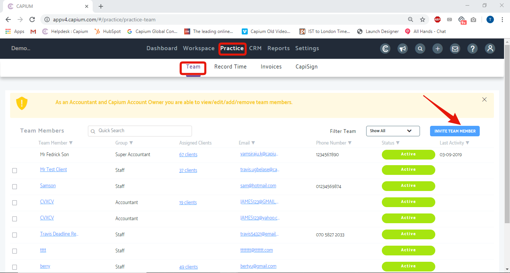

# How to add Team members
	 	
			
			Print

- **Folder:** Practice Management FAQs
- **Source URL:** [https://capium.freshdesk.com/support/solutions/articles/9000165785-how-to-add-team-members](https://capium.freshdesk.com/support/solutions/articles/9000165785-how-to-add-team-members)
- **Article ID:** 9000165785

## Content

Solution home 
		Practice Management 
		Practice Management FAQs

### How to add Team members

			Print

	Modified on: Tue, 3 Sep, 2019 at  4:08 PM

		Location: Practice Management module > Practice > Team

You can add/view/update users such as Accountant and Staff in your firm.

Help/Guide:

 - You can add/view/update users such as Accountant and Staff in your firm. 
 - You can see the list of the existing users
 - To add a new user, you need to click on Invite Team Member available at the top right-hand side and in the pop-up, you need to provide the details.
 - Here you can invite them by email or can import from Google, Office 365 and Slack.
 - There is an option to allow/disallow them to web access through a radio button

										Did you find it helpful?
								Yes
								No

Send feedback	Sorry we couldn't be helpful. Help us improve this article with your feedback.

## Images & Screenshots (1)

