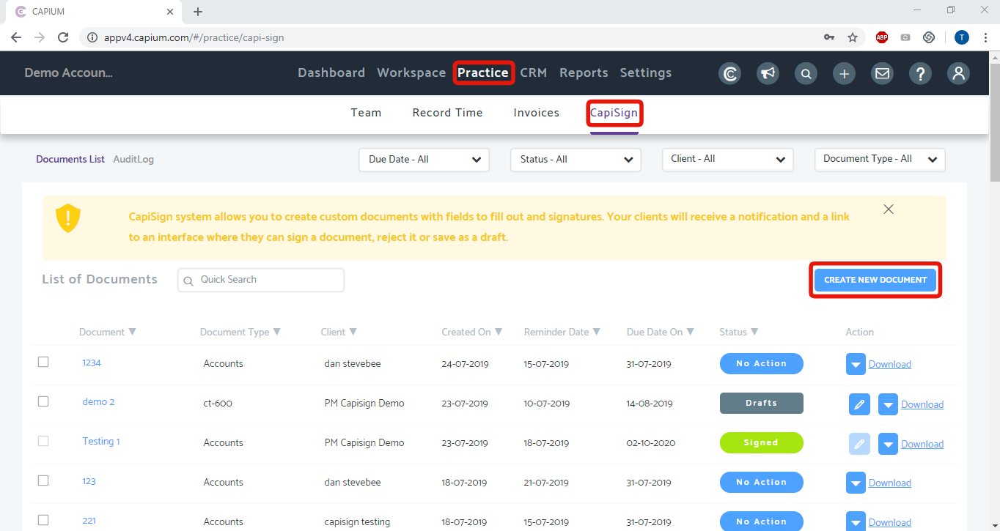
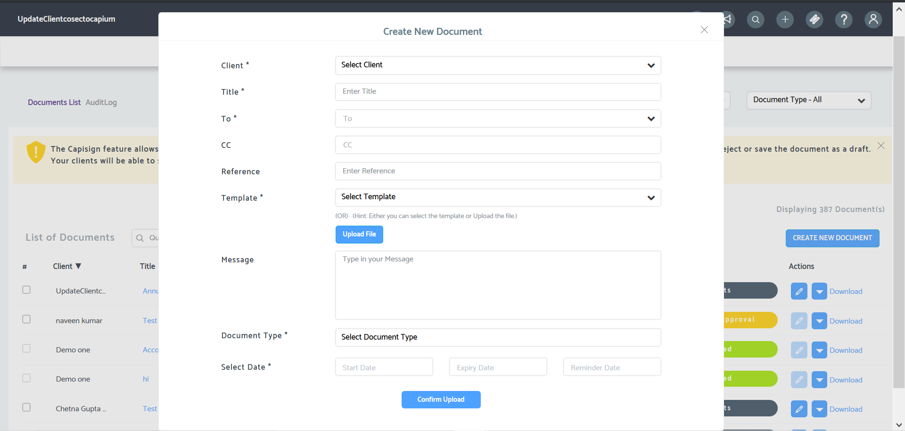
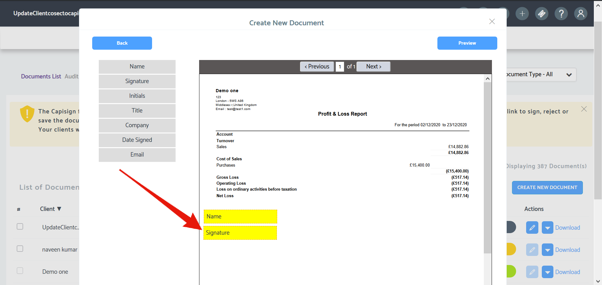
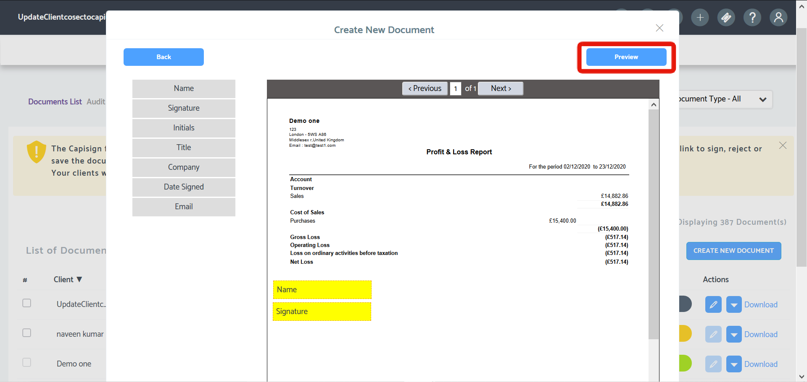
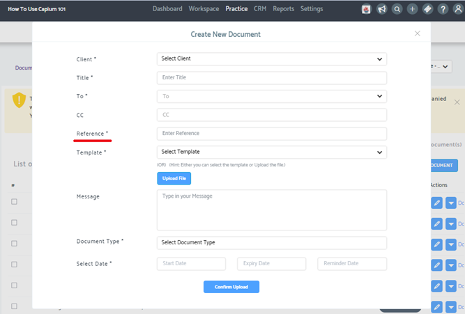
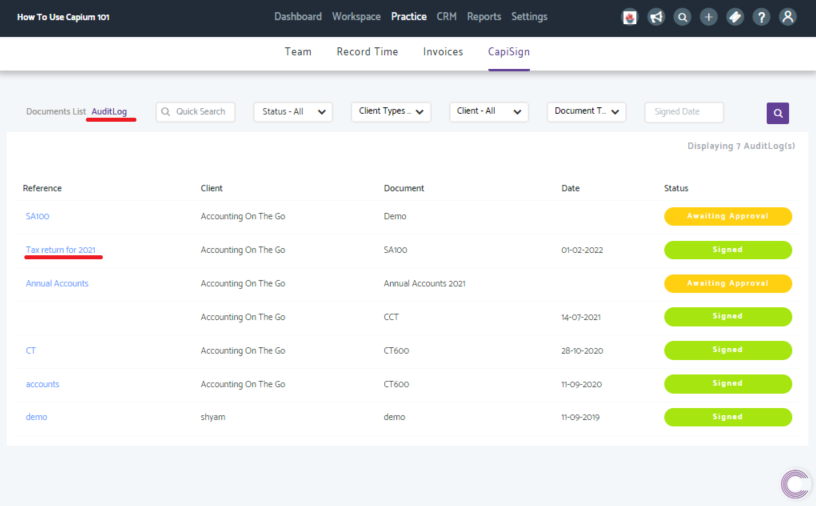
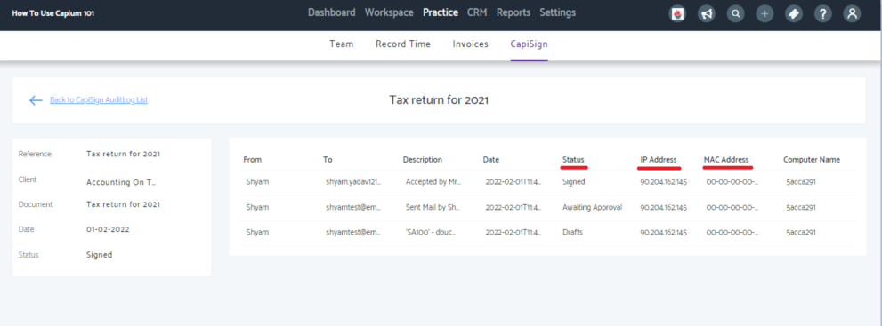

# Electronic signing - How to E-Sign using Capisign
	 	
			
			Print

- **Folder:** Practice Management FAQs
- **Source URL:** [https://capium.freshdesk.com/support/solutions/articles/9000165786-electronic-signing-how-to-e-sign-using-capisign](https://capium.freshdesk.com/support/solutions/articles/9000165786-electronic-signing-how-to-e-sign-using-capisign)
- **Article ID:** 9000165786

## Content

Solution home 
		Practice Management 
		Practice Management FAQs

### Electronic signing - How to E-Sign using Capisign

			Print

	Modified on: Thu, 24 Apr, 2025 at  2:20 PM

		Location: Practice Management module > Practice > CapiSign

You can create and send documents for E-Signing through CapiSign. Using the feature, accountants can send documents such as Accounts Report, CT600 or any other important documents to their clients for electronic signatures. And it will also cover the client authorisation for the submissions to Companies House or HMRC.

Help/Guide:

To send the documents you need to provide your clients with user access by adding them as a 'Client User' click here to see how to add a client User. You will need to create a password to which they can login to their secure environment with. 

Once the document is sent, the system will send an email to the client with a link which will redirect the client to Capium, where the client needs to log in and access the document.

The document can be signed by double-clicking on the tags, a pop-up appears where the client can manually type in their name to sign.

CapiSign is legally a valid document.

Head to CapiSign page by following the navigation above. Once there click on 'Create New Document'.

Fill the mandatory fields out as marked by the asterisks and upload the document (has to be a PDF document).

Drag and drop the desired fields from the left panel onto the document to be signed. You can also right click on any fields to delete them.

Click the 'Preview' button located on the above screen, confirm the fields entered on the document, then click Send.

In order for your client to sign the sent documents, you will need to add them as one of your Client Users, follow the link here to add them as a Client User.

They will then be able to sign in with the credentials you create from the above link, to sign and automatically send back to you.

Click here to watch how to use CapiSign

Click here to see how clients sign documents sent through CapiSign

Updates made of January 2022

When sending a Capisign document the reference field has now been changed to mandatory. 

There are two key benefits of using the reference field:

1) This will allow the accountant to reference a specific document that needs to be signed

2) The reference field will be used within the audit log for Capisign document

To use the new audit log feature:

Navigate to 'Audit Log' > Click on the referenced document 

This will give an overview of when and where the document was signed.

The aim is to eliminate confusion between accountants and clients regarding documents that need to be signed.  

										Did you find it helpful?
								Yes
								No

Send feedback	Sorry we couldn't be helpful. Help us improve this article with your feedback.

## Images & Screenshots (7)

