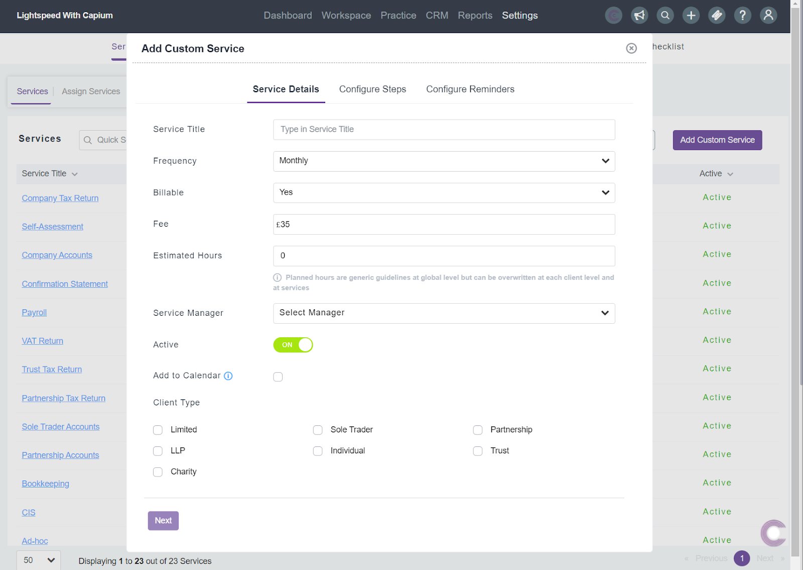
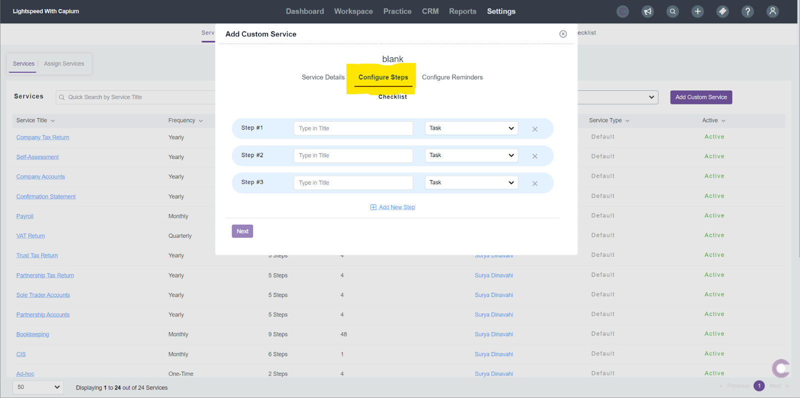

# Top Article - How  offer services through Capium practice management platform
	 	
			
			Print

- **Folder:** Practice Management FAQs
- **Source URL:** [https://capium.freshdesk.com/support/solutions/articles/9000166605-top-article-how-offer-services-through-capium-practice-management-platform](https://capium.freshdesk.com/support/solutions/articles/9000166605-top-article-how-offer-services-through-capium-practice-management-platform)
- **Article ID:** 9000166605

## Content

Solution home 
		Practice Management 
		Practice Management FAQs

### Top Article - How  offer services through Capium practice management platform

			Print

	Modified on: Thu, 24 Apr, 2025 at  2:19 PM

		Navigation: Practice Management >>>Settings>>>Services

Help/Guide:

This guide will show you step by step how to set up the services your practice offers, configuring steps for those services and then creating reminders too.

It is critical that when using Practice Management, the settings have been set up as will be shown in this article, so data then flows through under Workspace for your clients and you can begin using the module to its full potential.

Setting up custom services:

Practice Management >>>Settings>>>Services

This involves clearly defining the services you offer, setting up the manager responsible for those services, setting a Standard Fee, estimated hours & custom reminders.

You have the choice of using the default services which will already be included for you & even customise the information for these services by simply clicking the name of the service.

However, to create a new customer service from scratch, please follow these steps:

Please click the purple ‘Add Custom Service icon’

Enter the service title, the frequency of service, estimated fee & service manager who will be in charge of that particular service. (Or choose to leave blank if multiple staff members)

Choose the client type that you want the service applicable for. EG.is it specifically just for limited companies, or a variety of client types which you can tick.

Configuring Steps:

This refers to creating all of the necessary steps, which need to be completed before that custom service can be completed. These steps will then automatically flow through under the workspace>>> Tasks.

You can create as many steps as you require and click ‘Next’ when ready for the final step.

Configure reminders

The final step is to configure reminders, which refer to custom reminders that can be created and sent out to notify both staff members and clients of an approaching deadline.

Once you click the ‘configure reminders’ tab, as shown above you will then be able to remind either your staff or clients.

For example, if you only want to remind your clients but not staff then please select the relevant clients under the drop down menu. But if you want to remind staff too, then you can use the staff filter to select any relevant staff.

You can create as many reminders as you need for a service, the aim is to customise the flow to completely suit your needs. Eg. You can create a deadline 3 months prior, 1 month prior and then 1 day prior.

Please note: The reminders will not be active until a deadline is created for that particular service.

This is so the system then knows when the next deadline is for that particular service so it can then automatically generate the tasks and their deadline dates for you for the corresponding months and years.

Deadlines can be created by navigating to Workspace>>>Deadlines & then select the ‘Add deadline’ button as shown below

										Did you find it helpful?
								Yes
								No

Send feedback	Sorry we couldn't be helpful. Help us improve this article with your feedback.

## Images & Screenshots (5)

