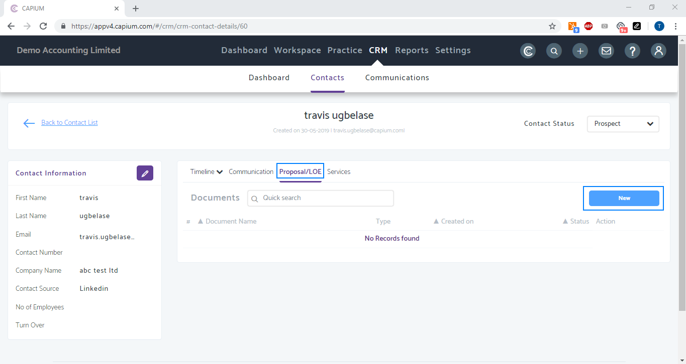
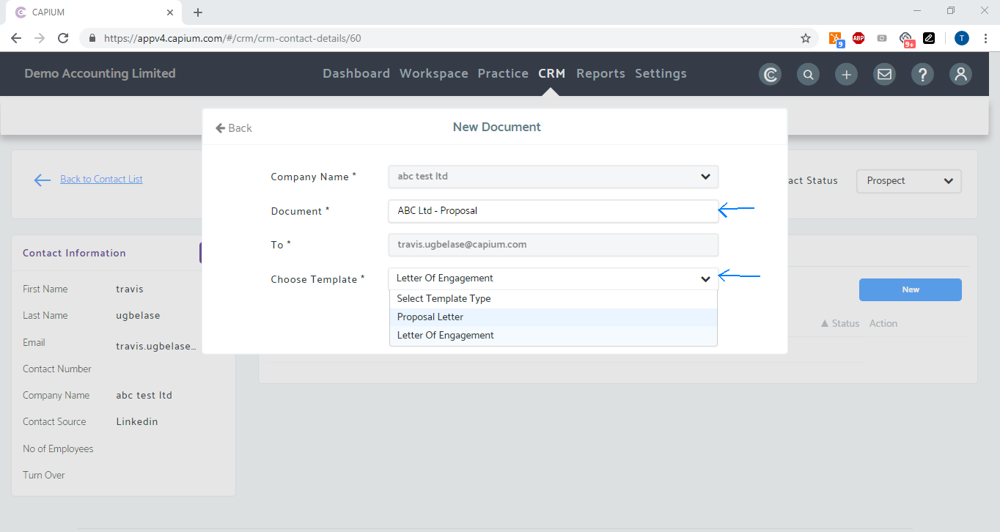
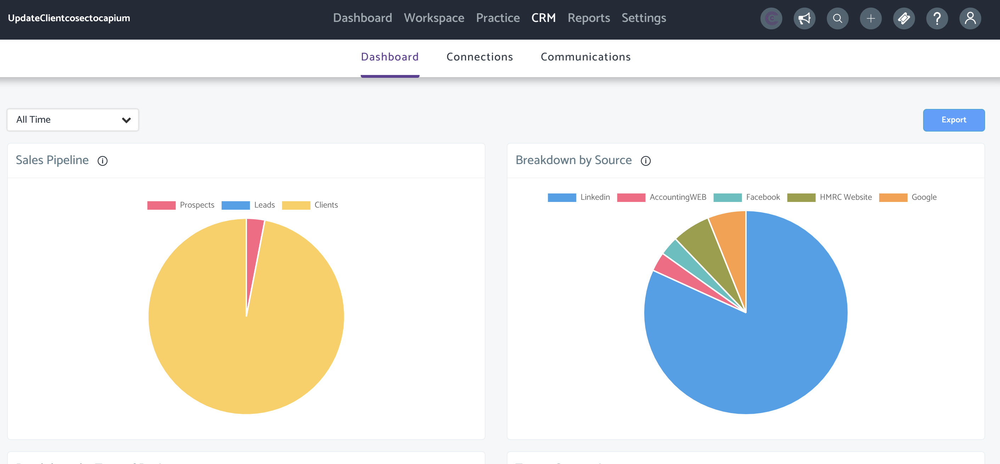

# Letters Of Engagement &amp; Proposals (for Prospects)
	 	
			
			Print

- **Folder:** Practice Management Help Guide
- **Source URL:** [https://capium.freshdesk.com/support/solutions/articles/9000169896-letters-of-engagement-proposals-for-prospects-](https://capium.freshdesk.com/support/solutions/articles/9000169896-letters-of-engagement-proposals-for-prospects-)
- **Article ID:** 9000169896

## Content

Solution home 
		Practice Management 
		Practice Management Help Guide

### Letters Of Engagement & Proposals (for Prospects)

			Print

	Modified on: Wed, 29 Jun, 2022 at 10:56 AM

		Location: Practice Management module > CRM > Contacts > Select a contact or add 'New Contact'

Refer to the link

Help/Guide: 

Once in the contact workspace, navigate to the Proposal/LOE tab and click 'New'

then enter the document name and select which type of document you want to send > Proposal or Letter of Engagement

Review the document and email - then preview, save as draft, or send to contact.

Once sent, your prospect/lead will receive an email containing details of the Letter of Engagement/Proposal along with a link for an e-signature. The status will appear as 'Waiting for Approval' and will change to 'Accepted' once the document is signed.

Click here to watch how to send Letters of Engagement/Proposals

										Did you find it helpful?
								Yes
								No

Send feedback	Sorry we couldn't be helpful. Help us improve this article with your feedback.

## Images & Screenshots (4)

