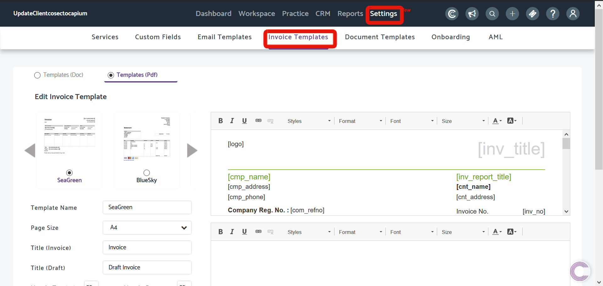
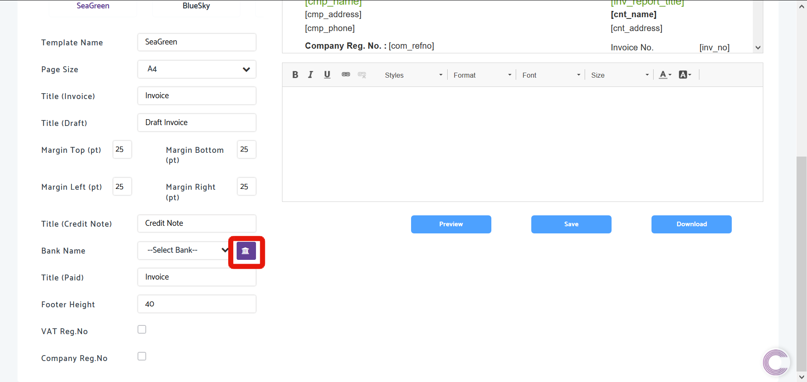
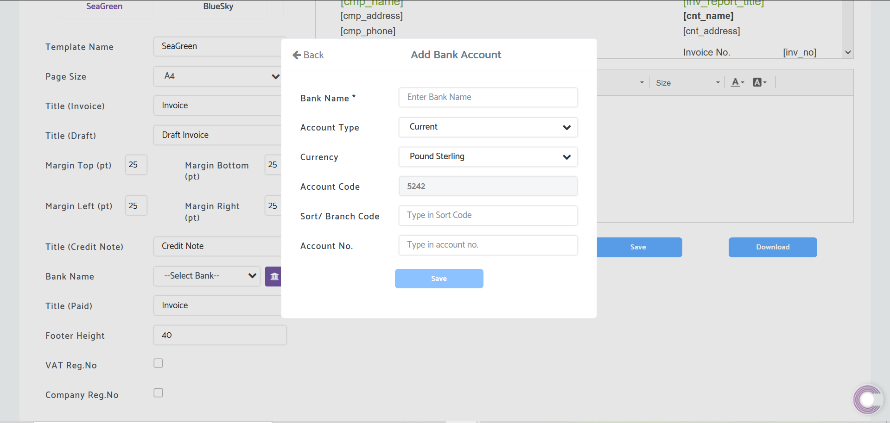

# How to add Bank details to Invoices in Practice Management
	 	
			
			Print

- **Folder:** Practice Management Help Guide
- **Source URL:** [https://capium.freshdesk.com/support/solutions/articles/9000172239-how-to-add-bank-details-to-invoices-in-practice-management](https://capium.freshdesk.com/support/solutions/articles/9000172239-how-to-add-bank-details-to-invoices-in-practice-management)
- **Article ID:** 9000172239

## Content

Solution home 
		Practice Management 
		Practice Management Help Guide

### How to add Bank details to Invoices in Practice Management

			Print

	Modified on: Tue, 6 Oct, 2020 at  5:28 PM

		Location: Practice Management module > Settings > Invoice Templates > Add Bank

Refer to the link

Help/Guide: 

Once in Invoice Templates, scroll down and click the 'Add Bank' icon as shown below

then fill the details in and Save.

										Did you find it helpful?
								Yes
								No

Send feedback	Sorry we couldn't be helpful. Help us improve this article with your feedback.

## Images & Screenshots (3)

