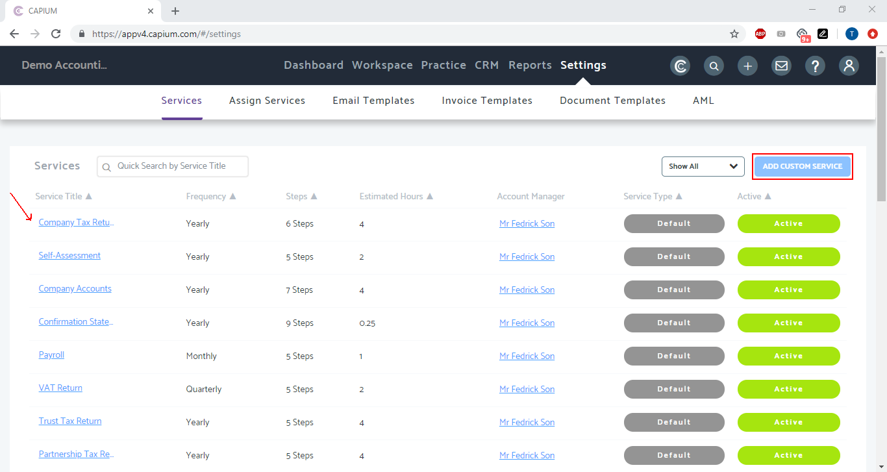
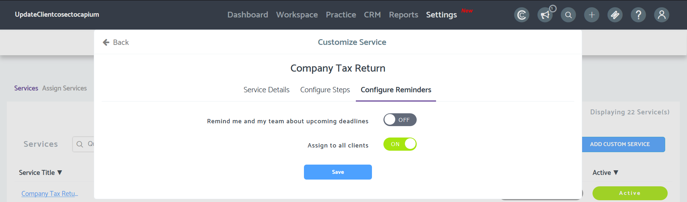
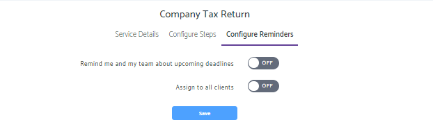
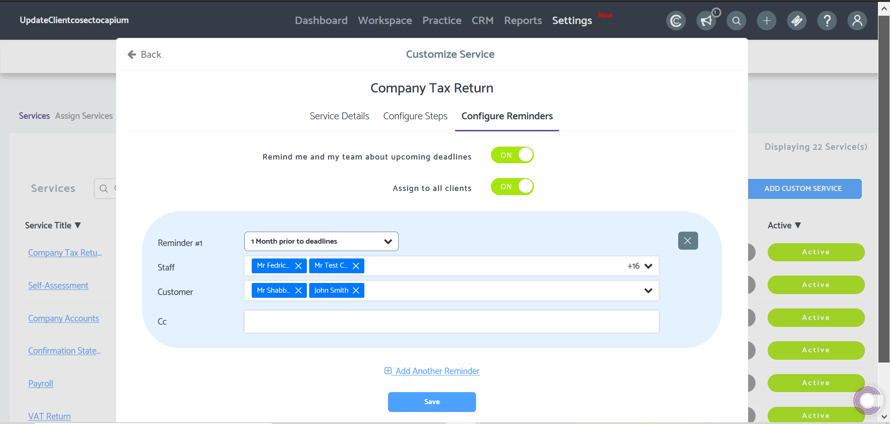
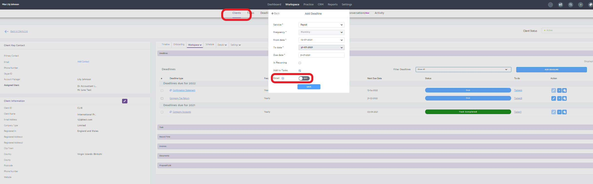
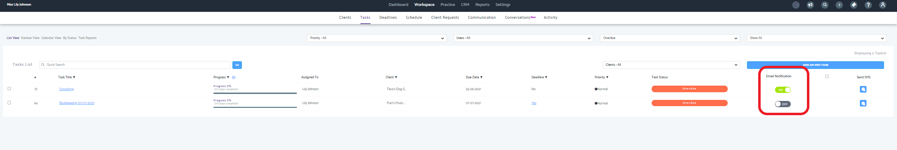

# How to setup and delete Deadline Email Reminders
	 	
			
			Print

- **Folder:** Practice Management Help Guide
- **Source URL:** [https://capium.freshdesk.com/support/solutions/articles/9000172240-how-to-setup-and-delete-deadline-email-reminders](https://capium.freshdesk.com/support/solutions/articles/9000172240-how-to-setup-and-delete-deadline-email-reminders)
- **Article ID:** 9000172240

## Content

Solution home 
		Practice Management 
		Practice Management Help Guide

### How to setup and delete Deadline Email Reminders

			Print

	Modified on: Mon, 1 Nov, 2021 at  4:29 PM

		Location:

Practice Management module > Settings > Services > Add new Customer Service or select existing service

Refer to the link

Video Tutorial:

Please click here to watch how to configure email reminders

Help/Guide:

Setting up a email reminder

Navigate to 'Settings' > Services.

From here you can either edit a service or click on 'Add Custom Service'.

Within the services configuration screen, navigate to 'Configure Reminders'.

Toggle the switch to 'On' or 'Off' according to if you want to be sent email reminders or not.

'Remind me and my team' - This will send an email reminder to your team's email addresses.

'Assign to all clients' - This will send email reminders to the clients whose deadline is approaching.

You can then setup the deadline reminder as shown below.

Click on 'Add deadline reminder' to set up multiple deadline reminders. 

To edit the email reminder, go into Settings > Email templates 

Assigning a email reminder

You will need to create a deadline for a specific client in order for a email reminder to be sent.

Please head to Practice Management > Workspace > Clients> Choose Client > Workspace > Deadlines

As you set up the deadline, switch the 'Email' toggle to 'Yes'. This will send the email reminders accordingly.

To remove a email reminder

Head to Workspace > Tasks.

You will then be able to toggle on or off the email reminders.

										Did you find it helpful?
								Yes
								No

Send feedback	Sorry we couldn't be helpful. Help us improve this article with your feedback.

## Images & Screenshots (6)

