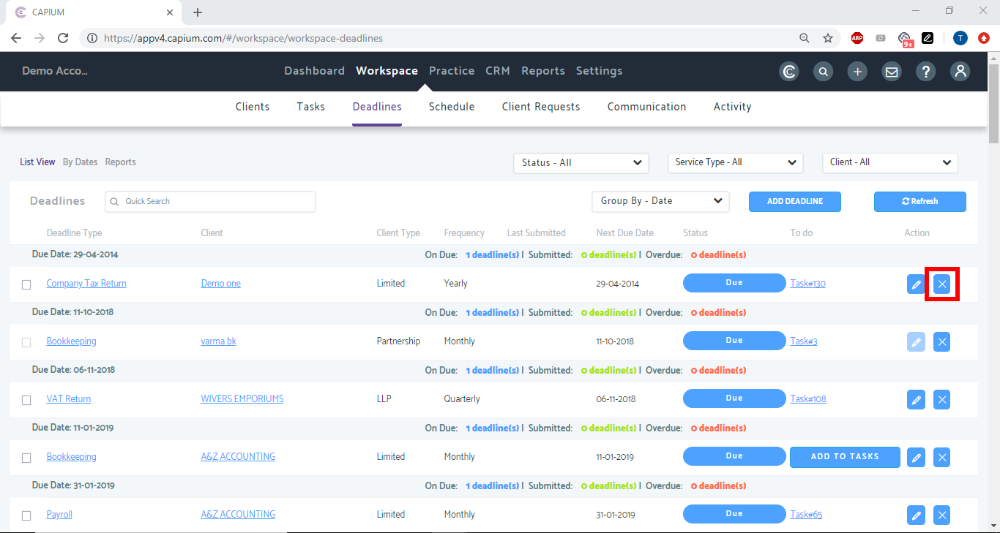
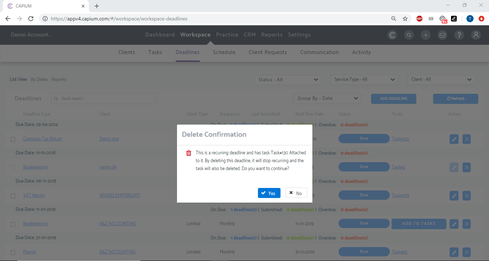

# How to delete Deadlines in Practice Management
	 	
			
			Print

- **Folder:** Practice Management Help Guide
- **Source URL:** [https://capium.freshdesk.com/support/solutions/articles/9000172244-how-to-delete-deadlines-in-practice-management](https://capium.freshdesk.com/support/solutions/articles/9000172244-how-to-delete-deadlines-in-practice-management)
- **Article ID:** 9000172244

## Content

Solution home 
		Practice Management 
		Practice Management Help Guide

### How to delete Deadlines in Practice Management

			Print

	Modified on: Tue, 6 Oct, 2020 at  5:01 PM

		Location: Practice Management module > Workspace > Deadlines

Refer to the link

Help/Guide: 

Once in Deadlines, click the delete button on the deadline as shown below

Confirm you want to proceed with deleting the deadline by clicking Yes.

										Did you find it helpful?
								Yes
								No

Send feedback	Sorry we couldn't be helpful. Help us improve this article with your feedback.

## Images & Screenshots (2)

