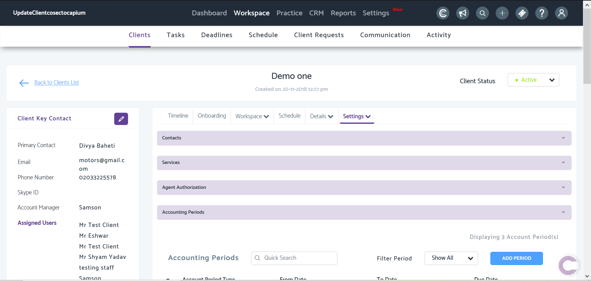
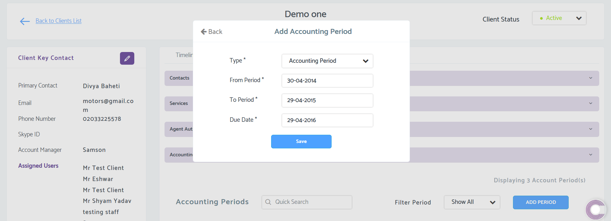

# How to add Accounting/VAT Periods in Practice Management 
	 	
			
			Print

- **Folder:** Practice Management Help Guide
- **Source URL:** [https://capium.freshdesk.com/support/solutions/articles/9000172245-how-to-add-accounting-vat-periods-in-practice-management-](https://capium.freshdesk.com/support/solutions/articles/9000172245-how-to-add-accounting-vat-periods-in-practice-management-)
- **Article ID:** 9000172245

## Content

Solution home 
		Practice Management 
		Practice Management Help Guide

### How to add Accounting/VAT Periods in Practice Management 

			Print

	Modified on: Mon, 5 Oct, 2020 at  4:40 PM

		Location: Practice Management module > Workspace > Clients > Select Client > Settings > Accounting Periods

Refer to the link

Adding an Accounting Period is needed when creating Company Tax and VAT Deadlines in Practice Management.

Follow the Navigation above to head to the area where you can add the Accounting/VAT Period. Once there, click Add Period, then follow the options presented.

Using the 'Type' drop-down filter, choose between a VAT or Accounting Period, then enter the desired dates.

Click here to watch how to create a VAT/Accounting Period in Practice Management

										Did you find it helpful?
								Yes
								No

Send feedback	Sorry we couldn't be helpful. Help us improve this article with your feedback.

## Images & Screenshots (2)

