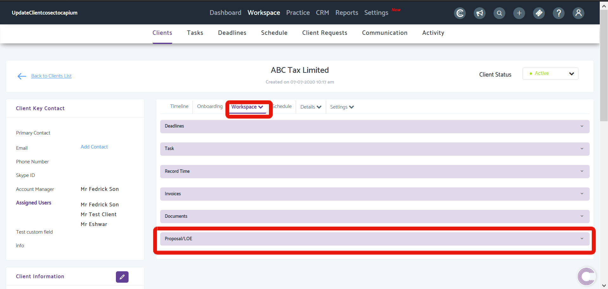
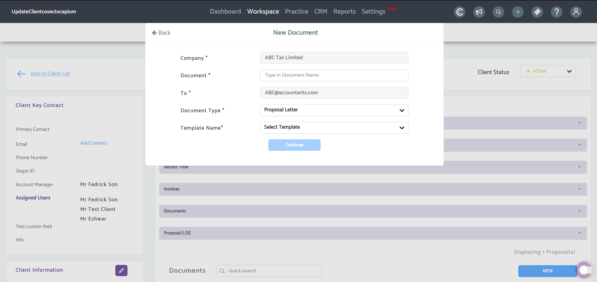
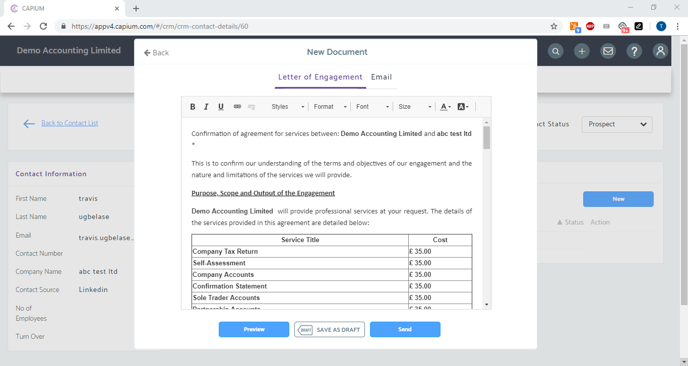
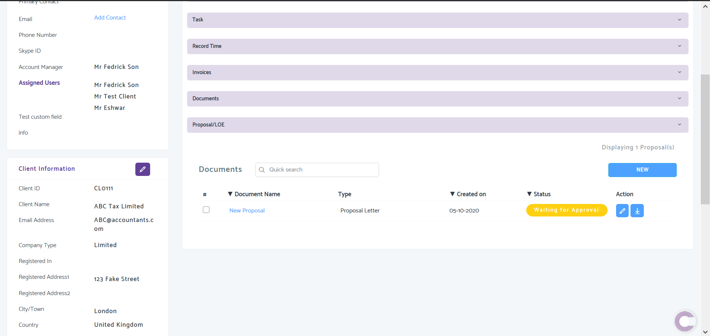

# Send Letters of Engagement &amp; Proposals to existing clients
	 	
			
			Print

- **Folder:** Practice Management Help Guide
- **Source URL:** [https://capium.freshdesk.com/support/solutions/articles/9000172376-send-letters-of-engagement-proposals-to-existing-clients](https://capium.freshdesk.com/support/solutions/articles/9000172376-send-letters-of-engagement-proposals-to-existing-clients)
- **Article ID:** 9000172376

## Content

Solution home 
		Practice Management 
		Practice Management Help Guide

### Send Letters of Engagement & Proposals to existing clients

			Print

	Modified on: Tue, 16 Feb, 2021 at 12:50 PM

		Location: Practice Management module > Workspace > Clients > Select a client > Workspace > Proposal/LOE

Refer to the link

Help/Guide:

Once in the contact workspace, navigate to the Proposal/LOE tab and click 'New'.

then enter the document name and select which type of document you want to send > Proposal or Letter of Engagement.

Review the document and email - then preview, save as draft, or send to contact.

Once sent, your client will receive an email containing details of the Letter of Engagement/Proposal along with a link for an e-signature. The status will appear as 'Waiting for Approval' and will change to 'Accepted' once the document is signed. 

Click here to watch how to Send an Engagement/Proposal Letter to existing Clients 

										Did you find it helpful?
								Yes
								No

Send feedback	Sorry we couldn't be helpful. Help us improve this article with your feedback.

## Images & Screenshots (4)

