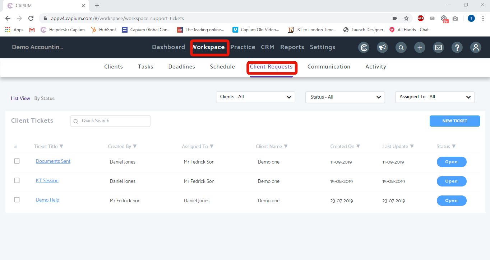
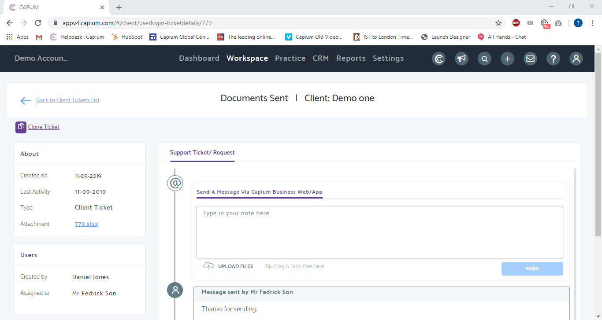

# How do I respond to Client Requests?
	 	
			
			Print

- **Folder:** Practice Management FAQs
- **Source URL:** [https://capium.freshdesk.com/support/solutions/articles/9000174901-how-do-i-respond-to-client-requests-](https://capium.freshdesk.com/support/solutions/articles/9000174901-how-do-i-respond-to-client-requests-)
- **Article ID:** 9000174901

## Content

Solution home 
		Practice Management 
		Practice Management FAQs

### How do I respond to Client Requests?

			Print

	Modified on: Wed, 11 Sep, 2019 at 11:03 AM

		Location: Practice Management Module > Workspace > Client Requests

Refer to the link

You can view and respond to tickets your clients send to you from the Client Requests section in Practice Management.

Once you are on the Client Requests page, click on the Ticket Title you wish to review.

On this page, scroll down to review the client request. You can also view and download any attachments.

Click here to watch how to respond to client requests

										Did you find it helpful?
								Yes
								No

Send feedback	Sorry we couldn't be helpful. Help us improve this article with your feedback.

## Images & Screenshots (2)

