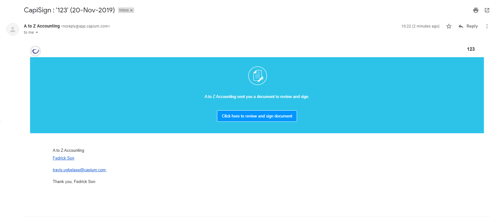
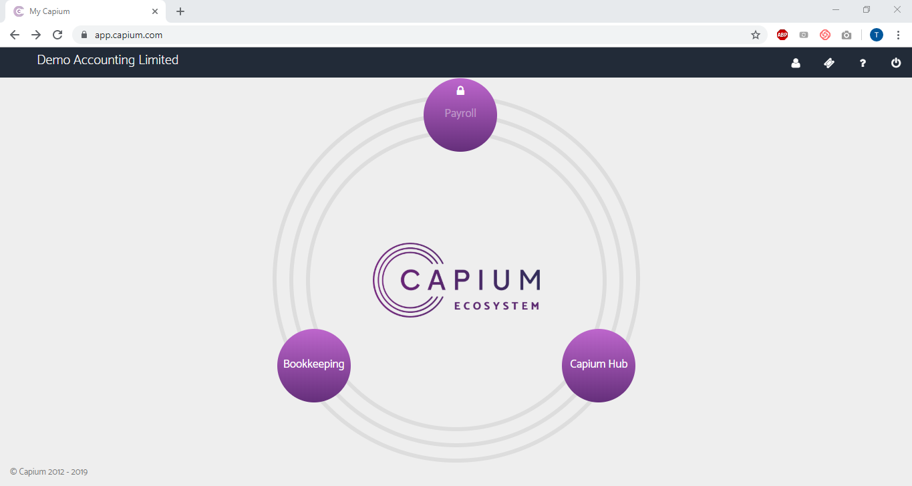
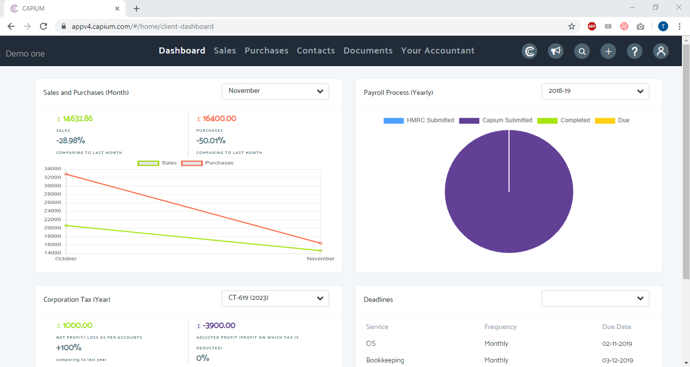
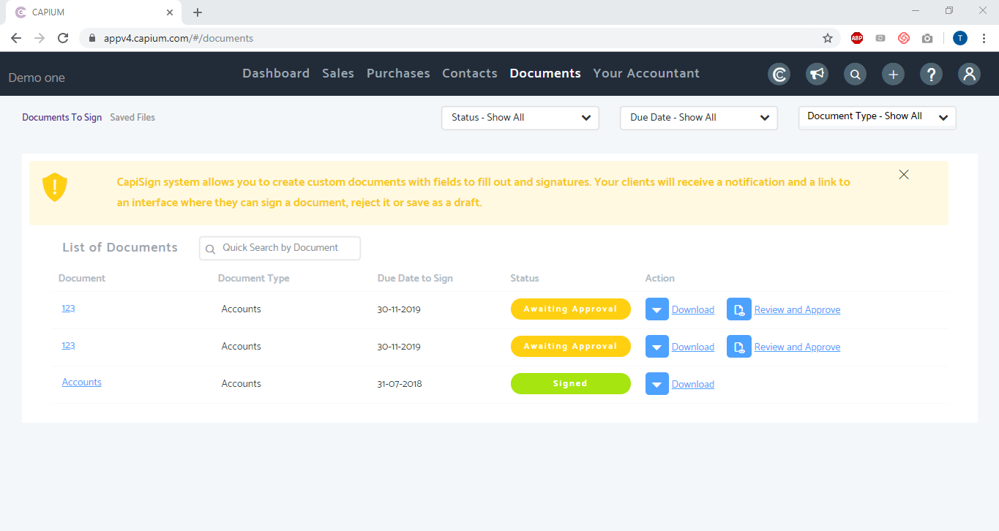
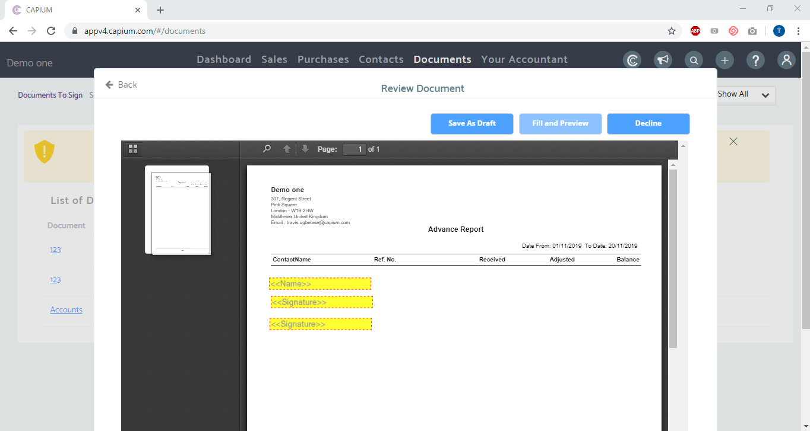
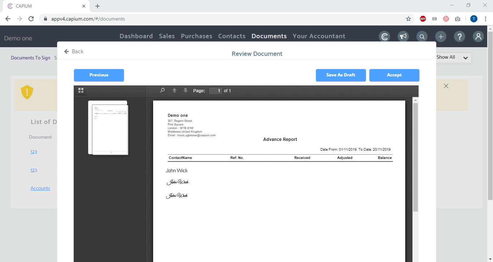
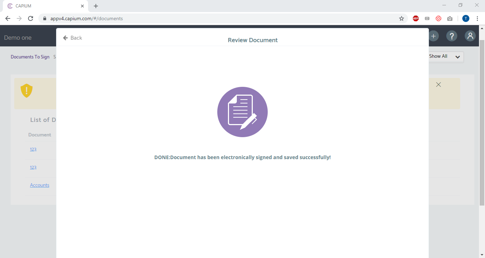

# How to sign Documents sent by Accountant
	 	
			
			Print

- **Folder:** Practice Management Help Guide
- **Source URL:** [https://capium.freshdesk.com/support/solutions/articles/9000178336-how-to-sign-documents-sent-by-accountant](https://capium.freshdesk.com/support/solutions/articles/9000178336-how-to-sign-documents-sent-by-accountant)
- **Article ID:** 9000178336

## Content

Solution home 
		Practice Management 
		Practice Management Help Guide

### How to sign Documents sent by Accountant

			Print

	Modified on: Mon, 18 May, 2020 at  5:23 PM

		CapiSign is a feature designed to facilitate the electronic signing of Documents. Using the feature, accountants can send documents such as Accounts Report, CT600 or any other important documents to their clients for electronic signatures. And it will also cover the client authorisation for the submissions to Companies House or HMRC.

For clients to sign such documents, they need to login to their User Profile, which is created by the accountant from the Users section here.

Help/Guide: 

1. Once a document has been sent for client signature/approval, the client will receive a secure email from Capium (shown below) Click the link in the email to be redirected the Capium website 

2. Once the client is signed in with their credentials, they will be brought to the Capium Eco System home page as shown below. The next step is to click 'Capium Hub' and then the 'Documents' menu option.

3. In the Documents page, the first tab is 'Documents To Sign'. Here clients will find any and all documents which require signature or have been signed previously. Simply click 'Review & Approve' besides the document(s) which require signature.

4. Double click on the fields yellow fields to enter the relevant information required. Then click 'Fill & Preview' to proceed and then 'Accept' on the next page to complete the e-signing process. The accountant will then be immediately notified via email of this.

6. Congratulations! Guide Complete!

Click here to watch How to Sign Documents sent by your accountant

										Did you find it helpful?
								Yes
								No

Send feedback	Sorry we couldn't be helpful. Help us improve this article with your feedback.

## Images & Screenshots (7)

