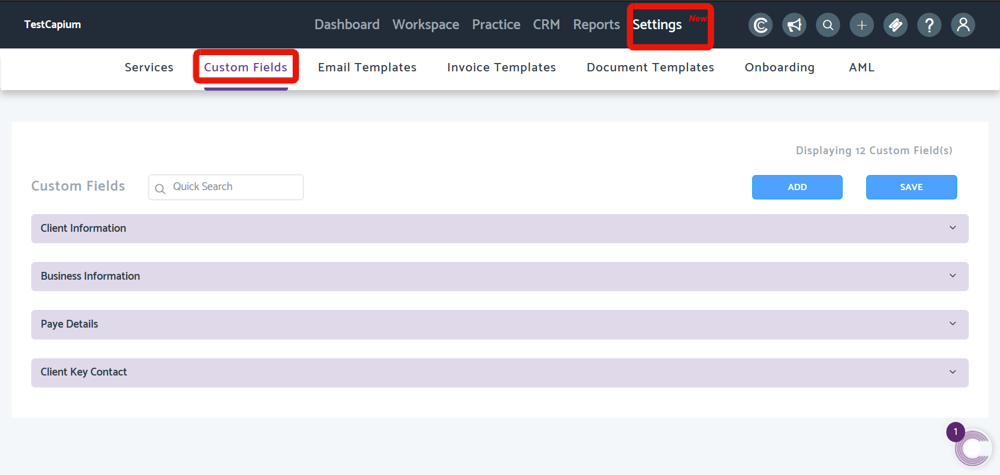
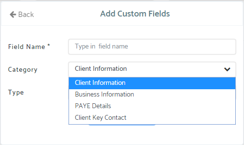
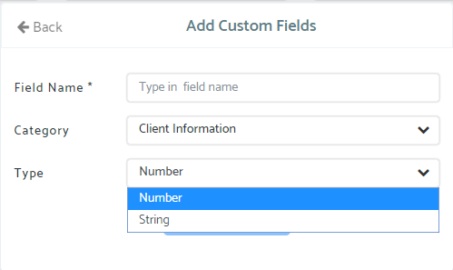
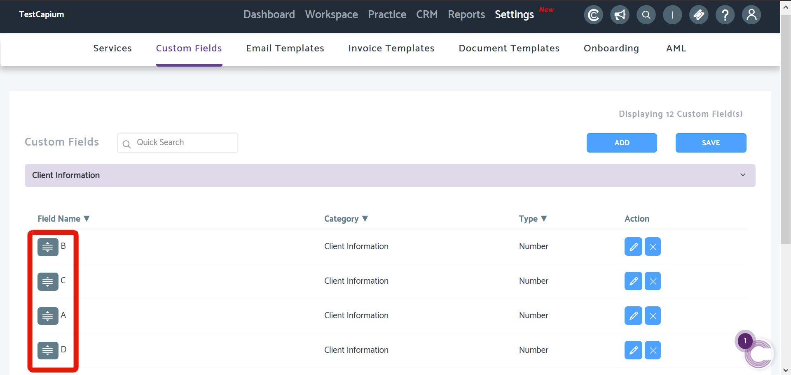
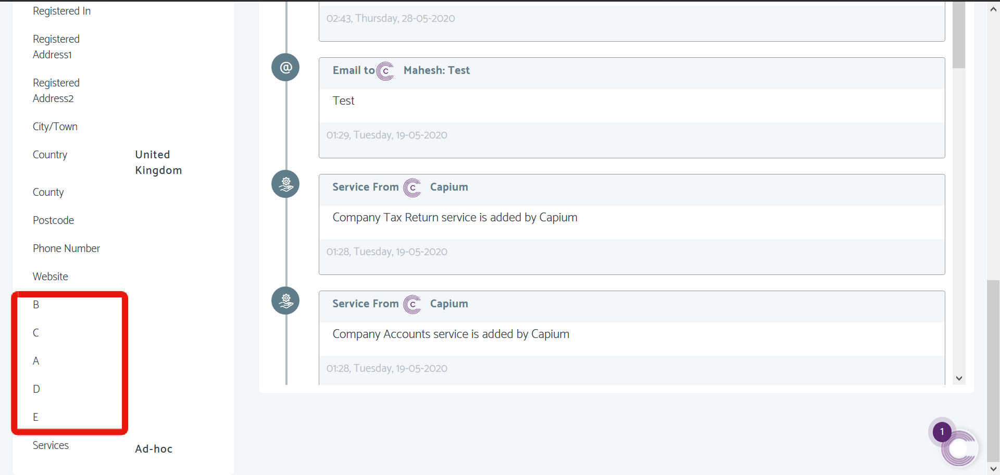

# Global Custom Fields
	 	
			
			Print

- **Folder:** Practice Management Help Guide
- **Source URL:** [https://capium.freshdesk.com/support/solutions/articles/9000179570-global-custom-fields](https://capium.freshdesk.com/support/solutions/articles/9000179570-global-custom-fields)
- **Article ID:** 9000179570

## Content

Solution home 
		Practice Management 
		Practice Management Help Guide

### Global Custom Fields

			Print

	Modified on: Fri, 29 May, 2020 at  1:00 PM

		Location: Practice Management module > Settings > Custom Fields

Refer to the link

Custom Fields are fields which can be applied to either the Client Information, Business Information, PAYE Details, or Client Key Contact sections of a Clients' details.

Help/Guide: 

Once in the Custom Fields page, click 'Add' to create a new Field.

Category - choose where you want the Custom Field to be added to from the options provided 

Type - choose between Number or String depending on the Field you want to create

Customising Sequence

Users will also be able to customer the order of which the fields should appear in based on preference. Simply use the button to the left of the field name to drag & drop as shown below.

Once created, based on the Category and Type, it appear as below;

Click here to watch how to setup Custom Fields

										Did you find it helpful?
								Yes
								No

Send feedback	Sorry we couldn't be helpful. Help us improve this article with your feedback.

## Images & Screenshots (5)

