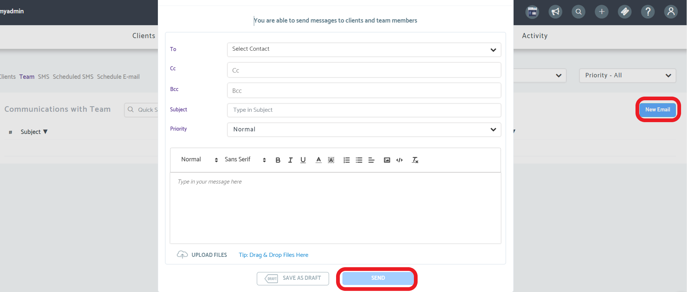
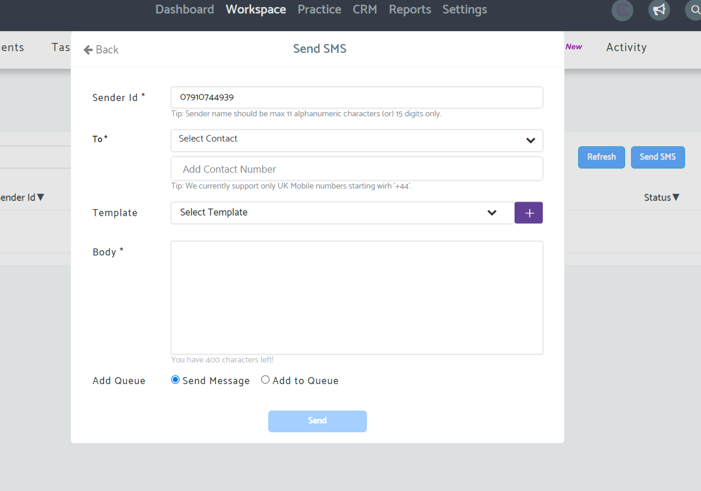
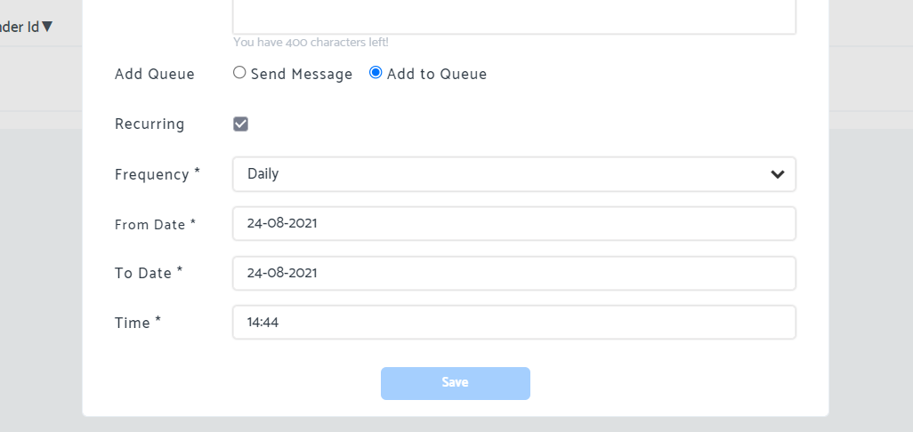
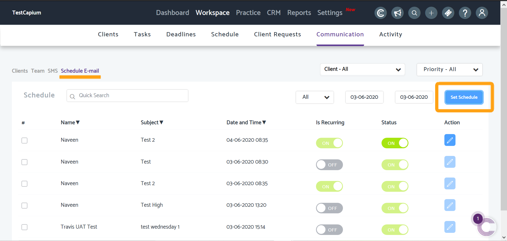
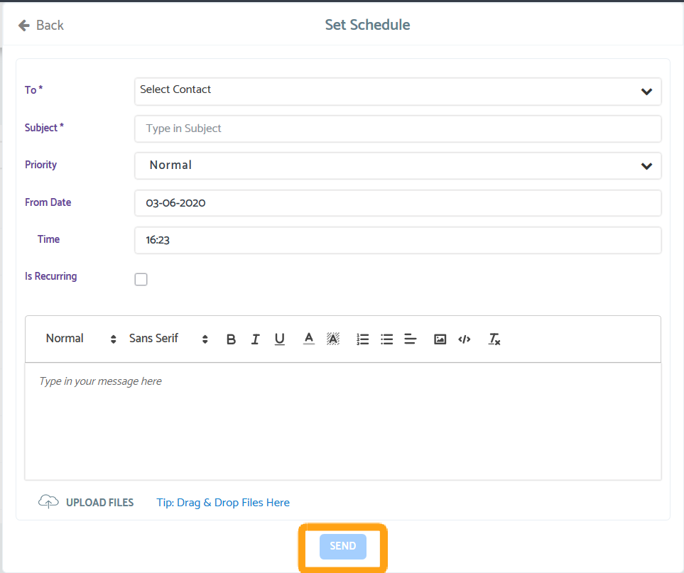

# Communication-How to send and schedule emails and SMS
	 	
			
			Print

- **Folder:** Practice Management Help Guide
- **Source URL:** [https://capium.freshdesk.com/support/solutions/articles/9000188513-communication-how-to-send-and-schedule-emails-and-sms](https://capium.freshdesk.com/support/solutions/articles/9000188513-communication-how-to-send-and-schedule-emails-and-sms)
- **Article ID:** 9000188513

## Content

Solution home 
		Practice Management 
		Practice Management Help Guide

### Communication-How to send and schedule emails and SMS

			Print

	Modified on: Fri, 9 Feb, 2024 at  9:24 AM

		Navigation: Practice Management > Workspace > Communication 

Please click here to watch a video on the communication tab

Help/Guide

There are 5 headings under Communication

Clients-Use this tab to send emails. You will be able to see previous emails to clients here
Team-Use this tab to send emails. You will be able to see previous emails to team members here.
SMS-use this tab to send an SMS message
Schedule SMS-use this tab to schedule an SMS message in the future. See SMS's which are scheduled
Schedule email-use this tab to schedule an email message in the future. See emails which are scheduled

Emails

You can send emails to multiple clients/team members at once by clicking on New Email, then selecting the contacts from the dropdown box

Update 24/08: CC and BCC functionality has been added

Please type the body of the email in the large box

When ready you can click send.

Note: the email will come from yourname@parse.capium.com though the title name will come through as your business. If the client replies to the email this will go to your Capium registered email.

Click here to find out how to send an email to a client with multiple email addresses

SMS

You can send SMS messages to your clients. Please get in contact if you cannot see the SMS access in Capium PM

The sender ID is your phone number which you want messages to be sent from (this will be charged from your phone company). The PM system will remember this number for the future.

Further more, if you want to send more 10 SMS's you will need to authenticated your account by entering a OTP, which will be sent to your designated mobile phone or email address.

Find out more about Capium SMS functionality here

The above article will let you know how to create an SMS template

When ready you can click send

By clicking add to queue you can schedule an SMS for the future

The following area will appear for you to add further information

When ready click save. These scheduled SMS will then should in the Scheduled SMS tab.

Scheduling e

Navigate to the Schedule Email page using the navigation above and once there, click the 'Set Schedule' button to begin

Upon clicking the Set Schedule button, you will be greeted with the below pop-up interface, simply fill the details accordingly

Once all the details have been entered such as Contact (client), Date, Time etc, click Send to set this Scheduled email up.

										Did you find it helpful?
								Yes
								No

Send feedback	Sorry we couldn't be helpful. Help us improve this article with your feedback.

## Images & Screenshots (5)

