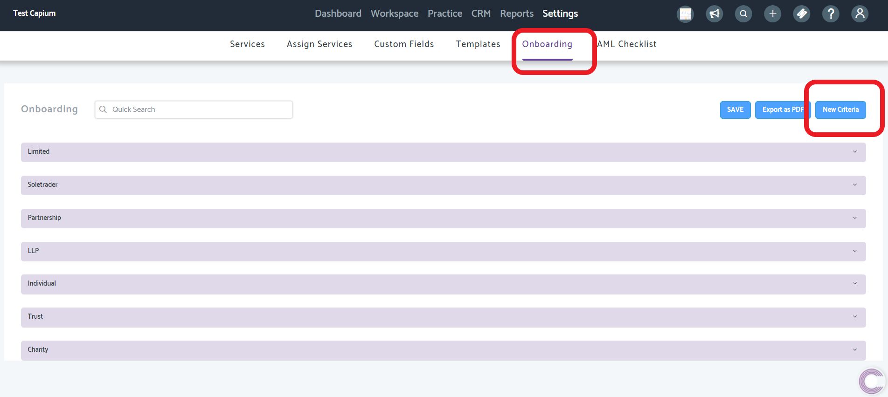
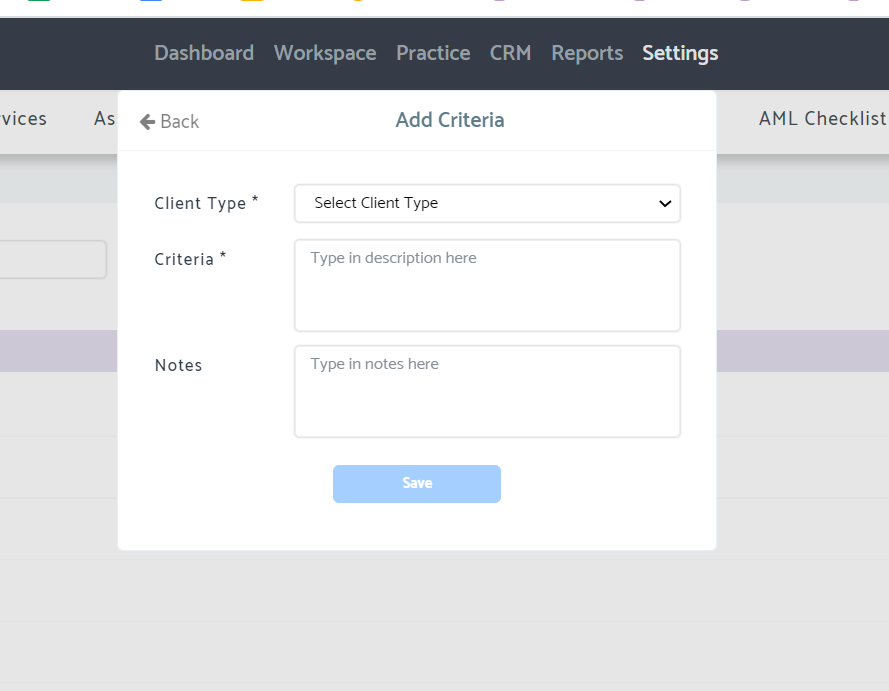
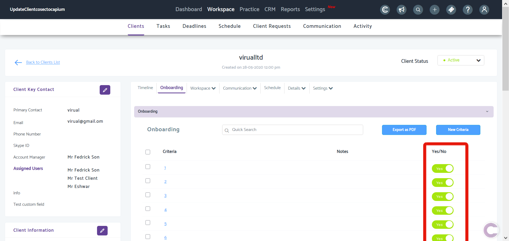

# Client On-Boarding Checklist
	 	
			
			Print

- **Folder:** Practice Management Help Guide
- **Source URL:** [https://capium.freshdesk.com/support/solutions/articles/9000188953-client-on-boarding-checklist](https://capium.freshdesk.com/support/solutions/articles/9000188953-client-on-boarding-checklist)
- **Article ID:** 9000188953

## Content

Solution home 
		Practice Management 
		Practice Management Help Guide

### Client On-Boarding Checklist

			Print

	Modified on: Fri, 2 Jul, 2021 at 11:50 AM

		Navigation: Practice Management > Settings > On-boarding

Refer to the quick-link

Click here to watch how to set up onboarding checklists 

Help/Guide

The On-Boarding has been designed to aid with the OB process for your new clients.

Head to the Onboarding section using the navigation above and you'll be presented with the below screen.

Once here, you can set up 'Criteria' which represent the checks your clients will need to pass to be successfully on-boarded. Click 'New Criteria' to begin adding the various criteria for new clients. 

The following pop up will appear, here you can select the client type and create the criteria for the client type

You can export this to PDF.

When going to a client in Practice Management > Workspace > Clients > Select Client > Onboarding you will see the specific 'client type' onboarding checklist

The Yes/No column represents if the client has passed a particular criteria and you can toggle that on/off.

Note: Any changes made in settings will apply to all clients however, you can go into a client workspace to change any of the criteria if you need to (see above)

										Did you find it helpful?
								Yes
								No

Send feedback	Sorry we couldn't be helpful. Help us improve this article with your feedback.

## Images & Screenshots (3)

