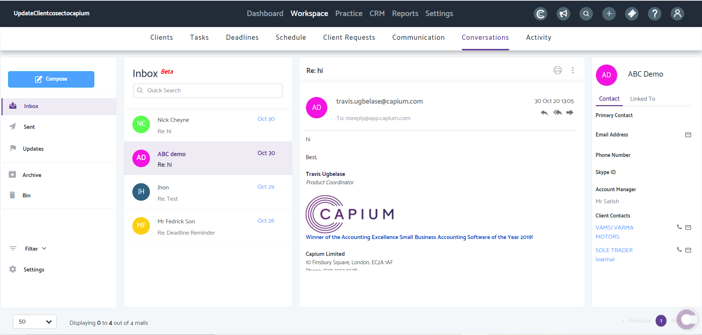
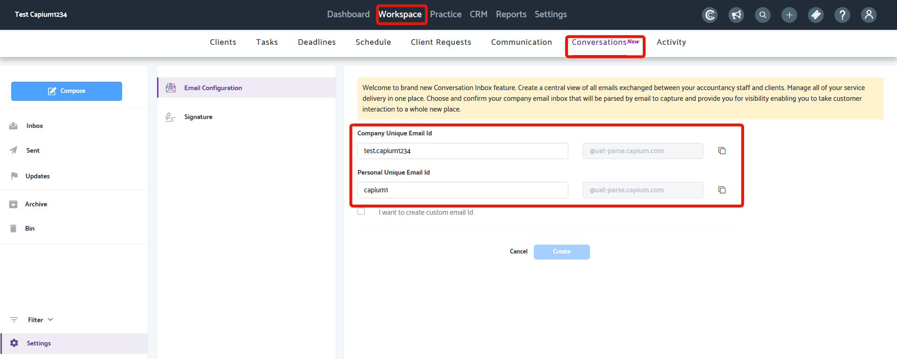
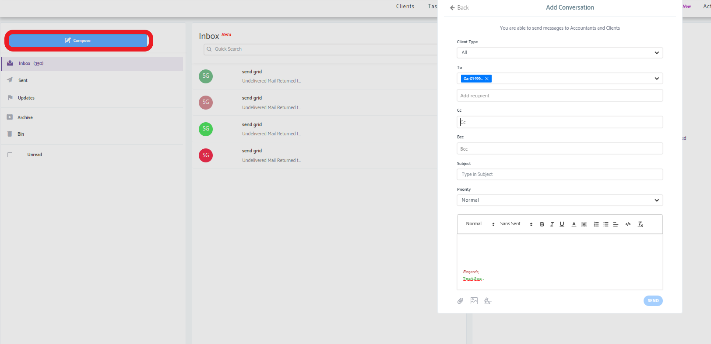
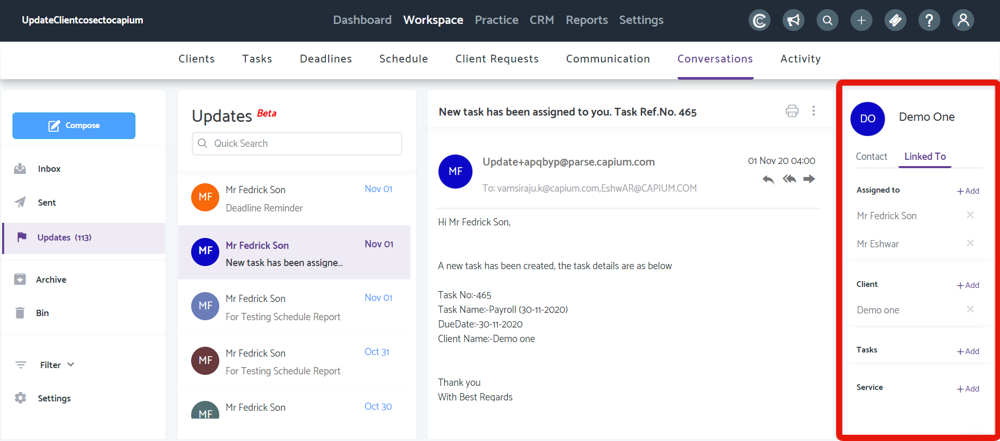
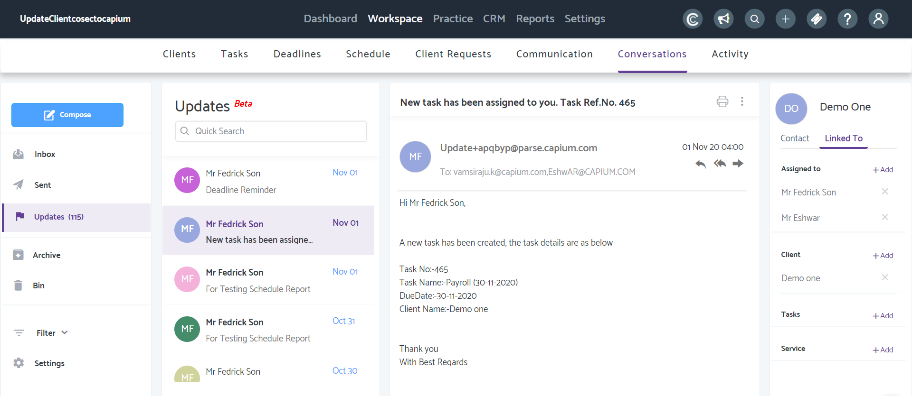
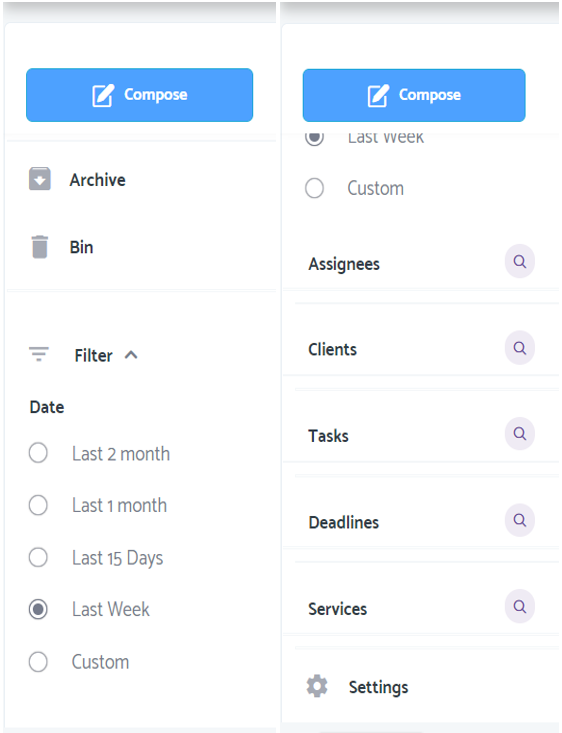
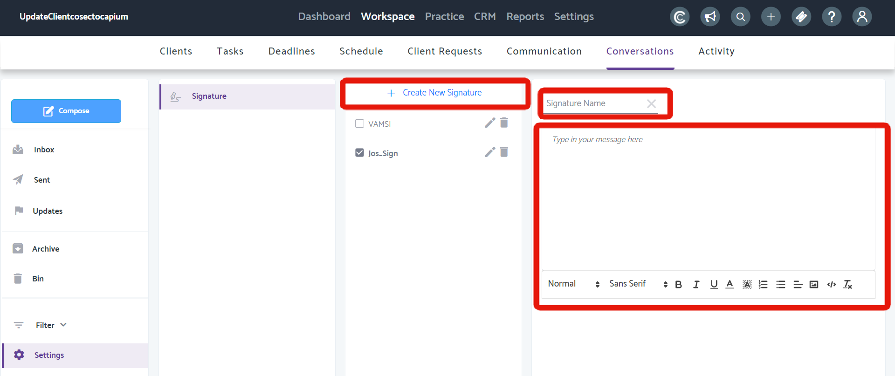

# Email Conversations - Link your Email Inbox to Capium
	 	
			
			Print

- **Folder:** Practice Management Help Guide
- **Source URL:** [https://capium.freshdesk.com/support/solutions/articles/9000195110-email-conversations-link-your-email-inbox-to-capium](https://capium.freshdesk.com/support/solutions/articles/9000195110-email-conversations-link-your-email-inbox-to-capium)
- **Article ID:** 9000195110

## Content

Solution home 
		Practice Management 
		Practice Management Help Guide

### Email Conversations - Link your Email Inbox to Capium

			Print

	Modified on: Tue, 24 Aug, 2021 at 11:30 AM

		Have you wondered how you can improve your customer service experience through keeping a track of all emails? 

If the answer is yes, then read on.

Watch how to use Capium Conversations from the video below

Help Guide

Email Conversations is feature designed to help you keep a track of all emails directly from Capium. Using a Forwarding rule, you will now be able to divert all emails from your own inbox into Email Conversations inbox, alleviating the need of having two separate inboxes.

Who can use Email Conversations

1. Super Accountant (Account holder)

2. Accountant Users

3. Staff Users

How to get there: Practice Management > Workspace > Conversations

Linking Email Conversations to your Email Domain

In order to track your emails from within Capium, you will need to setup a Forwarding Rule, which will automatically forward incoming emails from your inbox to Email Conversations' inbox.

Click here to read how to setup a forwarding rule in Outlook 

Click here to read how to setup a forwarding rule in Gmail

Click here to read how to setup a forwarding rule in Hotmail 

To setup the Forwarding Rule, you will need a unique ID. Under Practice Management, head to Workspace > Email Conversation > Settings > Email Configuration as shown below. Here you can either choose to use the automatically generated ID or tic the checkbox to create your own ID.

To link the Company's email into Capium, use the first entry - Company Unique Email ID - and to link your own personal email into Capium, use the second - Personal Unique Email ID.

The first ID should be used as the forwarding email ID to direct all emails into the main Capium account.

The second ID should be used when a user (Accountant or Staff) wants to forward their emails into their own Capium Account.

Inbox

Email Conversations is like any other email inbox, you are able to send emails, reply to and forward emails directly from there. In addition, any email received/sent to your clients will be automatically displayed under each client's specific workspace within Practice Management.

Compose Emails using the Compose button. You can either select a client using the Contact drop-down list or type their email directly into the field below. Additionally you are also able to attach files, images and configure your email signature.

Please click here to find out more about signatures 

Update 24/08/21: You can now add CC and BCC email recipients in

Associations/Linked To

This section displays associations with any email. Upon receiving and clicking on an email, the Linked To section as shown below will be populated based on associations in Capium. For example, the Task creation email below shows that it has been assigned to two people and also the client for whom the Task was created.

Updates

The Updates section will display all the Automated emails that are triggered from Capium (Deadline, Tasks etc)

Filter

Use the Filter option to view emails based on the date filters provided as well as to specifically filter all emails relating Deadlines, Tasks, Services, Clients & Assignees.

Settings

Email Signature

You can also setup your email signature from the Settings section. Click on Create New Signature to enable the section to the right. There, you can enter a Signature Name, then proceed to create or paste your signature into the box directly below.

										Did you find it helpful?
								Yes
								No

Send feedback	Sorry we couldn't be helpful. Help us improve this article with your feedback.

## Images & Screenshots (7)

