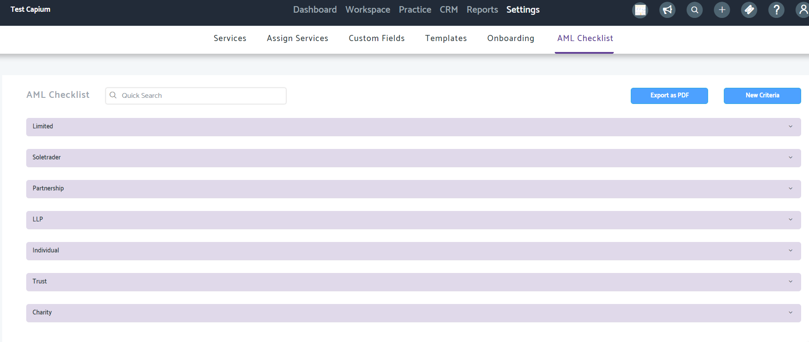
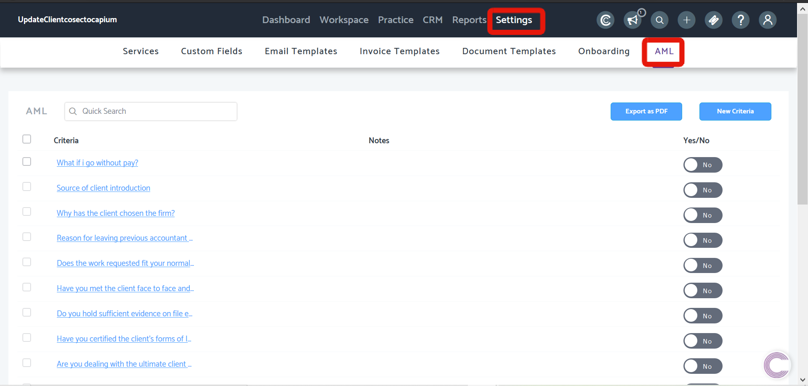
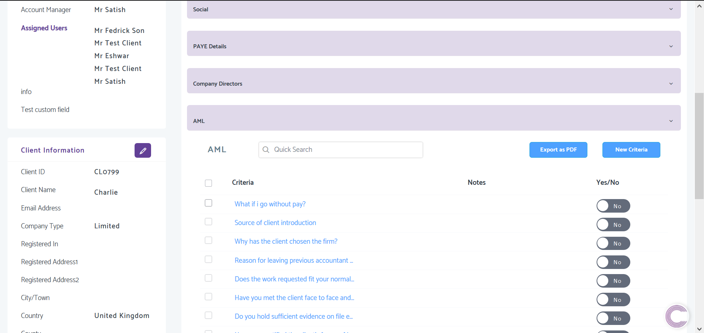

# AML/Risk Assessment Checklist
	 	
			
			Print

- **Folder:** Practice Management Help Guide
- **Source URL:** [https://capium.freshdesk.com/support/solutions/articles/9000195171-aml-risk-assessment-checklist](https://capium.freshdesk.com/support/solutions/articles/9000195171-aml-risk-assessment-checklist)
- **Article ID:** 9000195171

## Content

Solution home 
		Practice Management 
		Practice Management Help Guide

### AML/Risk Assessment Checklist

			Print

	Modified on: Thu, 5 Aug, 2021 at  3:15 PM

		Navigation: Practice Management > Settings > AML

Quick access link

Please click her for a video of the new AML checklist-July 2021

Help Guide

The built-in AML checklist is a feature designed to properly assess the potential risk of bringing on new clients. Once at the AML section.

This is separated into your different types of client, where you can use the default checklist or add custom fields.

You will find a list of various criteria which have been setup by default under each heading. However, you are able to completely customise and change based on your preference.

Once here, you will need to set up 'Criteria' which represent the checks/items which need to have been done for a client to pass this assessment. Click 'New Criteria' to begin adding the various criteria for new clients or click on the writing to edit the existing criteria. The Yes/No column represents if the client has passed a particular criteria and you can toggle that on/off.

Note: Any changes made here will apply to all clients however, you can go into a client workspace to change any of the criteria if you need to (see above)

										Did you find it helpful?
								Yes
								No

Send feedback	Sorry we couldn't be helpful. Help us improve this article with your feedback.

## Images & Screenshots (3)

