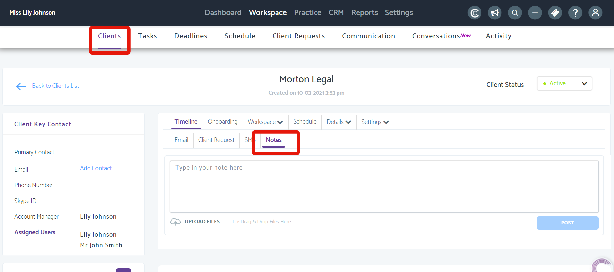
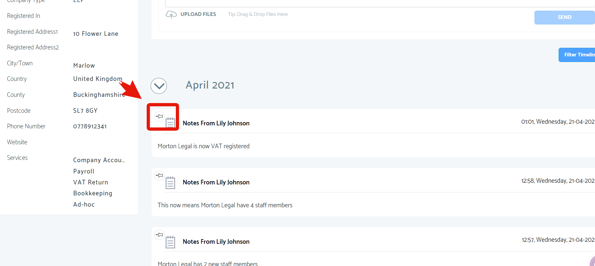
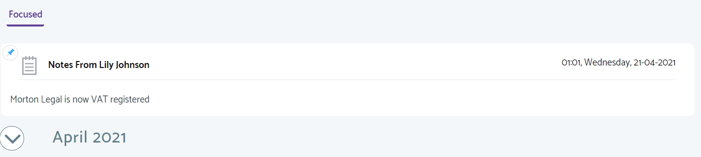

# How to pin notes to a clients timeline in Practice Management
	 	
			
			Print

- **Folder:** Practice Management Help Guide
- **Source URL:** [https://capium.freshdesk.com/support/solutions/articles/9000201273-how-to-pin-notes-to-a-clients-timeline-in-practice-management](https://capium.freshdesk.com/support/solutions/articles/9000201273-how-to-pin-notes-to-a-clients-timeline-in-practice-management)
- **Article ID:** 9000201273

## Content

Solution home 
		Practice Management 
		Practice Management Help Guide

### How to pin notes to a clients timeline in Practice Management

			Print

	Modified on: Wed, 21 Apr, 2021 at  2:36 PM

		Click here to watch how to pin notes to a clients timeline

My Admin Navigation: Practice Management >> Workspace >> Clients>>click on a client>> Timeline>> Notes

Help/Guide

We're thrilled to release our new feature in Practice Management allowing you to pin notes to a clients timeline.

Please click on clients in practice management. Then click on a client you would like to add a note too. 

Click on Timeline then click Notes

Add the note you would like to add.

Head back to the main timeline and you will see your notes below the date reading.

To pin the note to the top of screen press the pin picture 

Once clicked, the note will be displayed under Focused notes

You can pin multiple notes under Focused notes.

You can unpin a note by unclicking the pin icon again.

										Did you find it helpful?
								Yes
								No

Send feedback	Sorry we couldn't be helpful. Help us improve this article with your feedback.

## Images & Screenshots (3)

