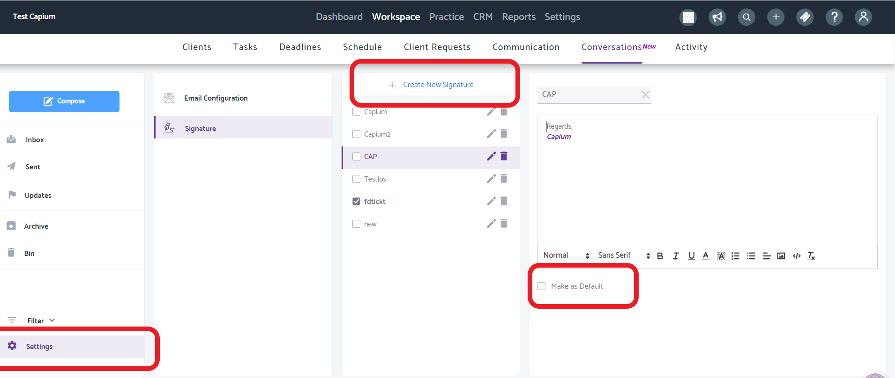
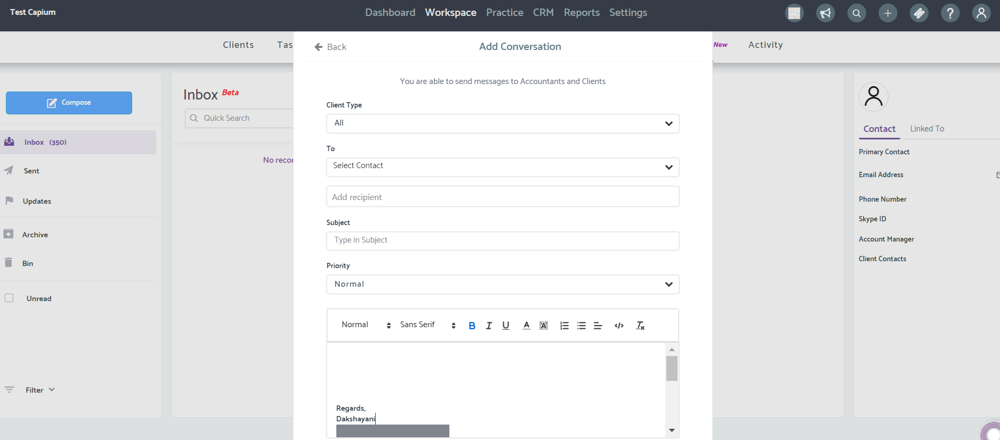
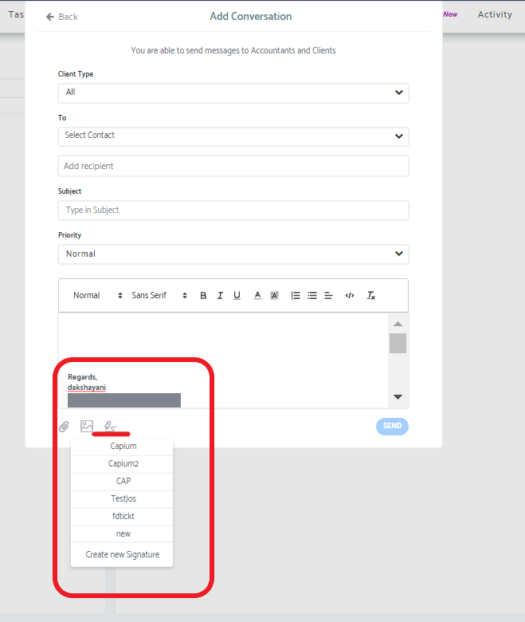
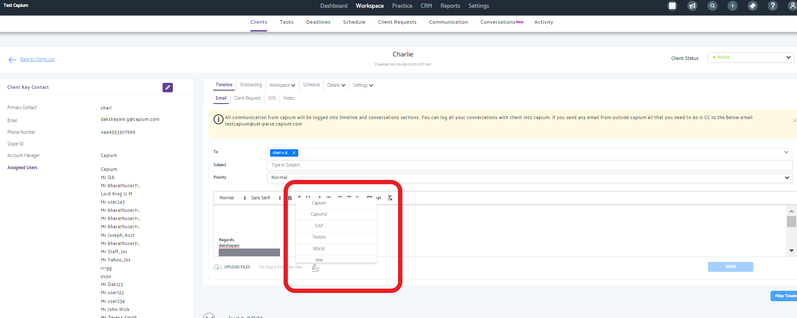

# How to add an email signature in Conversations in Practice Management
	 	
			
			Print

- **Folder:** Practice Management Help Guide
- **Source URL:** [https://capium.freshdesk.com/support/solutions/articles/9000203130-how-to-add-an-email-signature-in-conversations-in-practice-management](https://capium.freshdesk.com/support/solutions/articles/9000203130-how-to-add-an-email-signature-in-conversations-in-practice-management)
- **Article ID:** 9000203130

## Content

Solution home 
		Practice Management 
		Practice Management Help Guide

### How to add an email signature in Conversations in Practice Management

			Print

	Modified on: Tue, 1 Jul, 2025 at  4:20 PM

		 Navigation: Practice Management > Workspace > Conversations > Settings

Click here to watch how to add and use an email signature 

Click here to see how to set up email conversations 

Help/Guide:

Please head to Conversations in Practice Management and click on settings in the bottom left corner

Click to create a new signature

You can copy and paste any pictures/wording you would like in the signature

You can create multiple signatures. However, please click Make as Default for the signature used the most often.

You can compose an email by clicking the blue compose button on the left.

The default signature will be automatically added. 

You will be able to change the signature by using the pen icon at the bottom of the pop up.

If not needed you can delete the signature.

You can email a client directly by going to Practice Management > Workspace > Clients > Select Client.

The default signature will appear in the email box.

By clicking on the pen icon you will be able to change the signature to another.

You can take off the signature by deleting the text

You can then proceed with sending the email.

										Did you find it helpful?
								Yes
								No

Send feedback	Sorry we couldn't be helpful. Help us improve this article with your feedback.

## Images & Screenshots (4)

