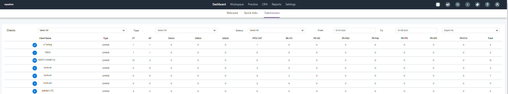
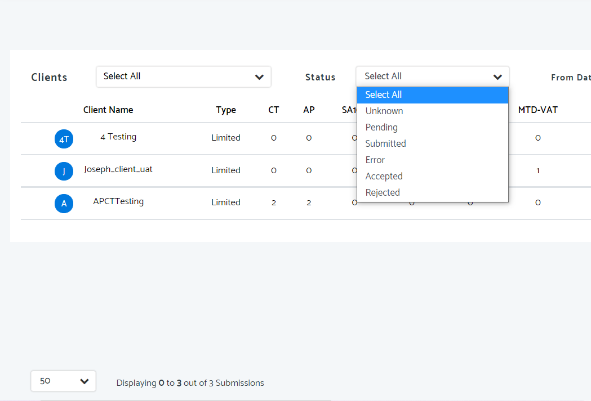
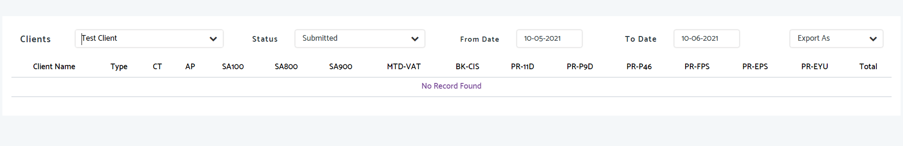

# Submissions Summary in Practice Management
	 	
			
			Print

- **Folder:** Practice Management Help Guide
- **Source URL:** [https://capium.freshdesk.com/support/solutions/articles/9000203137-submissions-summary-in-practice-management](https://capium.freshdesk.com/support/solutions/articles/9000203137-submissions-summary-in-practice-management)
- **Article ID:** 9000203137

## Content

Solution home 
		Practice Management 
		Practice Management Help Guide

### Submissions Summary in Practice Management

			Print

	Modified on: Tue, 10 Aug, 2021 at  2:12 PM

		Navigation: Practice Management > Dashboard> Submissions

Please click here to watch a video on the submissions summary

Help/Guide:

Now when you click onto Practice Management and Dashboard you will see a new tab with the name Submissions.

This is a summary of all submissions which have been made through the Capium software.

For example, if  1 EPS submission has been submitted in Capium payroll for a client. This will be displayed here with no further action required.

Clients will be shown in alphabetical order

You can change the submission status in the dropdown box shown

You can also select the type of client (either sole trader/individual/limited/partnership/LLP/trust/charity)

You can change the from and to dates.

You can also download this to PDF and CSV

If a client has no submissions the following screen will be shown

										Did you find it helpful?
								Yes
								No

Send feedback	Sorry we couldn't be helpful. Help us improve this article with your feedback.

## Images & Screenshots (3)

