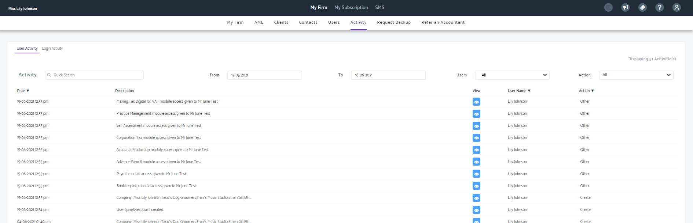
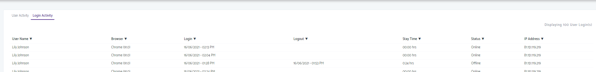
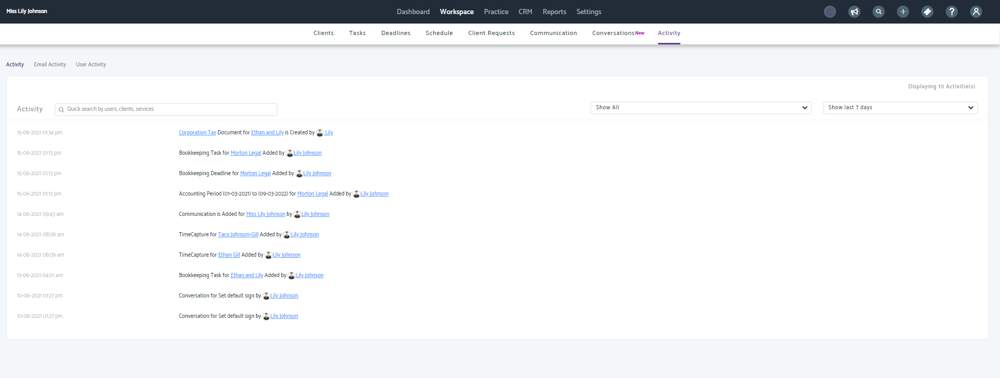

# How to view your users activity in My Admin and Practice Management
	 	
			
			Print

- **Folder:** Practice Management FAQs
- **Source URL:** [https://capium.freshdesk.com/support/solutions/articles/9000203352-how-to-view-your-users-activity-in-my-admin-and-practice-management](https://capium.freshdesk.com/support/solutions/articles/9000203352-how-to-view-your-users-activity-in-my-admin-and-practice-management)
- **Article ID:** 9000203352

## Content

Solution home 
		Practice Management 
		Practice Management FAQs

### How to view your users activity in My Admin and Practice Management

			Print

	Modified on: Wed, 16 Jun, 2021 at  4:21 PM

		Please click here to watch how to view user activity 

Please click here to find out how to add a user

In My Admin

Location: My Admin > My Firm > Activity

Help/Guide:

Once in My Admin, click activity from the top work bar

Here you can click between user activity and login activity

Under User Activity

You will be able to see the My admin activities which have been added or created by users (for example access permissions)

you can user the search bar in the top right to search for a specific event
you can change the dates
you can search for a specific user activity in the drop down
Under action, you can select deletion, creation, updates or other activities
Under Login Activity

You will be able to see the latest 100 logins by your users of the:

 Time of login
 Browser used to login
 Amount of time on the system

In Practice Management

Location: Practice Management > Workspace > Activity

Help/Guide:

You can view an activity guide in Practice Management for actions performed in Practice Management

Here you can see detailed activity under the following headings

Activity
Shows all activity from users of Practice Management

Email Activity
This shows automated emails as well as emails created through conversations

User Activity
Shows when users have logged in and out

										Did you find it helpful?
								Yes
								No

Send feedback	Sorry we couldn't be helpful. Help us improve this article with your feedback.

## Images & Screenshots (3)

