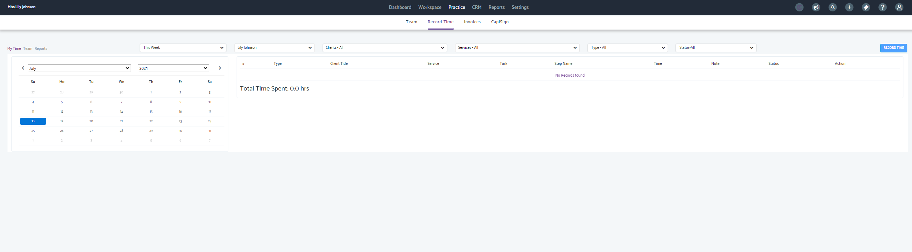
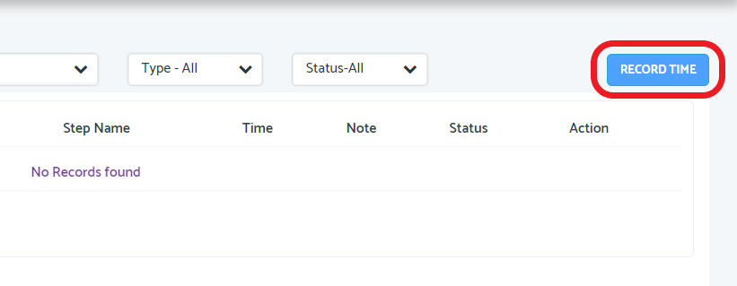
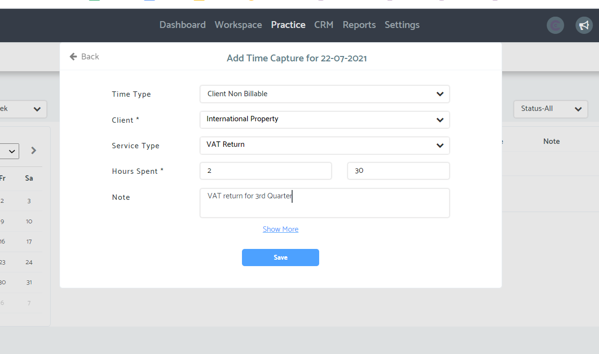
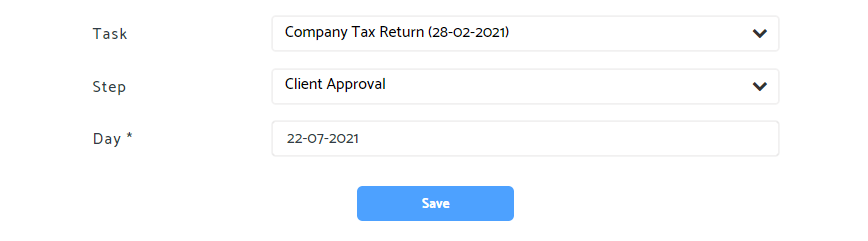
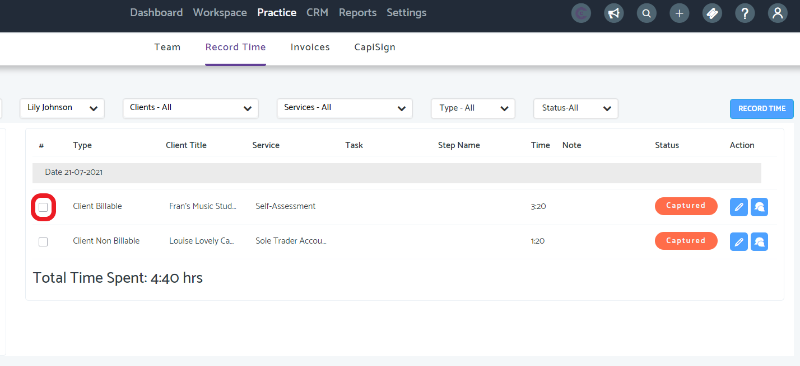
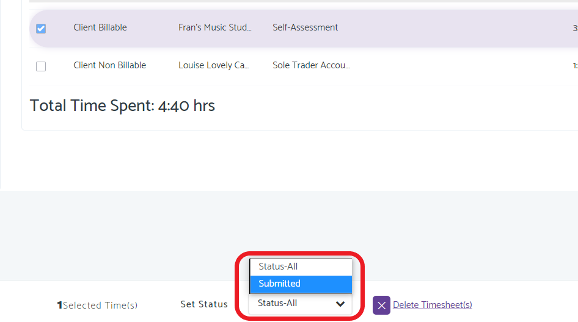
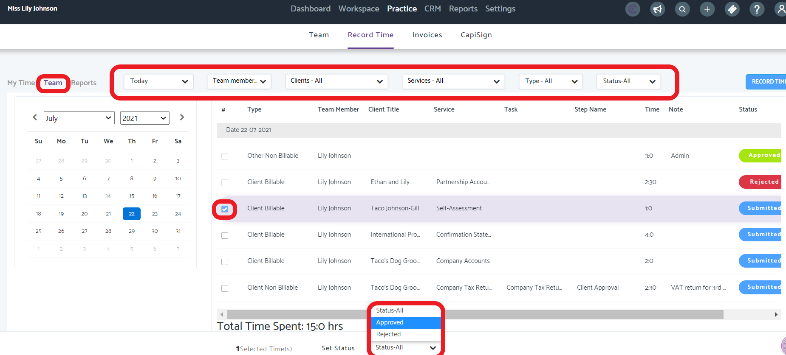
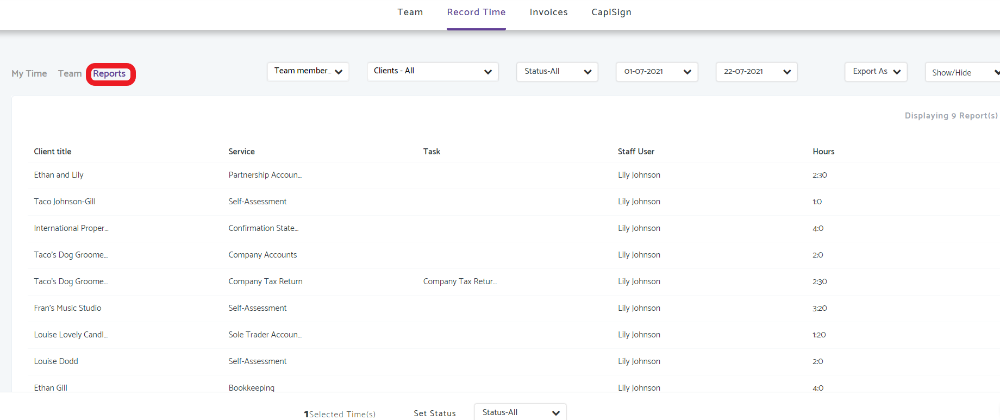
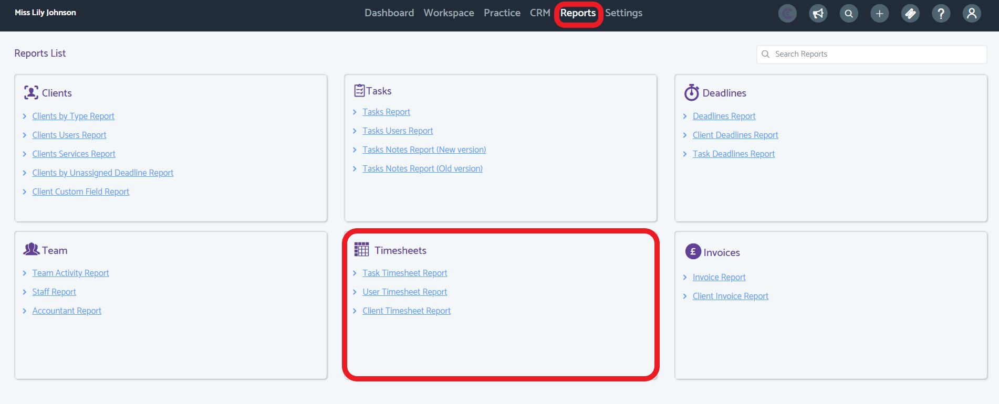
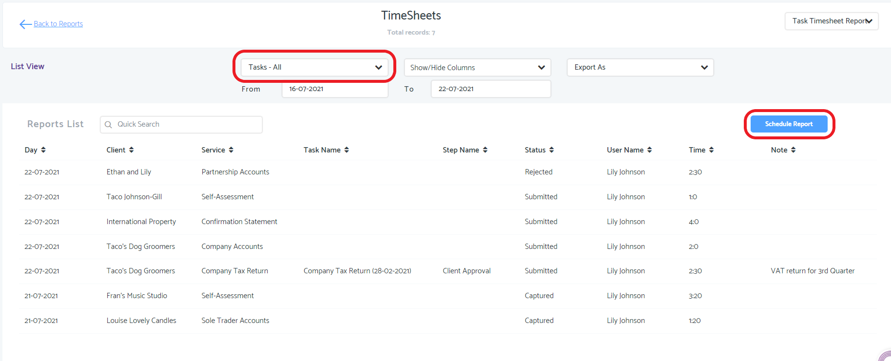

# Recording Time and Timesheets
	 	
			
			Print

- **Folder:** Practice Management Help Guide
- **Source URL:** [https://capium.freshdesk.com/support/solutions/articles/9000204723-recording-time-and-timesheets](https://capium.freshdesk.com/support/solutions/articles/9000204723-recording-time-and-timesheets)
- **Article ID:** 9000204723

## Content

Solution home 
		Practice Management 
		Practice Management Help Guide

### Recording Time and Timesheets

			Print

	Modified on: Thu, 22 Jul, 2021 at  5:12 PM

		Navigation - Practice Management >> Practice  >> Record Time

Please click here to watch how to record time and create timesheets

Help/Guide 

You and your staff members can record their time to either Client Billable, Non Client Billable or Other Non Billable

You can create timesheets as reports and autogenerate these

Only the individual staff members can record their own time. The Super Accountant is the only account which can approve time

Please head to practice management and then click on practice, and then record time

To record time please click on the blue button

The following pop up will appear, please fill in the information as necessary 

This will automated to the date of entry. To change the date of entry to a previous date, please click show more

Furthermore, clicking on show more you will be able to connect the time capture to a task, and the step of the task.

Please then click save

This will then live as captured in the list shown below

Captured time can be edited by using the pencil icon, and deleted by selecting the check box

To submit your time, check the check box circled below

Please set the status to submitted to send your time to your Super Accountant

Super Accountant Approval

Please click the team button, which is next to My Time,

Here you will be able to see all team members (and your own) submitted time

You can click on the checkboxes to accept or reject time at the bottom

Please note the dropdown boxes at the top where you can change the headings.

The Reports section allows you to create a report (PDF or CSV) download of the time captured, submitted, rejected and accepted time

Report-Timesheets

To get a timesheet or more detailed report please head to Reports > Timesheets

There are three categories

Task timesheet
User timesheet
Client timesheet
These timesheets will show all non approved time

Entering the task timesheet report:

You can specify a task, or set to all

You can export to CSV, Excel or PDF

As with all the reports these can be scheduled to automatically be emailed to you and your colleagues 

Please click here to find out more about reports and scheduling reports

										Did you find it helpful?
								Yes
								No

Send feedback	Sorry we couldn't be helpful. Help us improve this article with your feedback.

## Images & Screenshots (10)

