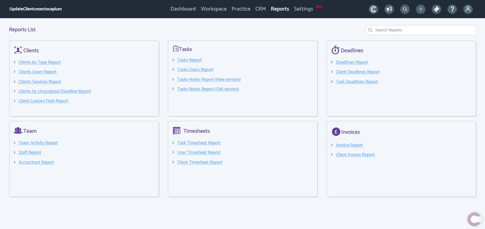
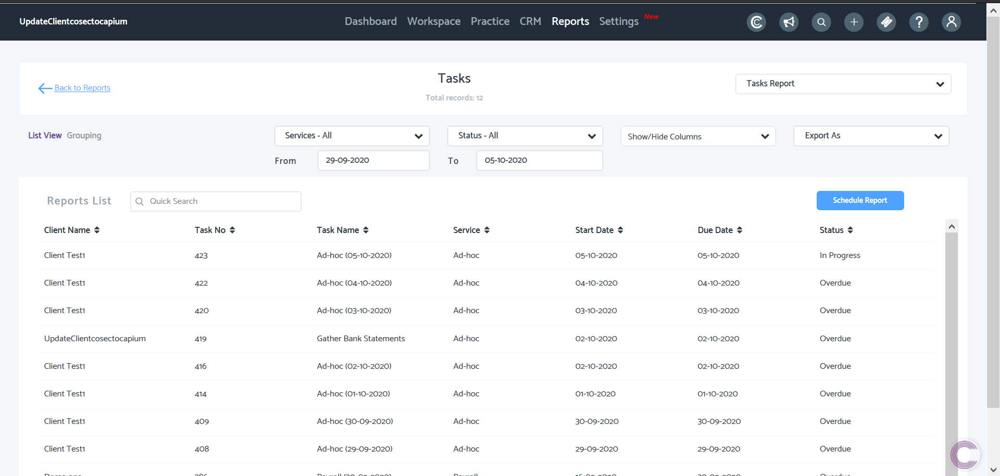
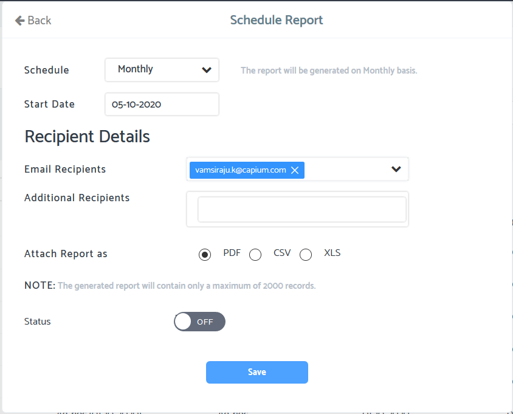

# How to view Reports in Practice Management
	 	
			
			Print

- **Folder:** Practice Management Help Guide
- **Source URL:** [https://capium.freshdesk.com/support/solutions/articles/9000207051-how-to-view-reports-in-practice-management](https://capium.freshdesk.com/support/solutions/articles/9000207051-how-to-view-reports-in-practice-management)
- **Article ID:** 9000207051

## Content

Solution home 
		Practice Management 
		Practice Management Help Guide

### How to view Reports in Practice Management

			Print

	Modified on: Thu, 14 Oct, 2021 at  5:12 PM

		Navigation: Practice Management > Reports

Refer to the link

Video Tutorial:

Click here to watch how to view reports in Practice Management

Help/Guide

Head to the Reports section using the navigation above. Once there, you will find 6 report categories: 

1. Clients

2. Tasks

3. Deadlines

4. Team

5. Timesheets

6. Invoices

Each report category will have a minimum of 2 sub categories which can be viewed - click on any line item to view the detailed report. Using the below example (Task Report) this will give you a complete overview of all tasks based on the filters setup at the top of the page.

You also have the option to export any report as CSV, XLS or PDF using the Export As option shown below.

Schedule Report

Within any report, you have the option to set up a Schedule so that reports can be sent to you automatically based on desired schedule. In any report, click the 'Schedule Report' button where you will be presented with the below interface. Go through the options available and set up as desired, then change the status to on and Save.

										Did you find it helpful?
								Yes
								No

Send feedback	Sorry we couldn't be helpful. Help us improve this article with your feedback.

## Images & Screenshots (3)

