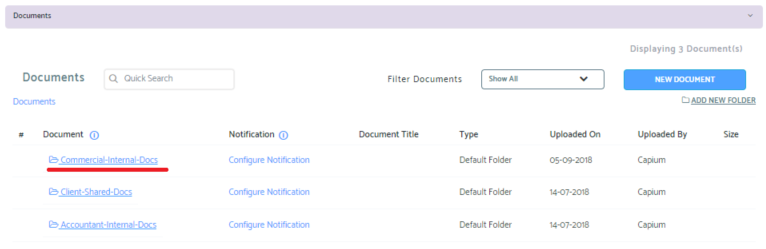
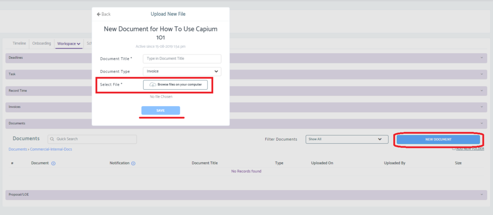
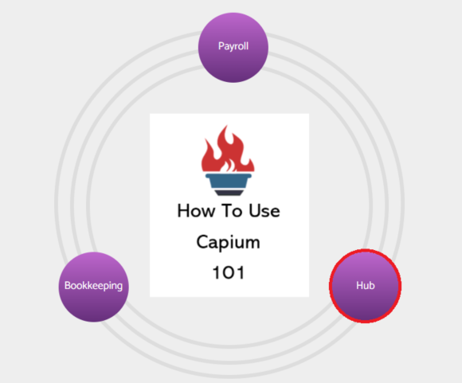
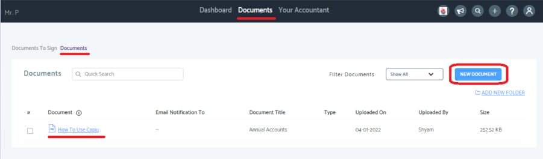
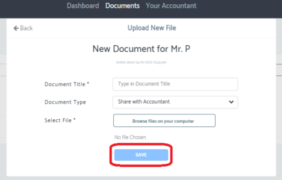

# Document Sharing &amp; Storage for Accountants and Clients
	 	
			
			Print

- **Folder:** Practice Management Help Guide
- **Source URL:** [https://capium.freshdesk.com/support/solutions/articles/9000209740-document-sharing-storage-for-accountants-and-clients](https://capium.freshdesk.com/support/solutions/articles/9000209740-document-sharing-storage-for-accountants-and-clients)
- **Article ID:** 9000209740

## Content

Solution home 
		Practice Management 
		Practice Management Help Guide

### Document Sharing & Storage for Accountants and Clients

			Print

	Modified on: Wed, 25 May, 2022 at  2:48 PM

		Location:

Practice Management > Select client > Client workspace > Documents

Video Tutorials:

How to create a client user

Help Guide:

There are 3 ways of storing a document in Capium:

Client Shared document = Use this folder when a file needs to be shared with a client. 

Commercial Internal Documents = Use this folder when storing documents that is accessible by any user who has access to the client.

Accountant document sharing = Use this folder to share documents that can only be seen by Accountant users

To store a document, select the folder where it needs to be saved.

Select 'New Document' and add the required information.

Where do clients see the shared documents / How can they share documents ?

In order for your clients to access the files you've shared with them, you must ensure they've been created as a user on the system. 

Once they have access to their account, navigate to Hub > Documents 

Clients will have access to all documents saved in the client shared folder.

Clients can share documents to accountants by clicking on 'New Document' and adding the information accordingly.

Any files that have been shared by a client will appear in the client shared folder 

										Did you find it helpful?
								Yes
								No

Send feedback	Sorry we couldn't be helpful. Help us improve this article with your feedback.

## Images & Screenshots (5)

