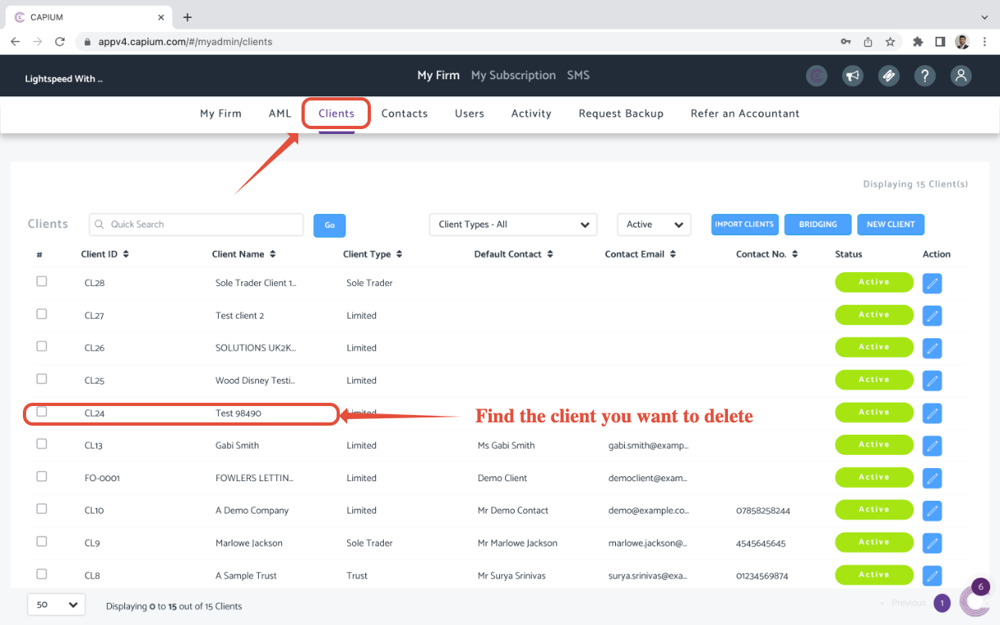
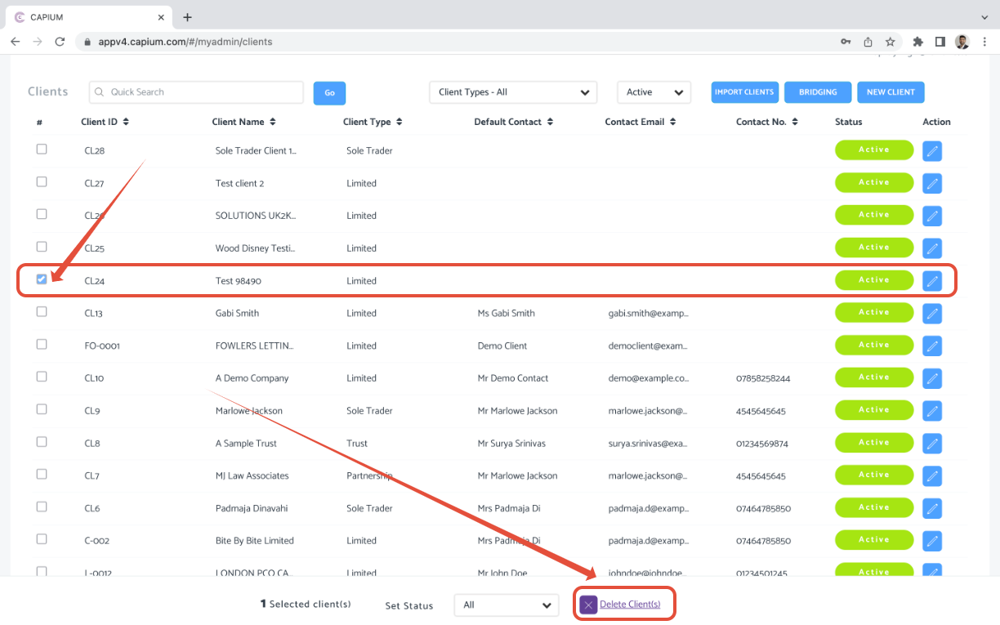
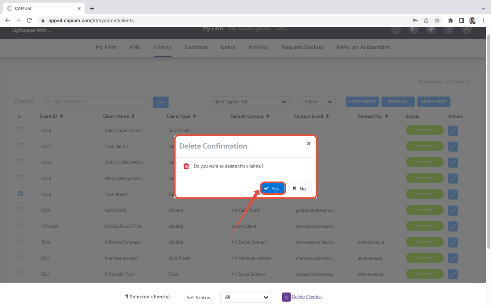
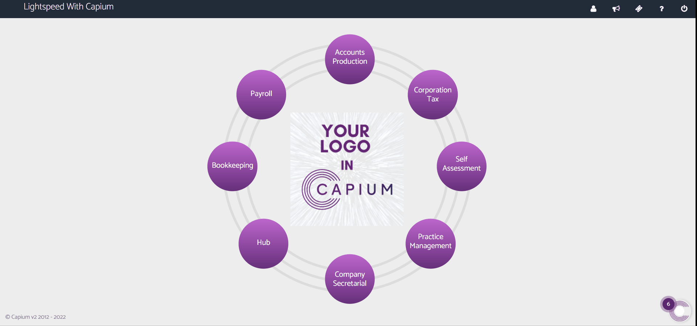

# How to delete a client
	 	
			
			Print

- **Folder:** Practice Management Help Guide
- **Source URL:** [https://capium.freshdesk.com/support/solutions/articles/9000214656-how-to-delete-a-client](https://capium.freshdesk.com/support/solutions/articles/9000214656-how-to-delete-a-client)
- **Article ID:** 9000214656

## Content

Solution home 
		Practice Management 
		Practice Management Help Guide

### How to delete a client

			Print

	Modified on: Wed, 27 Apr, 2022 at 11:37 PM

		Please Note - 

When deleting any data, please consider downloading any relevant reports, ledgers as necessary. Data can't be retrieved once deleted. 

Navigation: My Admin >> Clients >> Find 

Alternatively, please click here and you will be redirected to the page

Once you navigate to the client page, you can choose the client that you want to delete. 

Click on the box on the left hand side of the client details as shown below, this will bring up a prompt on the bottom of your screen (as shown in the screen shot below).

Once you click on delete, then you have you will get a confirmation where you'll have to select 'yes' to delete the client.

The the above steps in the form of a video below.

										Did you find it helpful?
								Yes
								No

Send feedback	Sorry we couldn't be helpful. Help us improve this article with your feedback.

## Images & Screenshots (4)

