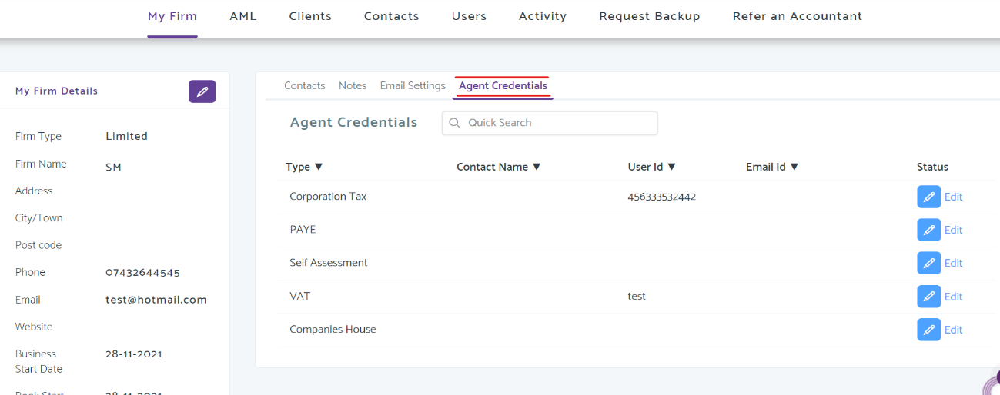
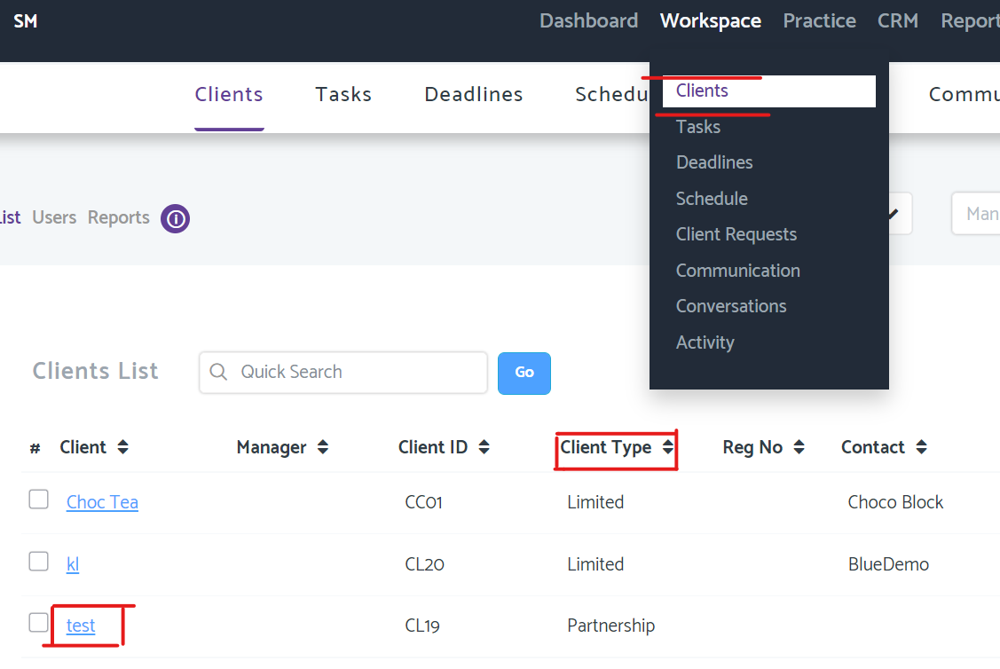
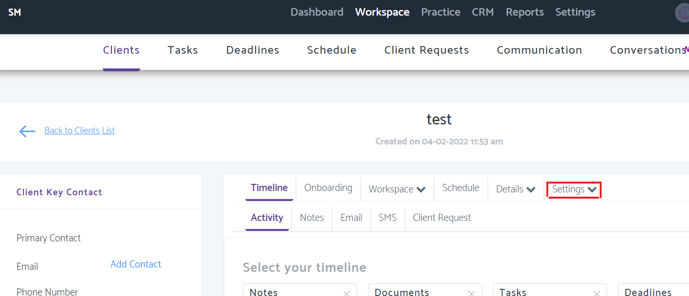
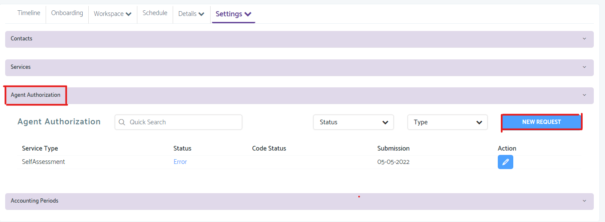

# 64-8 - Authorise a tax agent
	 	
			
			Print

- **Folder:** Practice Management Help Guide
- **Source URL:** [https://capium.freshdesk.com/support/solutions/articles/9000214943-64-8-authorise-a-tax-agent](https://capium.freshdesk.com/support/solutions/articles/9000214943-64-8-authorise-a-tax-agent)
- **Article ID:** 9000214943

## Content

Solution home 
		Practice Management 
		Practice Management Help Guide

### 64-8 - Authorise a tax agent

			Print

	Modified on: Fri, 6 May, 2022 at  5:20 PM

		Use the 'Authorising your agent (64-8)' form to tell HMRC that you give authorisation for someone to act on your behalf for individual or business tax affairs.

Step 1: Ensuring your required agent details are entered into Capium.

From the Home menu along the right: Click to open My Admin > Within my firm select agent credentials > Click the edit option to add in the agent credentials. (Display Image below)

Step 2: Preparing and filing the 64-8

Click the Capium Logo to open the menu > Open Practice manager > Select workspace along the top > Dropdown menu select clients > Click on the client/s name (blue highlight)-(Image Below).

Capium 64-8 is suitable for all Client types:

Below is the client menu from where the settings option will display > Click Agent Authorization to open the window to enable a new request to HMRC. (Images below)

Step 3: Client details

Ensure you have entered the following required information into ‘Client details’ in admin/Practice manager. Note that data marked * and the Client’s Code are the only data sent VIA Online submission.
IndividualsUnique Taxpayer Reference (UTR)* & National Insurance Number (NINO)*
Name & address/postcode*

CompaniesUTR* & Company Registration Number (CRN)*
Company name & registered office address/postcode*
Associated directors, secretaries, etc via ‘Relationships’

PartnershipsUTR
Partnership name & address/postcode
Associated partners, etc via ‘Relationships’

TrustsUTR
Settlor/Trustee name & address/postcode
Associated trustees etc via ‘Relationships’

Tax CreditsAs individuals above, plus joint claimant’s NINO if required

PAYEIn addition to the above, the PAYE reference & PAYE Office Code (employers only)

VATIn addition to the above, the VAT registration number

What happens after successful activation of the 64-8:

It can take up to 24 hours for a 64-8 related to an Individual to appear on your HMRC client list.
It can take up to 72 hours for a 64-8 related to a Limited Company to appear on your HMRC client list.
Note that you can still file the client’s SA100 or CT600 tax returns at any time.
Potential Issues faced:

1046 – Authentication Failure
 - 7001/7008 – Data does not match the error 

										Did you find it helpful?
								Yes
								No

Send feedback	Sorry we couldn't be helpful. Help us improve this article with your feedback.

## Images & Screenshots (5)

