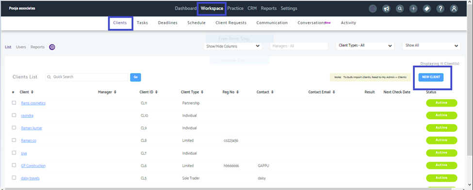
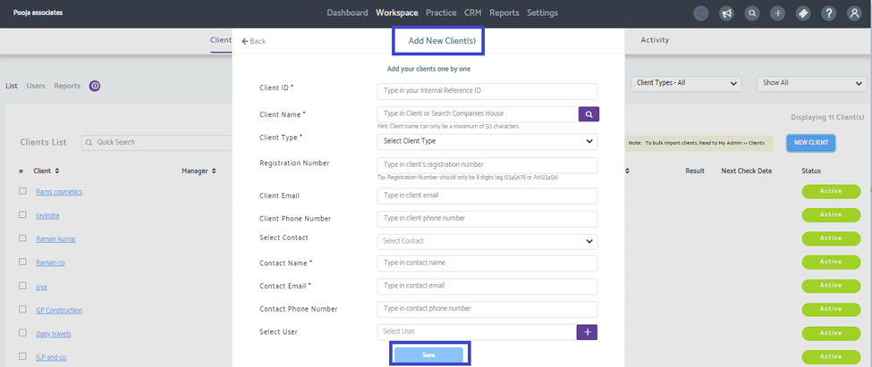

# Adding clients from the practice management module
	 	
			
			Print

- **Folder:** Practice Management Help Guide
- **Source URL:** [https://capium.freshdesk.com/support/solutions/articles/9000216489-adding-clients-from-the-practice-management-module](https://capium.freshdesk.com/support/solutions/articles/9000216489-adding-clients-from-the-practice-management-module)
- **Article ID:** 9000216489

## Content

Solution home 
		Practice Management 
		Practice Management Help Guide

### Adding clients from the practice management module

			Print

	Modified on: Tue, 9 Dec, 2025 at  6:37 PM

Navigation: Practice Management >> Workspace >> Clients. 

On right of the screen, click on the add new client button.

Alternatively please click on this link and you will be taken to the page.

Once done you can fill in the details for adding the new client as shown below and save.

										Did you find it helpful?
								Yes
								No

Send feedback	Sorry we couldn't be helpful. Help us improve this article with your feedback.

## Images & Screenshots (2)

