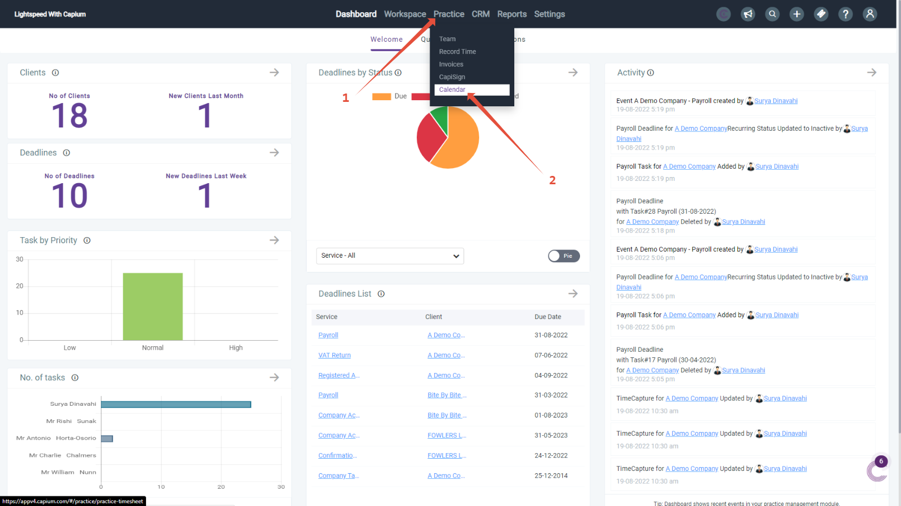
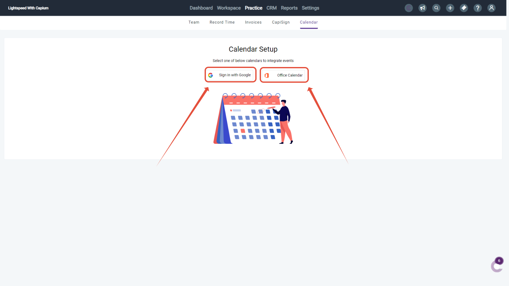
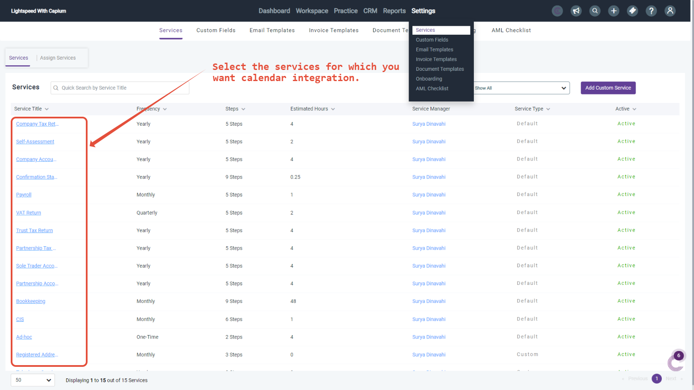
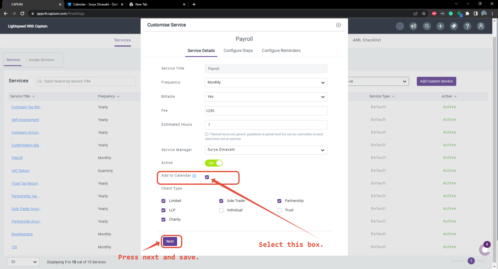
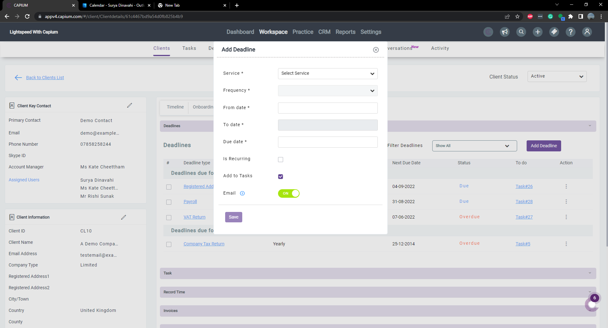

# Calendar Integration
	 	
			
			Print

- **Folder:** Practice Management Help Guide
- **Source URL:** [https://capium.freshdesk.com/support/solutions/articles/9000218653-calendar-integration](https://capium.freshdesk.com/support/solutions/articles/9000218653-calendar-integration)
- **Article ID:** 9000218653

## Content

Solution home 
		Practice Management 
		Practice Management Help Guide

### Calendar Integration

			Print

	Modified on: Fri, 16 Dec, 2022 at 10:48 AM

		Product Showcase

How to set up Calendar integration?

STEP 1 

Navigation: Practice Management >> Practice >> Calendar

Alternatively please click on this link to be redirected to the page. 

Please note that the current integration is with Google and Microsoft Office Calendars. 

Click and log into the Google/Microsoft calendar 

Please note that the reminders for the calendars events are auto-generated within your calendar are based on your Google or Microsoft Office account settings. 

Calendars are also unique to individual user accounts and are not shared across the organisation.

STEP 2 

Navigation: Practice Management >> Settings >> Services >> Select a service >> Add to Calendar 

Alternatively please click on this link. 

Please note that for any recurring services the calendar notifications will be added on from the next deadline. 

STEP 3 

Navigation: Practice Management >> Workspace >> Clients >> Select a company >> Add a deadline

Alternatively please click on this link.

You can add any deadlines and they will be populated in the synced calendar as well. 
This feature will not work on existing deadlines.
For existing recurring deadlines. The calendar will be updated in the next time an automatic reminder is generated within the system 

Key considerations: 

While adding the calendar integration and connecting to your work/personal calendar. The system will import all the deadlines with user approvals from within the system. 
All the auto-generated deadlines will be automatically added onto the Capium calendar. 
Although you can import your exiting data from your current calendar to Capium, you can't edit this data from Capium and you will need to make edits or remove the events from the source. 
Reminders are scheduled based on the setting of your existing calendar and Capium's integration can't edit the reminder schedules on your calendar. 
Once an event/deadline has been added it can't be deleted from Capium and you will need to delete it at the source. 

										Did you find it helpful?
								Yes
								No

Send feedback	Sorry we couldn't be helpful. Help us improve this article with your feedback.

## Images & Screenshots (5)

