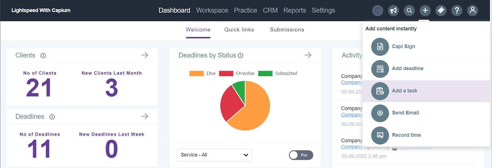

# Practice Management Quick Additions
	 	
			
			Print

- **Folder:** Practice Management Help Guide
- **Source URL:** [https://capium.freshdesk.com/support/solutions/articles/9000219857-practice-management-quick-additions](https://capium.freshdesk.com/support/solutions/articles/9000219857-practice-management-quick-additions)
- **Article ID:** 9000219857

## Content

Solution home 
		Practice Management 
		Practice Management Help Guide

### Practice Management Quick Additions

			Print

	Modified on: Fri, 30 Sep, 2022 at  2:38 PM

		Location: Practice Management module >> + Add (small icon on the top right-hand corner) >> Add content instantly.

The instant adding option enables practices to quickly add tasks,deadlines, contacts and clients. These options are also accessible in all the other screens of Practice Management. This “quick add” option will directly navigate to that section where you can easily fill the details and save. 

										Did you find it helpful?
								Yes
								No

Send feedback	Sorry we couldn't be helpful. Help us improve this article with your feedback.

## Images & Screenshots (1)

