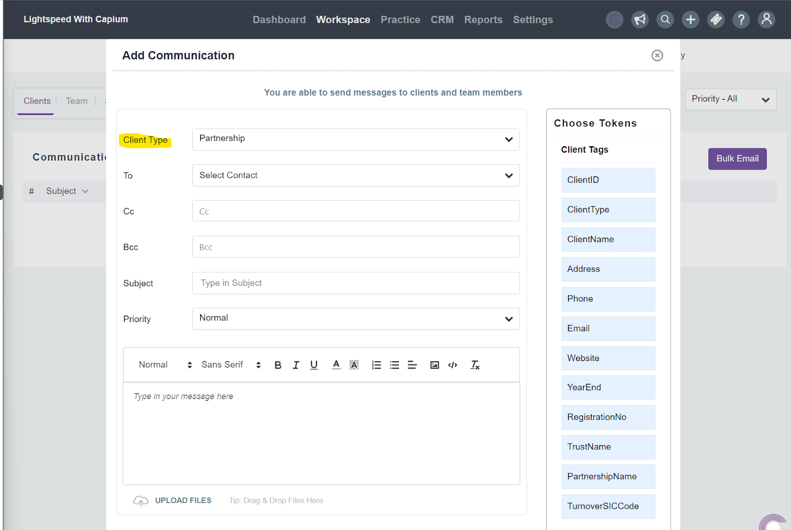
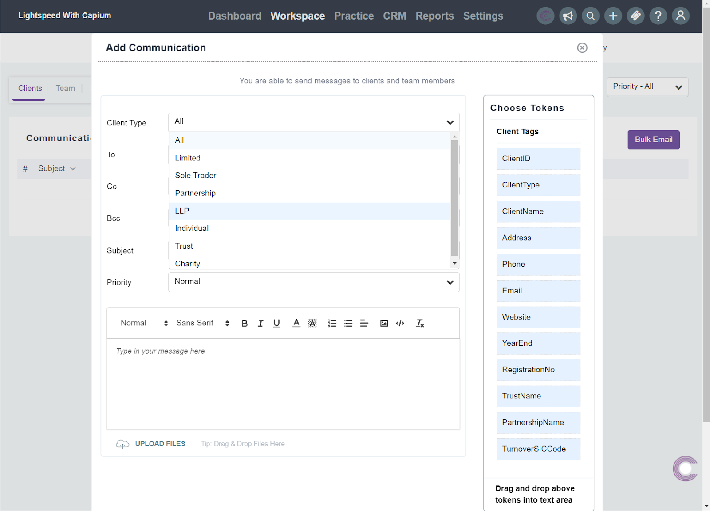

# Practice Management - Bulk email; Email tagging &amp; Client type filter
	 	
			
			Print

- **Folder:** Practice Management Help Guide
- **Source URL:** [https://capium.freshdesk.com/support/solutions/articles/9000224477-practice-management-bulk-email-email-tagging-client-type-filter](https://capium.freshdesk.com/support/solutions/articles/9000224477-practice-management-bulk-email-email-tagging-client-type-filter)
- **Article ID:** 9000224477

## Content

Solution home 
		Practice Management 
		Practice Management Help Guide

### Practice Management - Bulk email; Email tagging & Client type filter

			Print

	Modified on: Tue, 7 Mar, 2023 at  4:21 PM

		Navigation: Practice Management >>> Workspace>>> Communication>>> Bulk email

Help/Guide:

This guide will show you how to use the new bulk email additions which allow you to use the ‘Client Type’ filter to easily select the relevant clients to include in emails. Additionaly, there are now token tags to choose from too which will automically pick up the data corresponding to the tag.

Please navigate to the Workspace>Communication>Bulk email section.

As seen in the below image there are the new tokens on the right hand side which can be dragged and dropped into the email as needed into the email to customise it.

2.  Client Type Filter:

As seen in the below image, the client type filter can be used to easily differentiate between your client types and filter down to the particular clients you want to include in the bulk email.

										Did you find it helpful?
								Yes
								No

Send feedback	Sorry we couldn't be helpful. Help us improve this article with your feedback.

## Images & Screenshots (2)

