# Risk Assessment Checks
	 	
			
			Print

- **Folder:** Practice Management Help Guide
- **Source URL:** [https://capium.freshdesk.com/support/solutions/articles/9000235538-risk-assessment-checks](https://capium.freshdesk.com/support/solutions/articles/9000235538-risk-assessment-checks)
- **Article ID:** 9000235538

## Content

Solution home 
		Practice Management 
		Practice Management Help Guide

### Risk Assessment Checks

			Print

	Modified on: Tue, 30 Jan, 2024 at  5:09 PM

In Practice Management  practices are able to conduct the Risk Assessments onto their Clients on any frequency as per their desire. Every six months, year etc.

Permissions to Risk assessment 

Any member will be able to do the Risk Assessment once they are given permissions and permissions are given from My Admin

Navigation:  My Admin> Users

In the My Admin section navigate to Users 

Permission for Accountant User 

Navigation: Users>Accountant User 

In the Accountant user type, click on the 'Action' button and proceed to edit the Accountant user. Within the user permissions section, you can now designate the Accountant as the AML Officer

Please refer the Below Screenshots 

Permission for Staff Users

Navigation: Users> Staff Users type 

Within the Staff User, under User Permissions, click on Modules. Select AML under

Practice Management.

Now once allocated in My Admin Navigate to Practice Management

Navigation:  Settings> Risk Assessment 

Under this section you can find different sets of  criteria for different entities. 

Limited

Sole Trader

Partnership

Individual

Trust

Please Refer to the screenshots below.

Running Risk Assessment 

Navigation:  Risk assessment > Select particular Client> Limited

In this section, Capium provides predefined risk criteria for entities. 

Additionally, you have the option to add new criteria in the "New Criteria" section.

Running Risk Assessment Criteria

Navigate to Workspace, then click on Client, and select a specific client.

Go to Onboarding and select the Risk Assessment tab.

Please Refer to the screenshot below.

Navigation: Risk Assessment> Run Risk Assessment

Under this section  click on the Risk Assessment it gives the risk criteria which has been already  done in the settings section, here you need to select Yes/ No.

Also fill the criteria accordingly as per the risk level:

Enhanced

Low

Normal

Navigation: Risk Assessment Result

Under this section enter the following information:

Reference ID

Risk Level

Assessment date 

Next Assessment date

AML Officer

Notes 

Once you have filled the criteria finally you can proceed to the Risk Assessment

After completing this page, you'll encounter the screen below. 

Head to the action dropdown, where you can either View or Download the document. 

Please refer to the screenshots below for guidance.

Here it can be downloaded and saved for future reference.

Note: The document can be viewed and downloaded, and it's secure from deletion. 

For example, if a staff member completes a risk assessment, the AML officer can either approve or deny it.

										Did you find it helpful?
								Yes
								No

Send feedback	Sorry we couldn't be helpful. Help us improve this article with your feedback.

## Images & Screenshots (12)

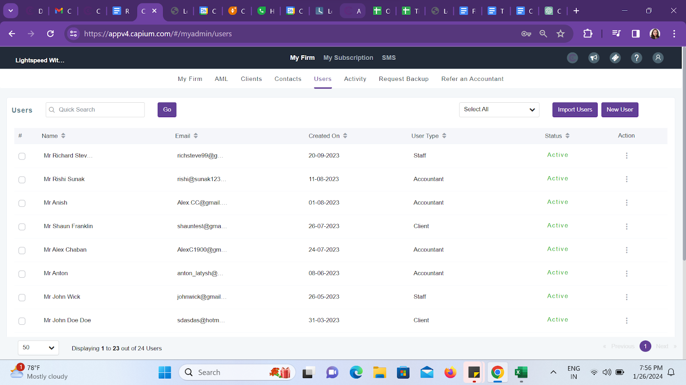

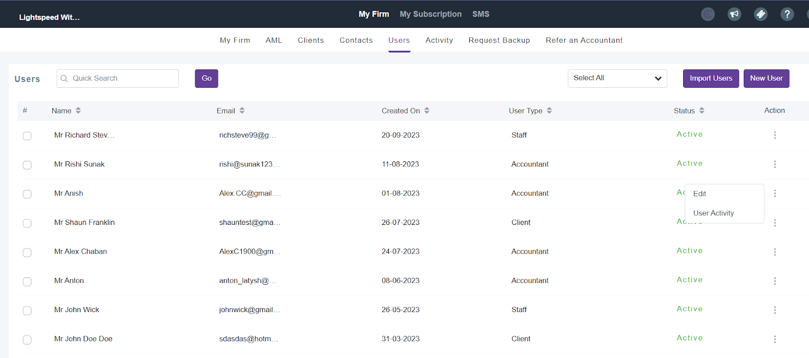

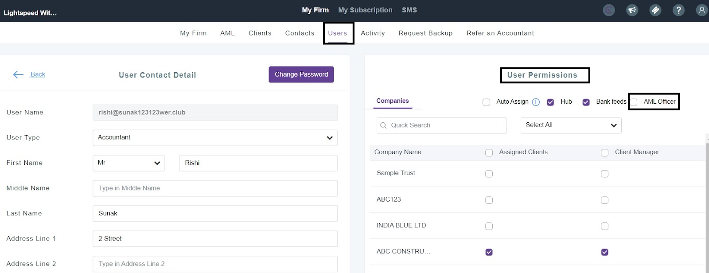

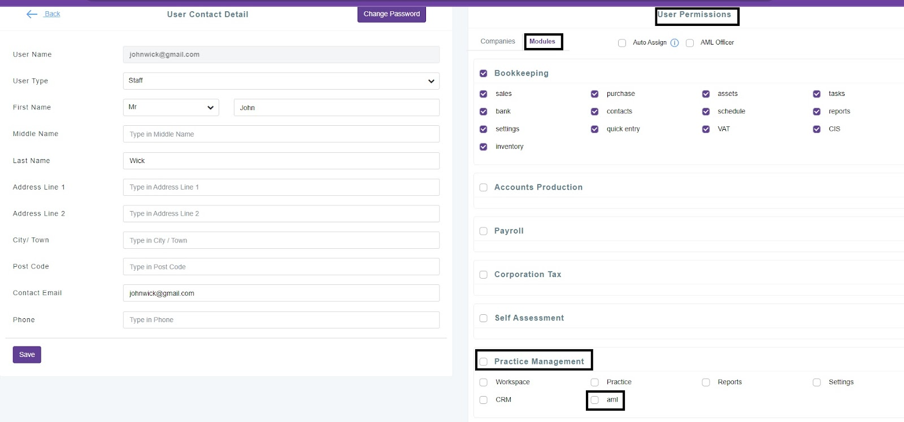

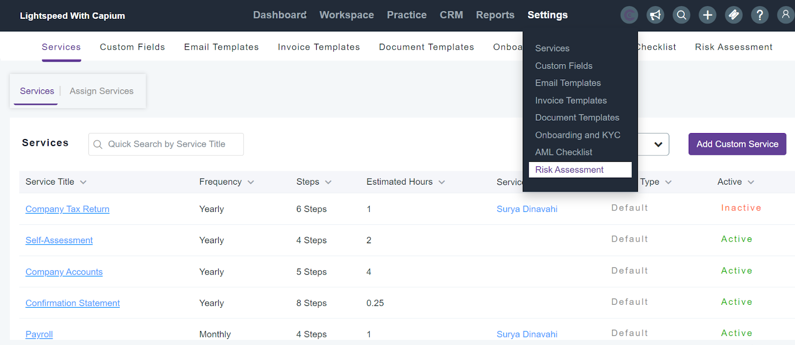

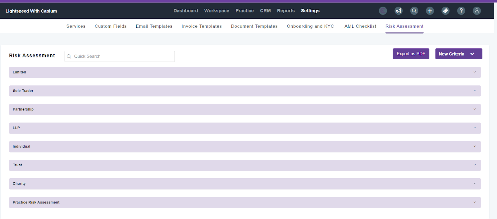

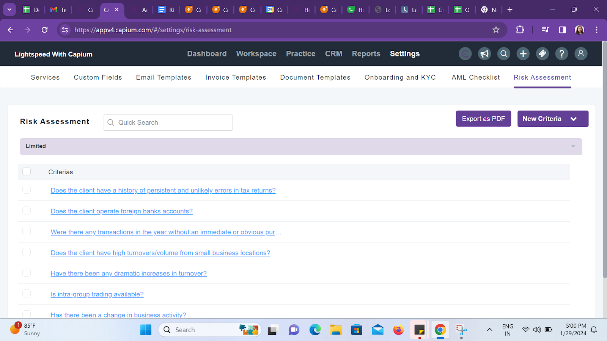

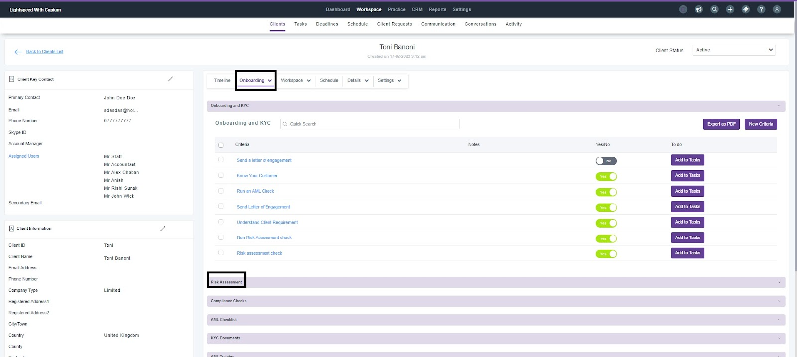

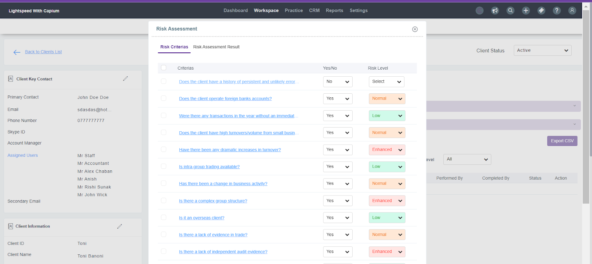

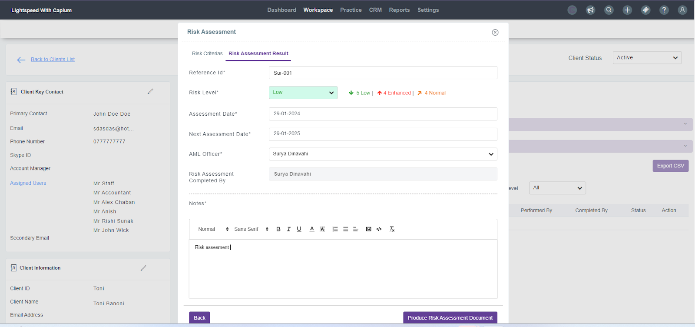

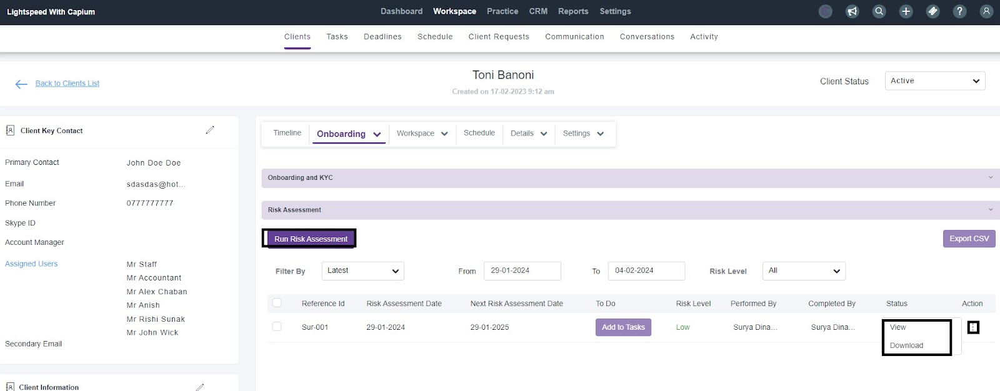

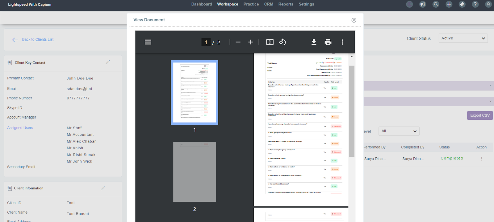

