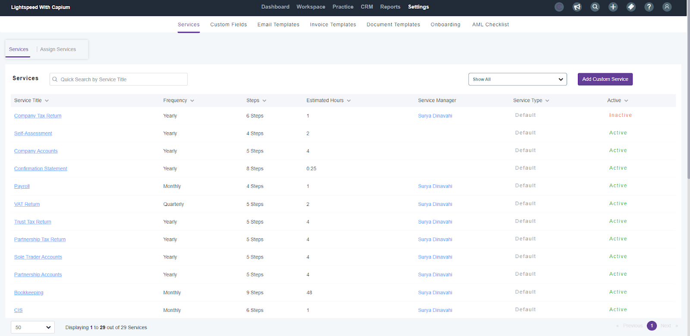
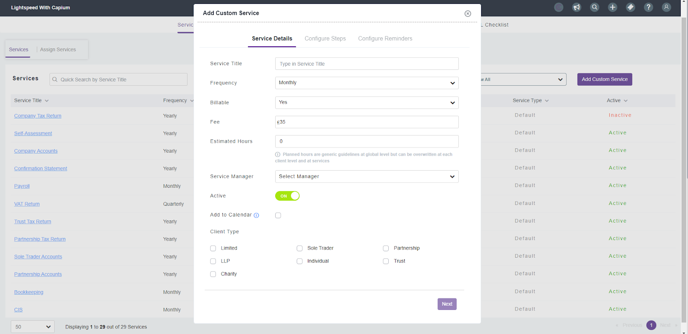
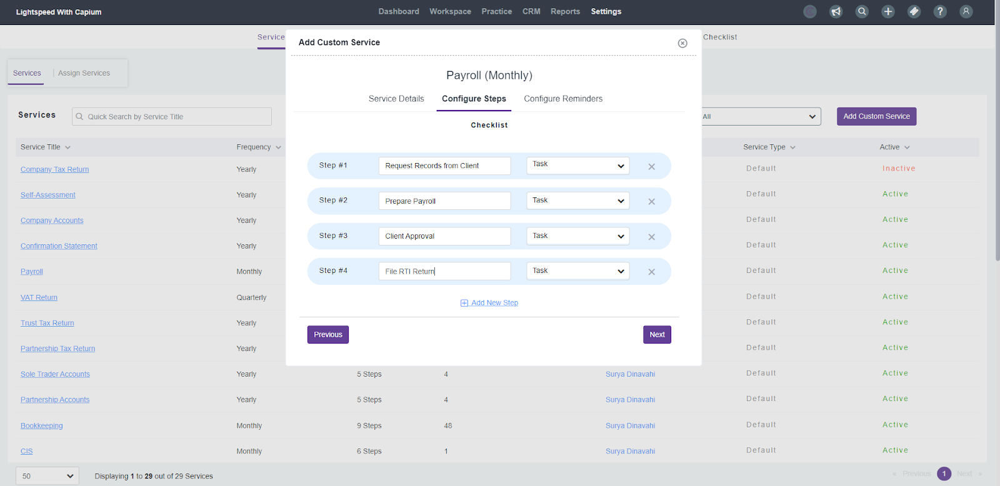
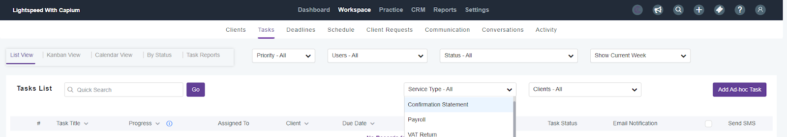
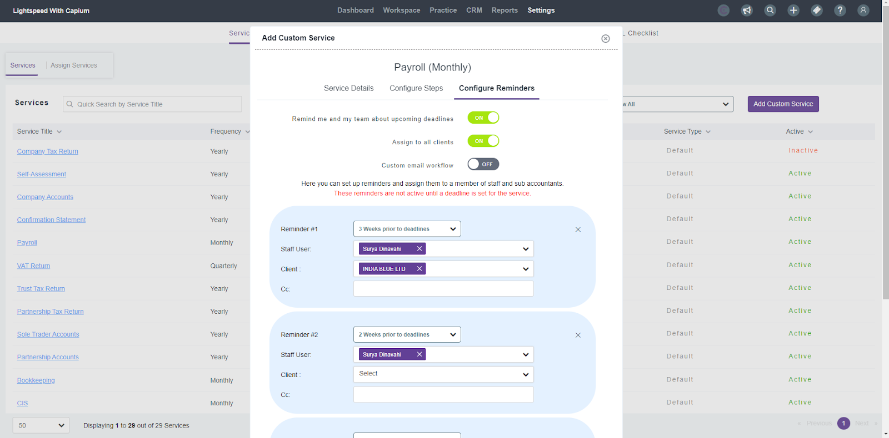
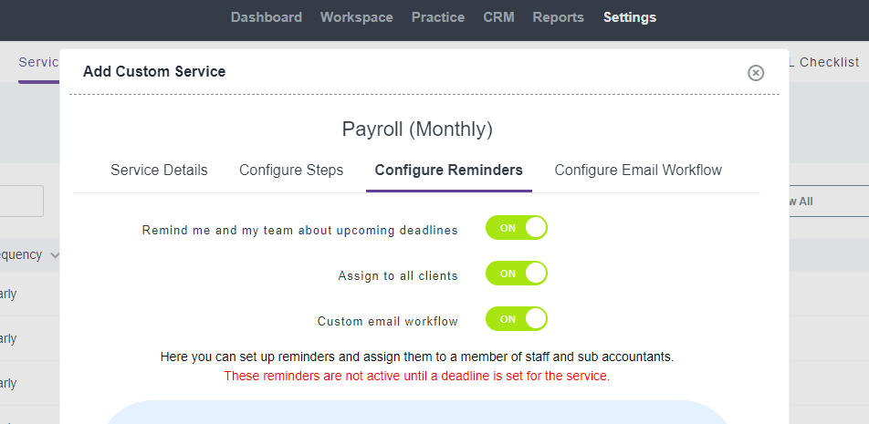
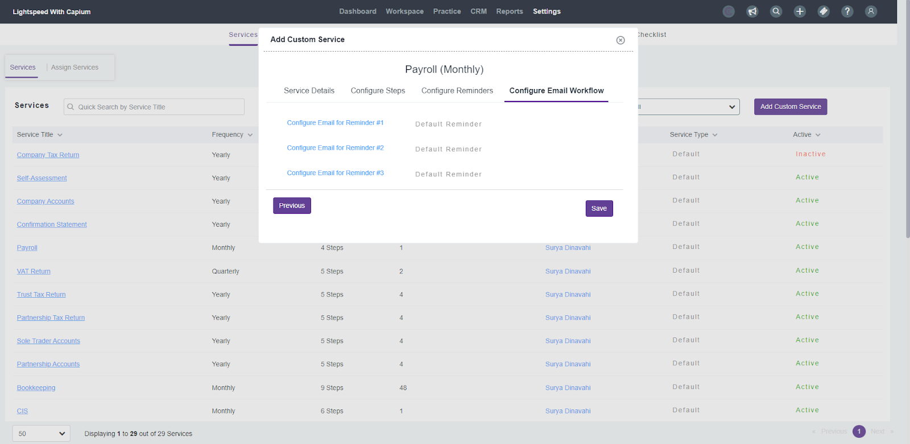
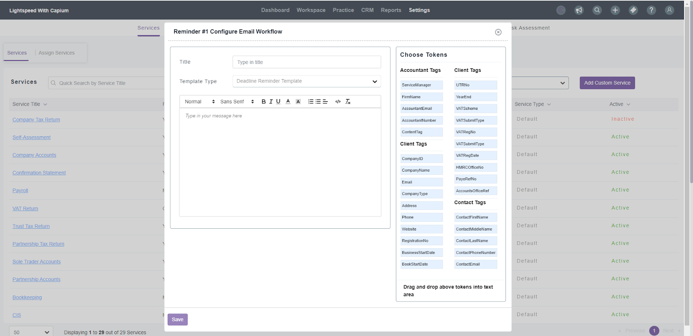
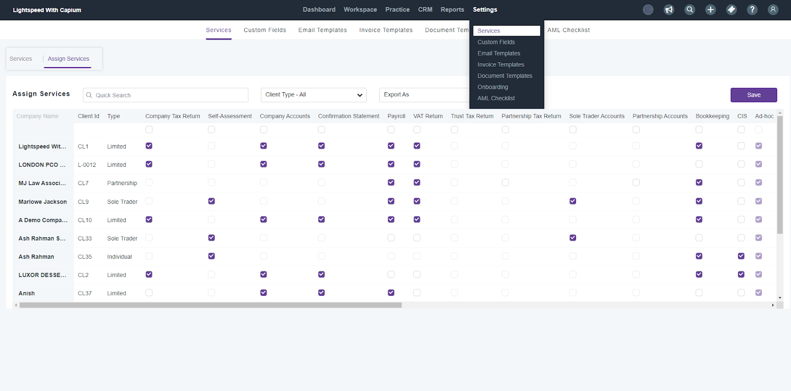
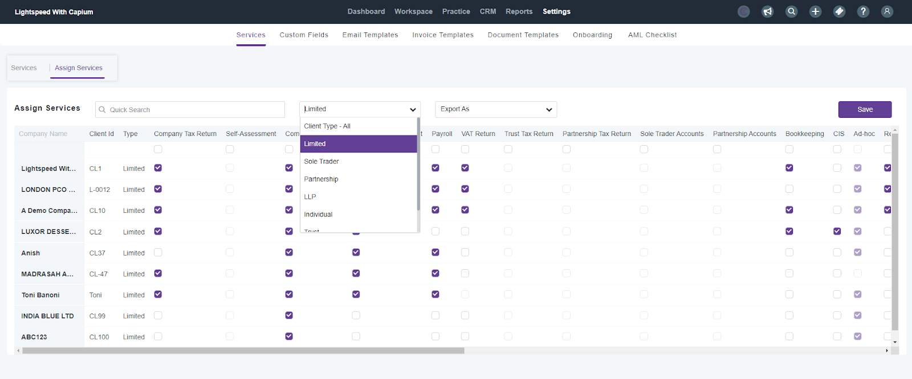

# How to setup services and assigning services to clients 
	 	
			
			Print

- **Folder:** Practice Management Help Guide
- **Source URL:** [https://capium.freshdesk.com/support/solutions/articles/9000235774-how-to-setup-services-and-assigning-services-to-clients-](https://capium.freshdesk.com/support/solutions/articles/9000235774-how-to-setup-services-and-assigning-services-to-clients-)
- **Article ID:** 9000235774

## Content

Solution home 
		Practice Management 
		Practice Management Help Guide

### How to setup services and assigning services to clients 

			Print

	Modified on: Mon, 3 Mar, 2025 at 11:56 AM

This article will provide a step-by-step guide on establishing the services you offer to your clients and demonstrating how to connect those services with them.

Setting up your Services

First step is to set up the services your practice will offer or already offer. The module has default services included. You can customise the information of these services by simply clicking the name of the service.

Navigation:  Practice Management > Settings > Services 

Click to redirect to the above navigation

Adding Custom Services

To add a custom service, begin by selecting 'Add Custom Service' on the left-hand side. The next step has been segregated into these following areas: 

Services Details

Configure Steps

Configure Reminders

Read the following for more information on these sections:

Service Details

Here you will add you service details, which start by populating the following areas: 

Service Title - Name of the service e.g. Payroll

Frequency - Shows the frequency of the service e.g. Monthly or Weekly

Billable - If the service is billable

Fee - The fee you are charging for the service

Estimated Hours - Planned hours which can be overwritten at each client level and at services

Service Manager - Assign a manager to this service

Active - Select whether you would like to activate or deactivate the service

Client Type - Select the client types you are offering this service to

Configure Steps

In the following section, you can set up the necessary steps or milestones associated with the service that need to be completed. See example below on how we configured the steps for a payroll service:

The checklist that you have created will automatically link with the ‘Tasks’ section under ‘Workspace’.

You can create as many steps as you require and click ‘Next’ when ready for the final step.

Configure Reminders

The final step when setting up your services is to configure reminders, where you custom reminders that can be created and sent out to notify both staff members and clients of an approaching deadlines.

Once you click the ‘configure reminders’ tab, you can send reminders to yourself and staff by selecting the relevant staff under the dropdown menu as well as send reminders to your clients by selecting the relevant client under the client dropdown menu. 

You also have the option to turn on/off these reminders for this particular service. You are able to create as many reminders as your service needs and customise the flow to suit your needs. 

Setting up Custom Email Workflow

Under ‘Configure Reminders’ you will have the option to create your email workflow. Once you have turned on ‘Configure Email Workflow’ it will show next to ‘Configure Reminder’, as shown below:

Once you have turn on your ‘Custom Email Workflow’. You will then be able to configure the workflow of your emails, which will then be sent out to your clients.

You can then proceed to design your email template for this specific service. To incorporate tags into the email, it's important to use the drag-and-drop method to place them in the appropriate section. 

Note: Please be aware that manually typing the tags directly into the template won't link them.

Assigning your Services to Clients

The next step will be to assign services to your clients, which can be done individually or bulk assign under the ‘Assign Services’ area. 

Navigation:  Practice Management > Settings > Services > Assign Services

Click to redirect to the above navigation

Once you have entered the ‘Assigned Services’ area, you will find your client list displayed on the left side of the screen, while the services you configured in the previous step will be visible at the top. To assign the services simply tick the checkbox(s).  You can also select the client type above the services, and bulk assign based on client type.

Congratulations! You've successfully configured your services and allocated them to your clients. If you encounter any issues or require further assistance, don't hesitate to reach out to your Onboarding Manager.

Related Articles:

Quick Guide: Getting started with Practice Management

Practice Management: Scheduling

Practice Management: Set-up Tasks

										Did you find it helpful?
								Yes
								No

Send feedback	Sorry we couldn't be helpful. Help us improve this article with your feedback.

## Images & Screenshots (10)

