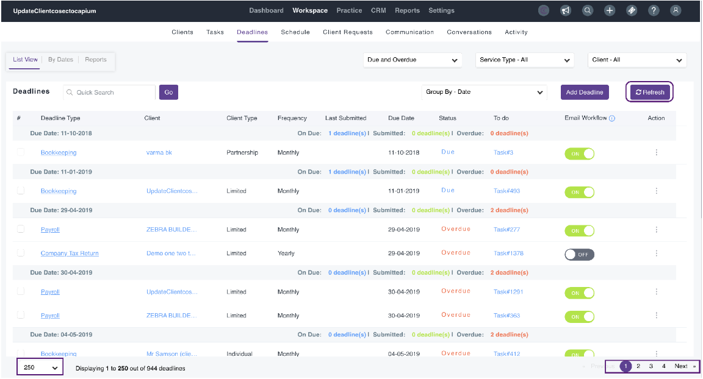

# Practice Management – Refresh Deadlines
	 	
			
			Print

- **Folder:** Practice Management Help Guide
- **Source URL:** [https://capium.freshdesk.com/support/solutions/articles/9000236557-practice-management-refresh-deadlines](https://capium.freshdesk.com/support/solutions/articles/9000236557-practice-management-refresh-deadlines)
- **Article ID:** 9000236557

## Content

Solution home 
		Practice Management 
		Practice Management Help Guide

### Practice Management – Refresh Deadlines

			Print

	Modified on: Wed, 28 Feb, 2024 at  2:13 PM

		Location: Practice Management >> Workspace >> Deadlines >> Refresh.

Confirmation statements and annual accounts deadlines are available after you assign a client for

these services in the settings tab, the deadlines will auto-sync directly from Companies House to

Capium.

Please Note: We recommend selecting the “Refresh” option often for auto-sync by selecting the

paginations including all clients.

										Did you find it helpful?
								Yes
								No

Send feedback	Sorry we couldn't be helpful. Help us improve this article with your feedback.

## Images & Screenshots (1)

