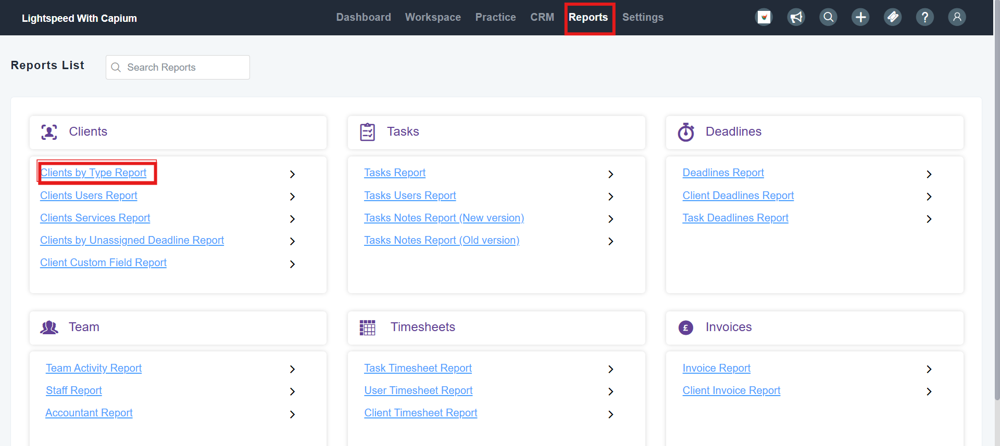
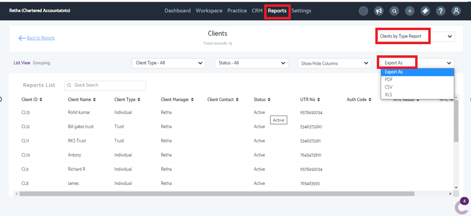

# How to export the client list from practice management?
	 	
			
			Print

- **Folder:** Practice Management FAQs
- **Source URL:** [https://capium.freshdesk.com/support/solutions/articles/9000236608-how-to-export-the-client-list-from-practice-management-](https://capium.freshdesk.com/support/solutions/articles/9000236608-how-to-export-the-client-list-from-practice-management-)
- **Article ID:** 9000236608

## Content

Solution home 
		Practice Management 
		Practice Management FAQs

### How to export the client list from practice management?

			Print

	Modified on: Thu, 8 May, 2025 at  4:07 PM

		Navigation: Practice management >>Reports>> Clients by type report>>Export As

										Did you find it helpful?
								Yes
								No

Send feedback	Sorry we couldn't be helpful. Help us improve this article with your feedback.

## Images & Screenshots (2)

