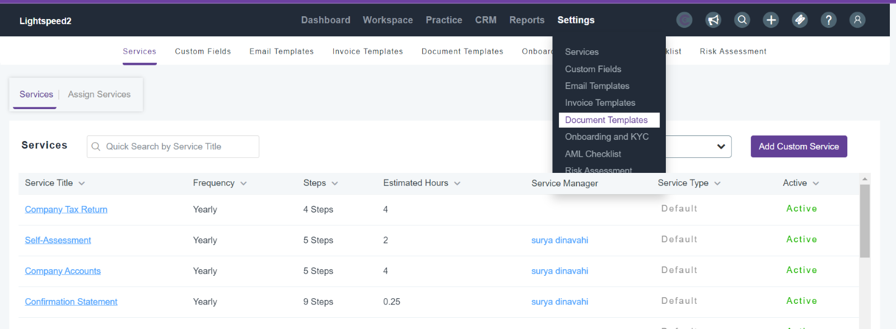
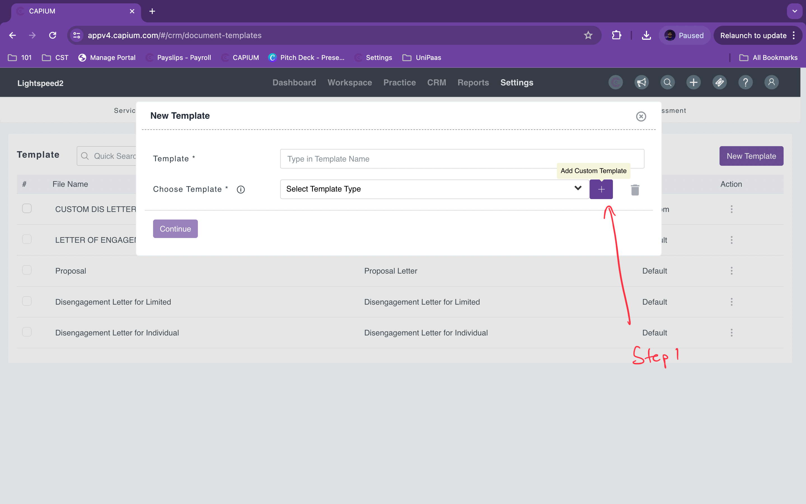
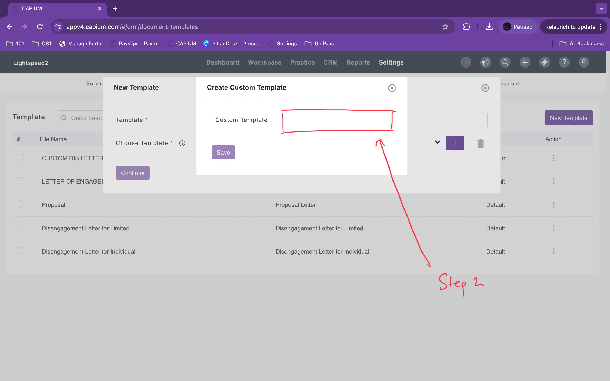
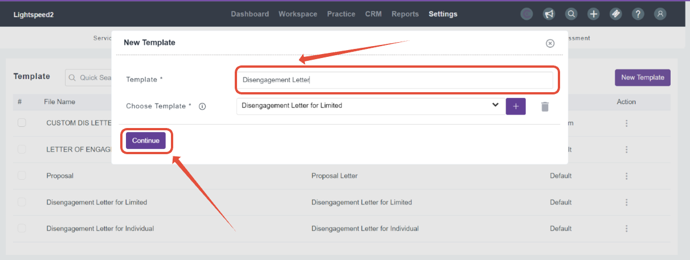
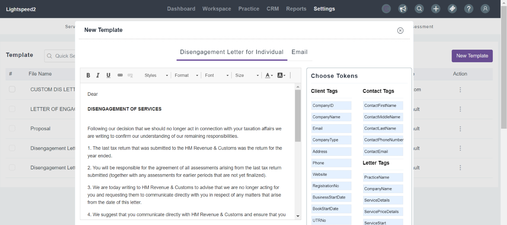
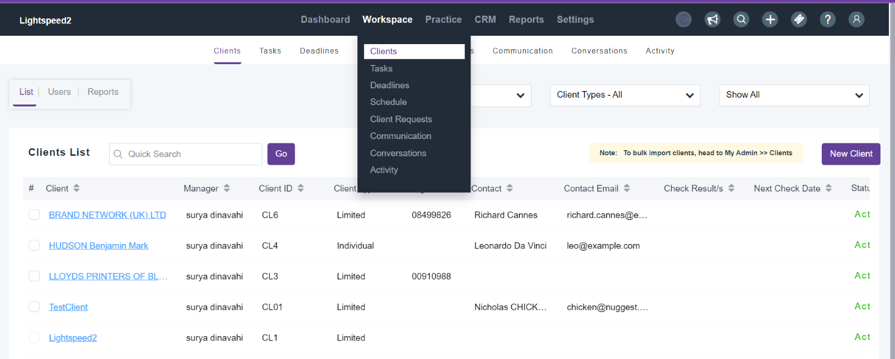
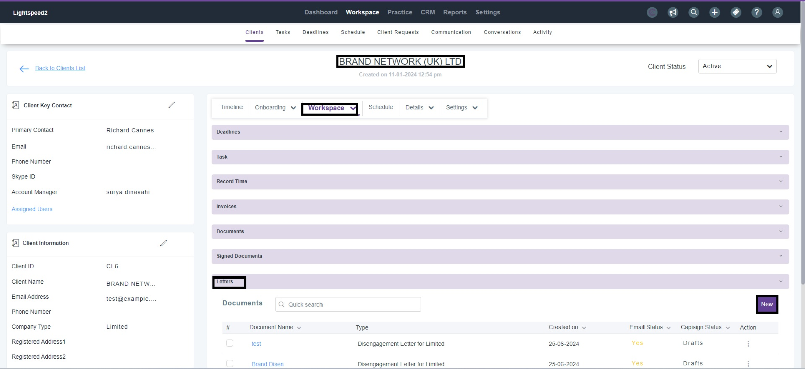
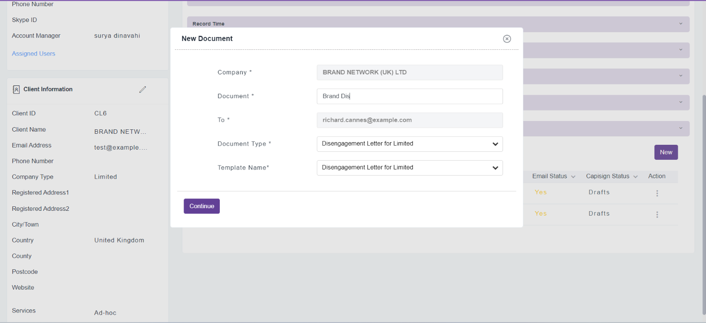
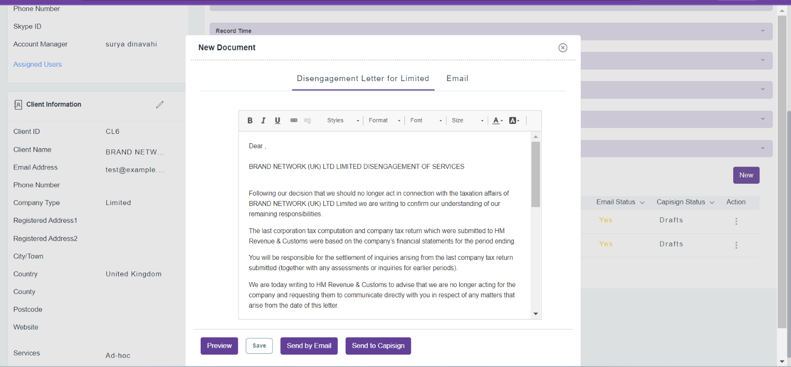

# Letters in Practice Management
	 	
			
			Print

- **Folder:** Practice Management Help Guide
- **Source URL:** [https://capium.freshdesk.com/support/solutions/articles/9000238645-letters-in-practice-management](https://capium.freshdesk.com/support/solutions/articles/9000238645-letters-in-practice-management)
- **Article ID:** 9000238645

## Content

Solution home 
		Practice Management 
		Practice Management Help Guide

### Letters in Practice Management

			Print

	Modified on: Tue, 25 Jun, 2024 at  6:07 PM

Navigation: Settings> Document Templates 
Alternatively, please click on this link to be redirected to the page. 

Here, you have the opportunity to customise your letters. As defaults, Capium provides the following templates:
    1. Proposal Letters

    2. Letters of Engagement

    3. Disengagement Letter for a Limited Company 

    4. Disengagement Letter for an Individual 

You have the ability to add new template types in the section as shown in the screenshots below:

Create your own custom letters by clicking the Add button in the template options and save. Once saved, they will be added to your templates. 

Once you have created a Custom Template you are able to create multiple custom templates. 

As part of creating new template you have to click on "New Template"
Following this you will have to add a template name for your custom template and click on "continue" as shown on the screen below:

Once you click on this page you will be able to see the below page, this page can be blank if you have created a custom template category from scratch. 

On the right hand side, you can see there are tags available to auto-populate the information from the 'My Admin' module. 

Once you have updated the letter you can save it by scrolling down and clicking on save on the bottom left of your screen. 

Once the letters are customised and saved. Please navigate to the following section:

Navigation:  Clients >Select specific client from the list. 

To create a new document for a specific client: 

Navigation: Workspace> Letters 

Scroll down to find the Letters option and select New Document to choose the customized template. 

Please refer to the below Screenshots 

When you select New Document, it will automatically pull the template. You can then email it to the client or send it to Capisign for e-signature. Please refer to  the below Screenshots.

Please note:
When using Capisign, the Capisign module doesn't currently show the status of the signed documents within the practice management module. You are still able to track this from the Capisign module itself, or via the email notifications that Capisign sends you. This feature is currently under development and we will update this article after it has been released. 

										Did you find it helpful?
								Yes
								No

Send feedback	Sorry we couldn't be helpful. Help us improve this article with your feedback.

## Images & Screenshots (9)

