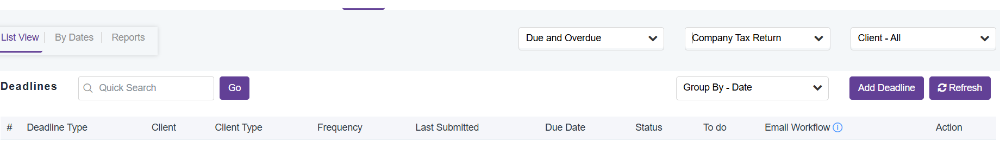
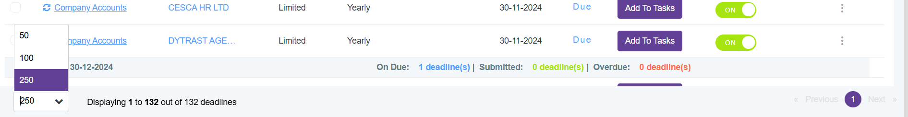

# Refreshing deadlines in Practice Management
	 	
			
			Print

- **Folder:** Practice Management FAQs
- **Source URL:** [https://capium.freshdesk.com/support/solutions/articles/9000247184-refreshing-deadlines-in-practice-management](https://capium.freshdesk.com/support/solutions/articles/9000247184-refreshing-deadlines-in-practice-management)
- **Article ID:** 9000247184

## Content

Solution home 
		Practice Management 
		Practice Management FAQs

### Refreshing deadlines in Practice Management

			Print

	Modified on: Tue, 5 Nov, 2024 at 10:15 AM

		To ensure the most up to date and accurate data for deadlines for company accounts, please follow the below;

When you refresh the deadlines, please select, due and overdue, then select company accounts, an

Then select the number of deadlines you have or maximum that you can on the pagination option,  then click refresh:

Depending on the number of deadlines you have, it may take up to 5 minutes for the refresh to take place. If you face any issues please contact the support team.

										Did you find it helpful?
								Yes
								No

Send feedback	Sorry we couldn't be helpful. Help us improve this article with your feedback.

## Images & Screenshots (2)

