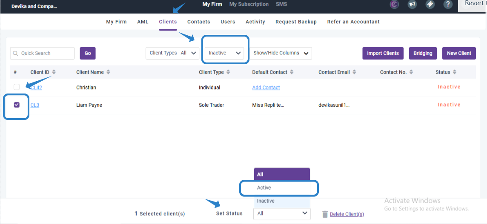

# How to reactivate a client- My admin
	 	
			
			Print

- **Folder:** Practice Management Help Guide
- **Source URL:** [https://capium.freshdesk.com/support/solutions/articles/9000271639-how-to-reactivate-a-client-my-admin](https://capium.freshdesk.com/support/solutions/articles/9000271639-how-to-reactivate-a-client-my-admin)
- **Article ID:** 9000271639

## Content

Solution home 
		Practice Management 
		Practice Management Help Guide

### How to reactivate a client- My admin

			Print

	Modified on: Wed, 22 Oct, 2025 at  6:43 AM

		How to Reactivate a Client from MY Admin

If you have a client who has become inactive and you want to reactivate them, you can easily do so from your My Admin account. Here's a step-by-step guide on how to reactivate a client:

1. Log in to your My Admin account and navigate to the My Firm section.

2. From there, go to the Clients tab and click on the Filters option.

3. In the Filters, select "inactive" to filter out the inactive clients.

4. Once you have the list of inactive clients, select the relevant client that you want to reactivate.

5. At the bottom of the client's profile, you will see a drop-down menu labelled "Set Status."

6. From the drop-down menu, choose "Active" to change the status of the client from inactive to active.

7. Once you have selected "Active," the client will be reactivated and will be able to access their account again.

We hope this guide helps you reactivate your client successfully. If you have any further questions or need additional support, please don't hesitate to reach out to our customer support team. We are here to help!

										Did you find it helpful?
								Yes
								No

Send feedback	Sorry we couldn't be helpful. Help us improve this article with your feedback.

## Images & Screenshots (1)

