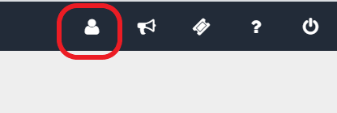
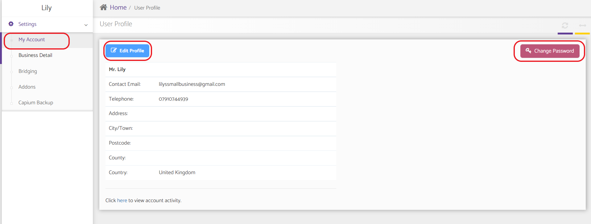
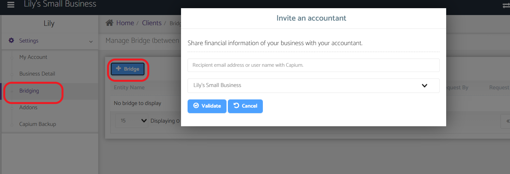
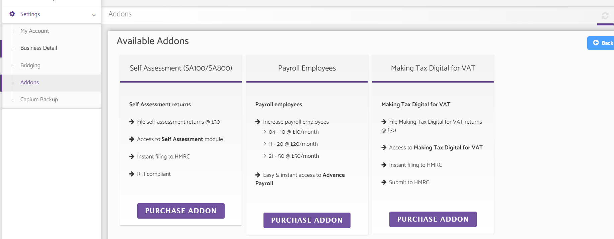

# SME-My Admin (settings) overview
	 	
			
			Print

- **Category:** SME User Information
- **Folder:** General
- **Source URL:** [https://capium.freshdesk.com/support/solutions/articles/9000204463-sme-my-admin-settings-overview](https://capium.freshdesk.com/support/solutions/articles/9000204463-sme-my-admin-settings-overview)
- **Article ID:** 9000204463

## Content

Solution home 
		SME User Information
		General

### SME-My Admin (settings) overview

			Print

	Modified on: Wed, 14 Jul, 2021 at  5:01 PM

		Help/Guide

Please head to my admin using the person icon in the top right hand side of the page

This will take you to My account where you can edit your profile and/or change your password

Business detail are you business details

Note: Business start date is the day of incorporation, Book start date is the date of trading.

Bridging allows you to share your data with your Capium accountant

The addons section allows you to purchase a Self Assessment Filing (£30), to add extra employees to payroll (£180) and to add MTD (£30)

All prices are excluding VAT

If you would like to add on Corporations Tax and Accounts Production please call out sales team on 020 3322 5578. This will cost £150 (plus VAT)

Capium Backup allows a request to obtain your data.

										Did you find it helpful?
								Yes
								No

Send feedback	Sorry we couldn't be helpful. Help us improve this article with your feedback.

## Screenshots & Diagrams (4)

