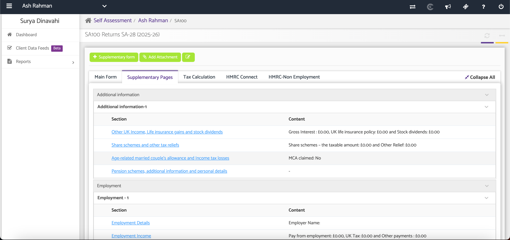
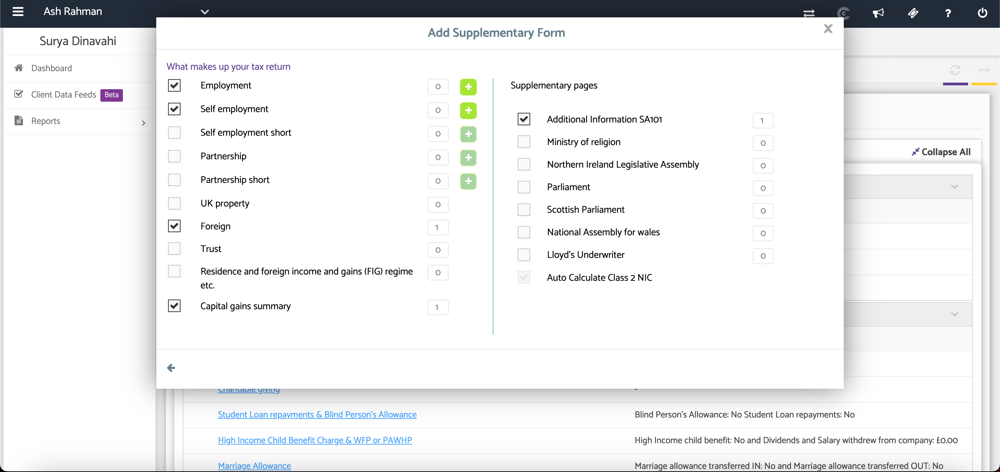
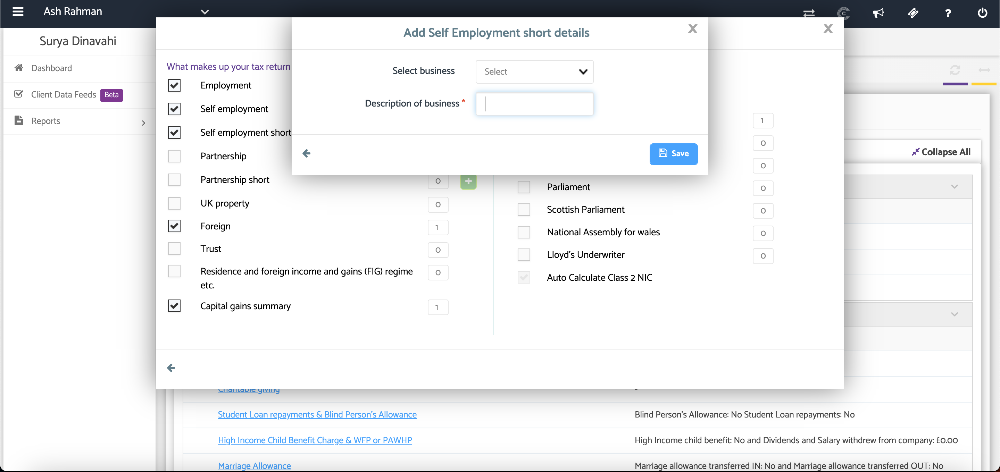

# Self Assessment Supplementary Pages
	 	
			
			Print

- **Category:** Self Assessment
- **Folder:** Self Assessment Help Guide
- **Source URL:** [https://capium.freshdesk.com/support/solutions/articles/9000165522-self-assessment-supplementary-pages](https://capium.freshdesk.com/support/solutions/articles/9000165522-self-assessment-supplementary-pages)
- **Article ID:** 9000165522

## Content

Solution home 
		Self Assessment 
		Self Assessment Help Guide

### Self Assessment Supplementary Pages

			Print

	Modified on: Tue, 30 Jun, 2026 at  6:04 PM

### Overview

The Supplementary Pages feature allows you to add additional HMRC forms to an SA100 return. These forms are used to report specific types of income or circumstances that are not covered by the main SA100 form.

### Navigation

Self Assessment > SA100 > Client > Select Form > Supplementary Pages

### Step 1: Open the Supplementary Pages and Select the Required Forms

Click + Supplementary and use the checkboxes to enable the supplementary forms required for the tax return.

The selected forms will be added to the return.

### Step 2: Review the Added Forms

Once selected, the supplementary forms will appear under the Supplementary Forms tab, where you can complete and review the relevant information. 

NOTE: Depending on the supplementary pages you select, you may need to fill out additional details. E.G. Self Employment Short.

### Additional Help

### Need Help?

If you need assistance or guidance, please contact your onboarding manager or email Support@capium.com, or call us on 020 3322 5578.

### Related Articles

Create a New SA100

View SA100 HMRC Form

Self Assessment - Capital Allowances Calculator

### 

										Did you find it helpful?
								Yes
								No

Send feedback	Sorry we couldn't be helpful. Help us improve this article with your feedback.

## Screenshots & Diagrams (3)

