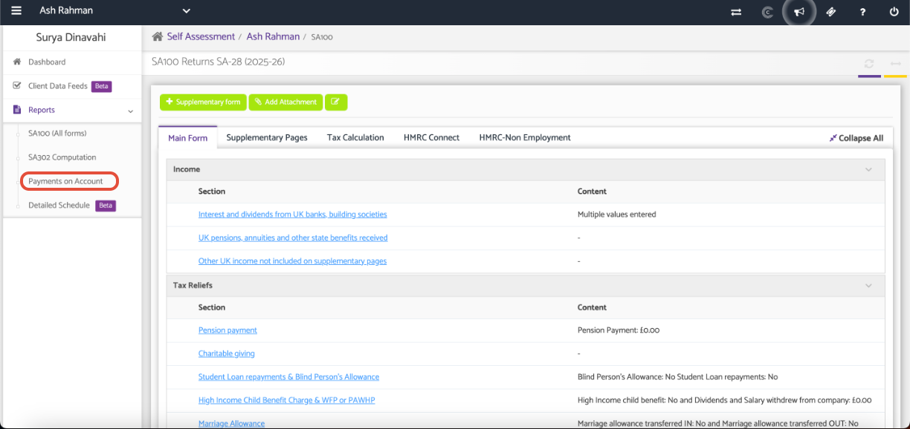
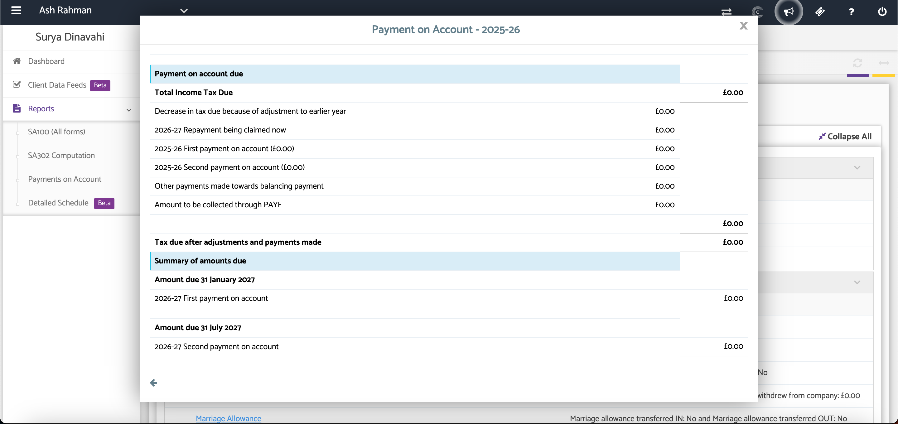

# View Payments on Accounts
	 	
			
			Print

- **Category:** Self Assessment
- **Folder:** Self Assessment Help Guide
- **Source URL:** [https://capium.freshdesk.com/support/solutions/articles/9000165524-view-payments-on-accounts](https://capium.freshdesk.com/support/solutions/articles/9000165524-view-payments-on-accounts)
- **Article ID:** 9000165524

## Content

Solution home 
		Self Assessment 
		Self Assessment Help Guide

### View Payments on Accounts

			Print

	Modified on: Tue, 30 Jun, 2026 at  6:17 PM

### Overview

The Payments on Account section allows you to view the taxpayer's Payments on Account (PoA) for the selected tax year. This provides a summary of the payments due and any amounts that have been recorded.

### Navigation

Self Assessment > SA100 > Client Specific > Reports > Payments on Account

A pop-up window will display the Payments on Account for the selected tax year.

Review the information to confirm the payment amounts and due dates.

### Support Video

Manually Entering Payments on Account (PoA)

### Additional Help

### Need Help?

If you need assistance or guidance, please contact your onboarding manager or email Support@capium.com, or call us on 020 3322 5578.

### Related Articles

Create a New SA100

View SA100 HMRC Form

Self Assessment Supplementary Pages

### 

### 

										Did you find it helpful?
								Yes
								No

Send feedback	Sorry we couldn't be helpful. Help us improve this article with your feedback.

## Screenshots & Diagrams (2)

