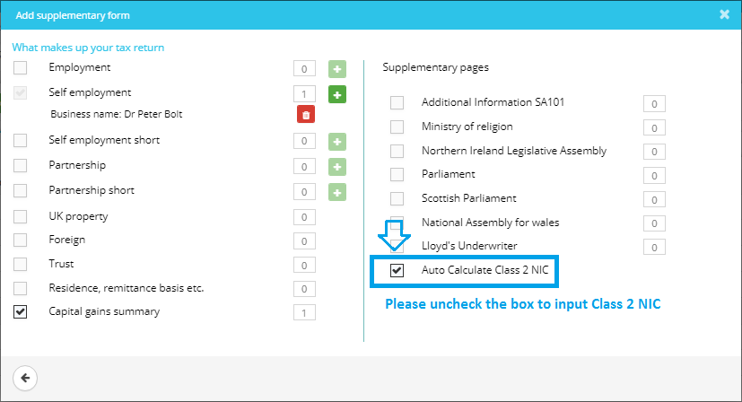
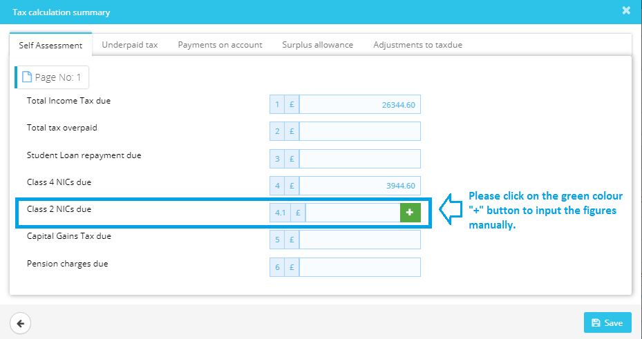

# How can we select for the client to pay class 2 NIC voluntarily?
	 	
			
			Print

- **Category:** Self Assessment
- **Folder:** Self Assessment FAQs
- **Source URL:** [https://capium.freshdesk.com/support/solutions/articles/9000165584-how-can-we-select-for-the-client-to-pay-class-2-nic-voluntarily-](https://capium.freshdesk.com/support/solutions/articles/9000165584-how-can-we-select-for-the-client-to-pay-class-2-nic-voluntarily-)
- **Article ID:** 9000165584

## Content

Solution home 
		Self Assessment 
		Self Assessment FAQs

### How can we select for the client to pay class 2 NIC voluntarily?

			Print

	Modified on: Mon, 25 Mar, 2019 at  3:37 PM

		The 'auto calculate class 2 NIC' checkbox should be ticked by default, hence you cannot input the figure manually, please untick the checkbox at the '+supplementary form' (button) available on the top left-hand side and input the amount of class 2 NIC on the tax calculation summary page.

Click here to watch how to voluntarily / manually calculate Class 2 NIC

Please refer below screenshot for more help.

										Did you find it helpful?
								Yes
								No

Send feedback	Sorry we couldn't be helpful. Help us improve this article with your feedback.

## Screenshots & Diagrams (2)

