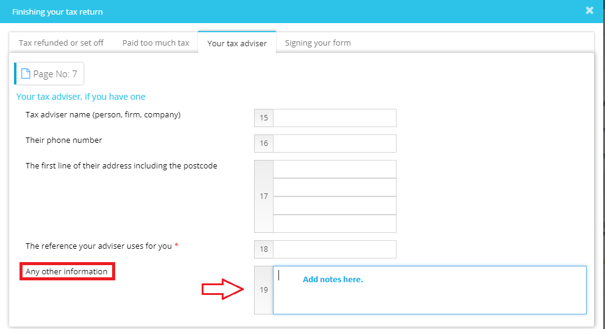

# How do we add notes on the tax return?
	 	
			
			Print

- **Category:** Self Assessment
- **Folder:** Self Assessment FAQs
- **Source URL:** [https://capium.freshdesk.com/support/solutions/articles/9000165596-how-do-we-add-notes-on-the-tax-return-](https://capium.freshdesk.com/support/solutions/articles/9000165596-how-do-we-add-notes-on-the-tax-return-)
- **Article ID:** 9000165596

## Content

Solution home 
		Self Assessment 
		Self Assessment FAQs

### How do we add notes on the tax return?

			Print

	Modified on: Mon, 25 Mar, 2019 at  3:32 PM

		Self Assessment >> Select Client >> Main form, please select the sub-section: Your tax adviser, if you have one under Finishing your Tax Return and then you may use the box-19.

Click here to watch how to add notes to SA100 Tax Returns

Another video on how to add notes in SA100

Please refer below screenshot for more help.

										Did you find it helpful?
								Yes
								No

Send feedback	Sorry we couldn't be helpful. Help us improve this article with your feedback.

## Screenshots & Diagrams (1)

