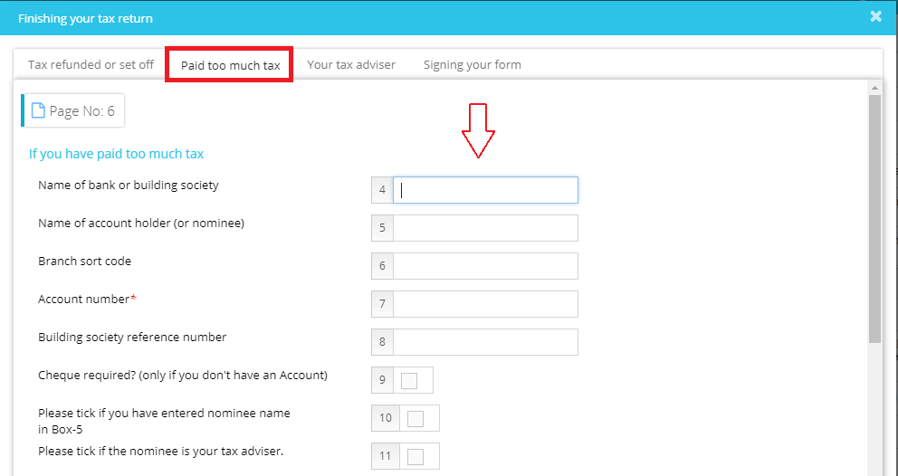

# How do we enter bank details on the SA100 to claim Refund?
	 	
			
			Print

- **Category:** Self Assessment
- **Folder:** Self Assessment FAQs
- **Source URL:** [https://capium.freshdesk.com/support/solutions/articles/9000165597-how-do-we-enter-bank-details-on-the-sa100-to-claim-refund-](https://capium.freshdesk.com/support/solutions/articles/9000165597-how-do-we-enter-bank-details-on-the-sa100-to-claim-refund-)
- **Article ID:** 9000165597

## Content

Solution home 
		Self Assessment 
		Self Assessment FAQs

### How do we enter bank details on the SA100 to claim Refund?

			Print

	Modified on: Mon, 25 Mar, 2019 at  3:29 PM

		Self Assessment >> Select Client >> Main form please select sub-section: if you have paid too much tax option under Finishing your Tax return to fill in the bank account details.

Click here to watch how to add bank details on SA100 for a refund

Click here to watch how to enter an agent's bank details on the the SA100 refund

Please refer below screenshot for more help.

										Did you find it helpful?
								Yes
								No

Send feedback	Sorry we couldn't be helpful. Help us improve this article with your feedback.

## Screenshots & Diagrams (1)

