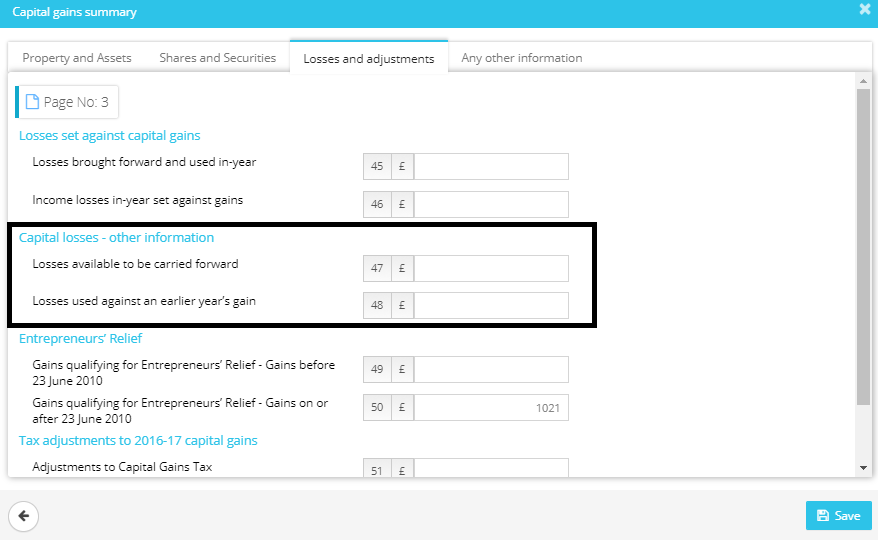
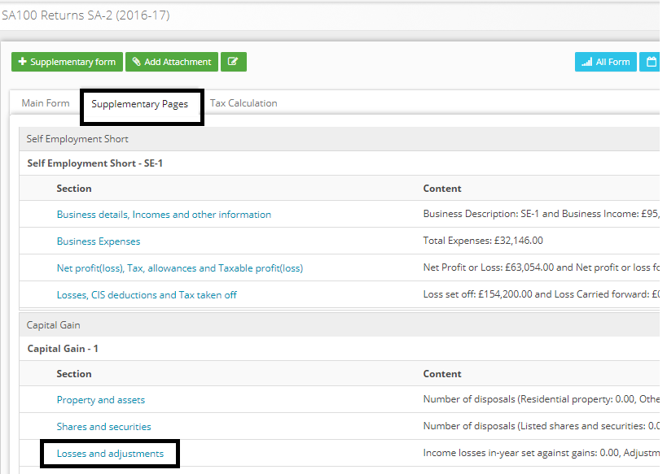

# In the tax return the computation does not appear to take entrepreneur&#39;s relief into account
	 	
			
			Print

- **Category:** Self Assessment
- **Folder:** Self Assessment FAQs
- **Source URL:** [https://capium.freshdesk.com/support/solutions/articles/9000165602-in-the-tax-return-the-computation-does-not-appear-to-take-entrepreneur-s-relief-into-account](https://capium.freshdesk.com/support/solutions/articles/9000165602-in-the-tax-return-the-computation-does-not-appear-to-take-entrepreneur-s-relief-into-account)
- **Article ID:** 9000165602

## Content

Solution home 
		Self Assessment 
		Self Assessment FAQs

### In the tax return the computation does not appear to take entrepreneur&#39;s relief into account

			Print

	Modified on: Mon, 25 Mar, 2019 at  3:45 PM

		It will happen if no amount has been updated for entrepreneur's relief. To update the relief, you may simply select the “losses and adjustments” under “supplementary pages”. 

Once you select losses and adjustments, a popup will appear where an entrepreneur's relief can be updated.

Please refer below screenshots for more help.

Click here to watch how to carry back losses from current period to previous

										Did you find it helpful?
								Yes
								No

Send feedback	Sorry we couldn't be helpful. Help us improve this article with your feedback.

## Screenshots & Diagrams (2)

