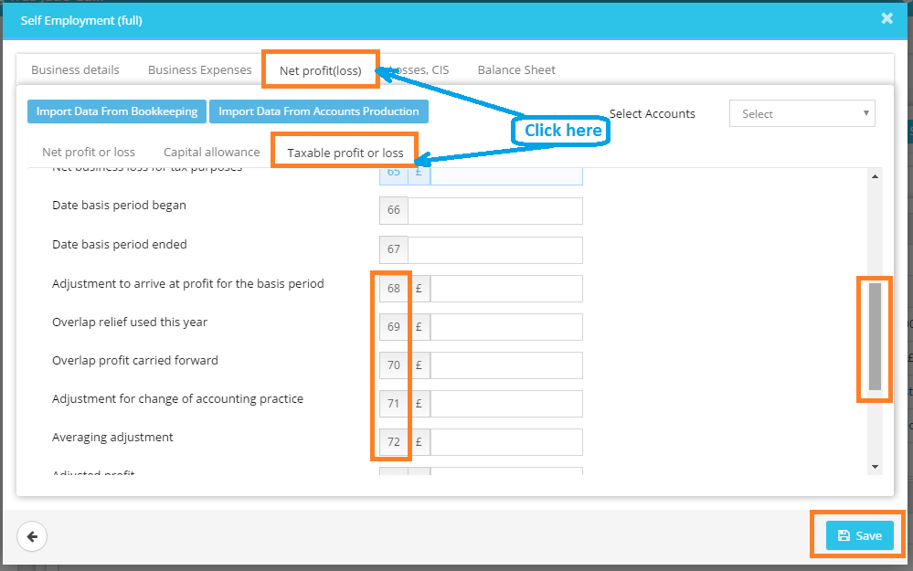

# Where in Capium I enter the overlap relief that will be deducted from their profits?
	 	
			
			Print

- **Category:** Self Assessment
- **Folder:** Self Assessment FAQs
- **Source URL:** [https://capium.freshdesk.com/support/solutions/articles/9000165612-where-in-capium-i-enter-the-overlap-relief-that-will-be-deducted-from-their-profits-](https://capium.freshdesk.com/support/solutions/articles/9000165612-where-in-capium-i-enter-the-overlap-relief-that-will-be-deducted-from-their-profits-)
- **Article ID:** 9000165612

## Content

Solution home 
		Self Assessment 
		Self Assessment FAQs

### Where in Capium I enter the overlap relief that will be deducted from their profits?

			Print

	Modified on: Mon, 25 Mar, 2019 at  3:08 PM

		You may simply click on "taxable profit or loss" tab "net profit loss" tab and then scroll down the window to input the values in box no. 69-72 as desired.

Watch the video here to add overlap relief

Please refer below screenshot for more help.

										Did you find it helpful?
								Yes
								No

Send feedback	Sorry we couldn't be helpful. Help us improve this article with your feedback.

## Screenshots & Diagrams (1)

