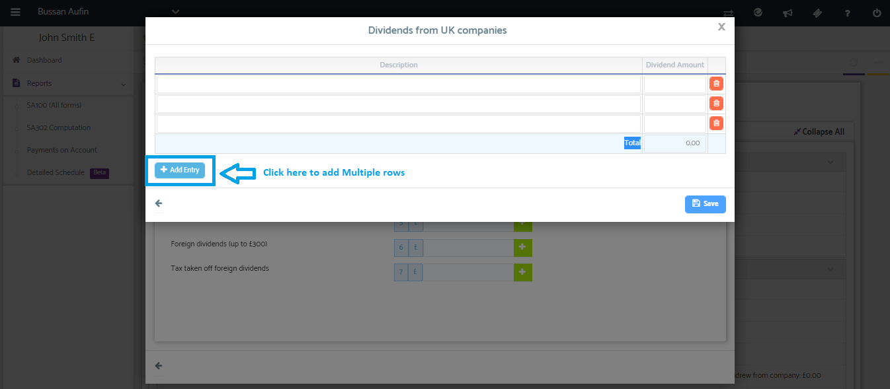

# How can I add multiple dividend incomes in the tax return?
	 	
			
			Print

- **Category:** Self Assessment
- **Folder:** Self Assessment FAQs
- **Source URL:** [https://capium.freshdesk.com/support/solutions/articles/9000165613-how-can-i-add-multiple-dividend-incomes-in-the-tax-return-](https://capium.freshdesk.com/support/solutions/articles/9000165613-how-can-i-add-multiple-dividend-incomes-in-the-tax-return-)
- **Article ID:** 9000165613

## Content

Solution home 
		Self Assessment 
		Self Assessment FAQs

### How can I add multiple dividend incomes in the tax return?

			Print

	Modified on: Mon, 25 Mar, 2019 at  2:14 PM

		You may click on the add rows button to record multiple items.

Please refer below screenshot for more help.

Watch here how to add multiple dividend income entries

										Did you find it helpful?
								Yes
								No

Send feedback	Sorry we couldn't be helpful. Help us improve this article with your feedback.

## Screenshots & Diagrams (1)

