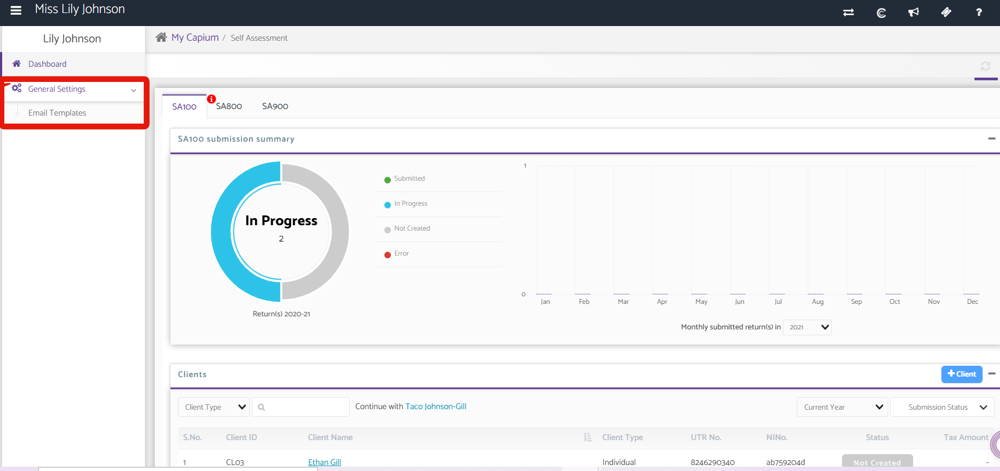
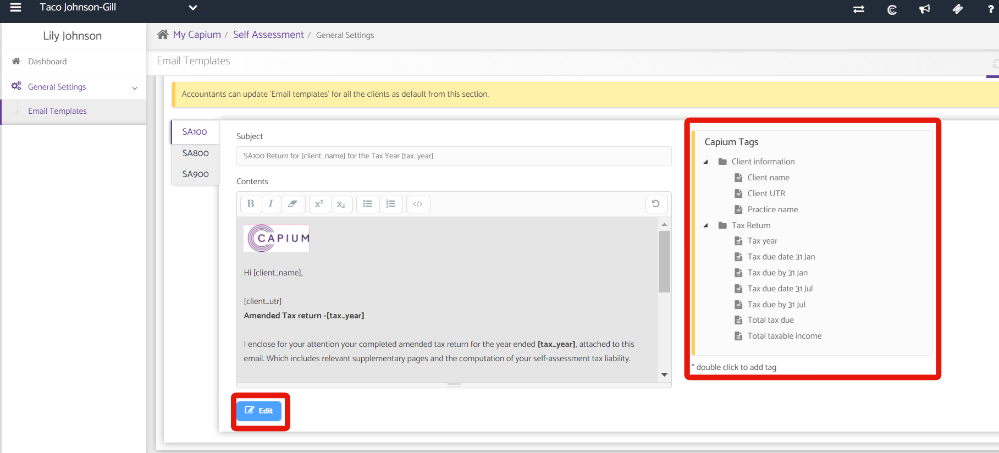
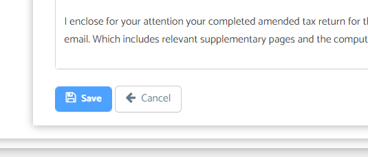
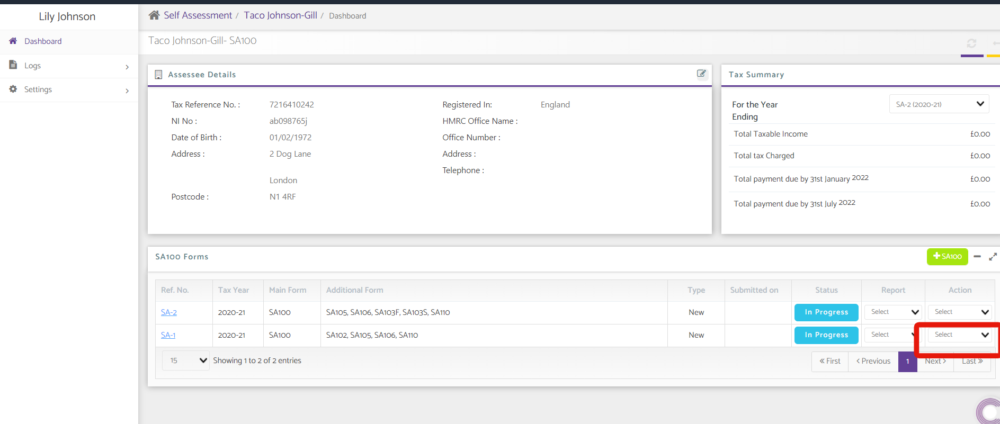
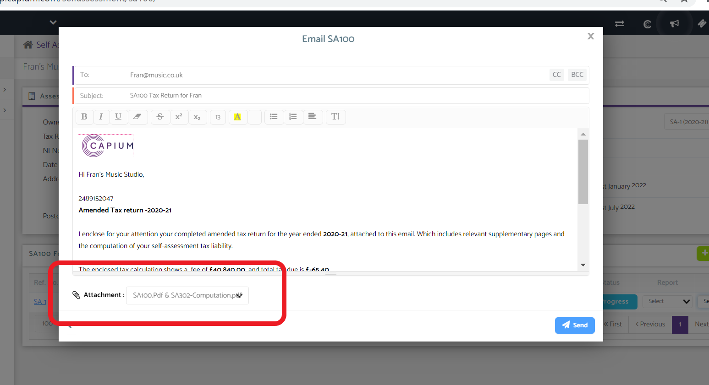

# How to Configure Emails in Self Assessment, Accounts Production and Corporation Tax
	 	
			
			Print

- **Category:** Self Assessment
- **Folder:** Self Assessment Help Guide
- **Source URL:** [https://capium.freshdesk.com/support/solutions/articles/9000201868-how-to-configure-emails-in-self-assessment-accounts-production-and-corporation-tax](https://capium.freshdesk.com/support/solutions/articles/9000201868-how-to-configure-emails-in-self-assessment-accounts-production-and-corporation-tax)
- **Article ID:** 9000201868

## Content

Solution home 
		Self Assessment 
		Self Assessment Help Guide

### How to Configure Emails in Self Assessment, Accounts Production and Corporation Tax

			Print

	Modified on: Tue, 1 Jun, 2021 at  2:59 PM

		Navigation: Chosen Module > General Settings > Email Templates

Click here to watch how to configure emails

Click here to watch the SA100 Email Attachment Update

Help/Guide

Please head to your chosen module either self assessment, accounts production or corporation tax.

Click on general settings, then email templates

To edit the template information for either SA100, 800, 900, Accounts Production or Corporation Tax, click on edit at the bottom of the page.

You can add tags by double clicking the desired tag on the right hand side

You can also copy and paste anything into the text box.

You can then save here

To send the email, click on the client, then the return, click on action and email

A pop up will appear with the email which will go to the client.

All the tagged information will be seen pulled through in the email

The correct form will be attached at the bottom of the email.

Note: Sending an SA100?-You can choose which attachment you would like to add either the SA100, SA302 or both!

Click send to email the client

										Did you find it helpful?
								Yes
								No

Send feedback	Sorry we couldn't be helpful. Help us improve this article with your feedback.

## Screenshots & Diagrams (5)

