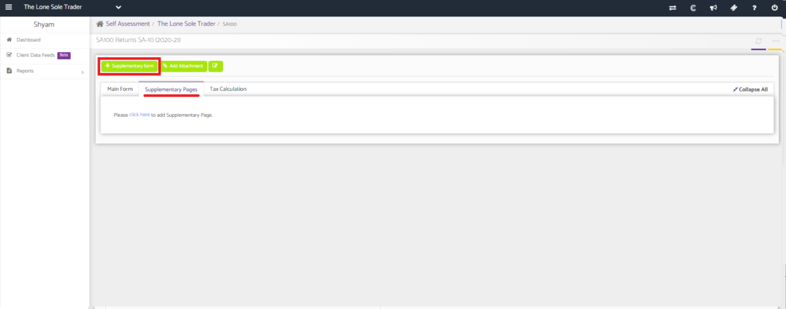
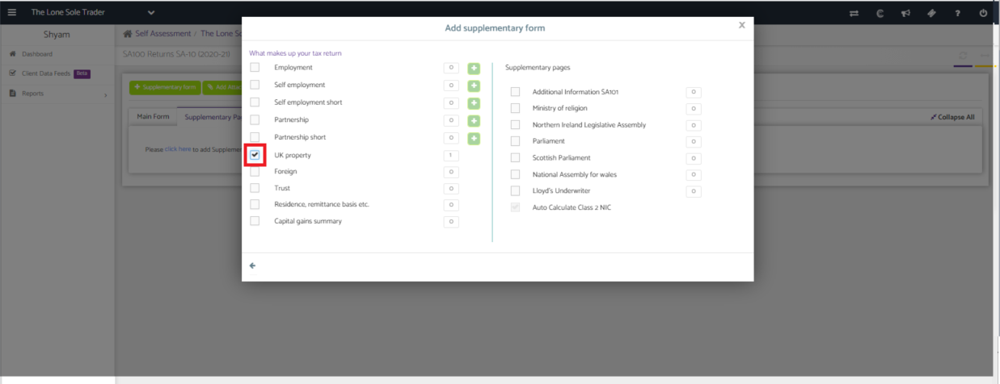
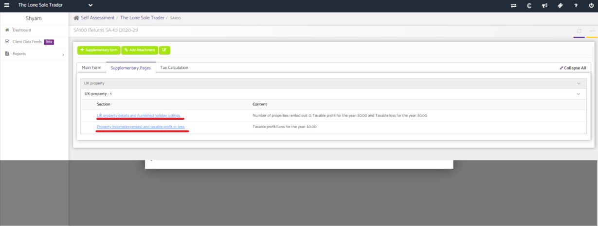
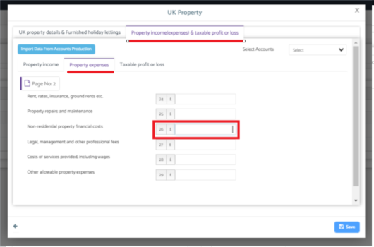
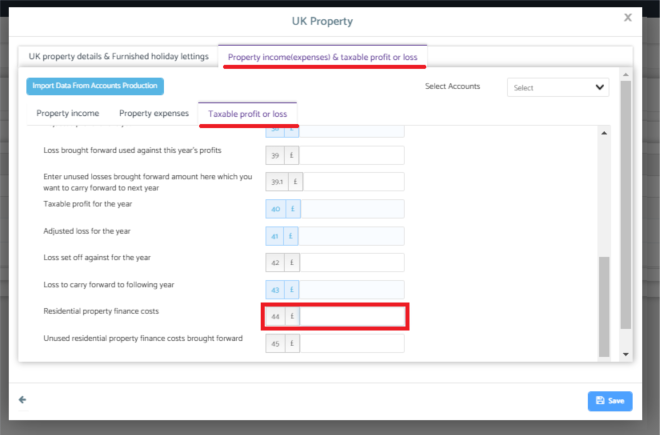

# How to update the relief for finance costs
	 	
			
			Print

- **Category:** Self Assessment
- **Folder:** Self Assessment FAQs
- **Source URL:** [https://capium.freshdesk.com/support/solutions/articles/9000204377-how-to-update-the-relief-for-finance-costs](https://capium.freshdesk.com/support/solutions/articles/9000204377-how-to-update-the-relief-for-finance-costs)
- **Article ID:** 9000204377

## Content

Solution home 
		Self Assessment 
		Self Assessment FAQs

### How to update the relief for finance costs

			Print

	Modified on: Tue, 13 Jul, 2021 at  3:20 PM

		Location:

On the self assessment return >> Supplementary pages  >> Add the page 'UK Property' >> Update 25% of the finance cost in box 26 >> Update 75% of the finance cost in box 44

Video Tutorial:

Click here to watch how to update finance costs 

Help Guide:

Adding the UK Property Supplementary Page

After creating a tax return, navigate to the Supplementary Pages section and click on the '+ Supplementary Page' button.

Add the UK Property page.

You will then be able to go into the relevant section that needs to be updated.

Updating the relief for finance cost

Enter 25% of the finance cost into box 26.

Enter 75% of the finance cost into box 44.

										Did you find it helpful?
								Yes
								No

Send feedback	Sorry we couldn't be helpful. Help us improve this article with your feedback.

## Screenshots & Diagrams (5)

