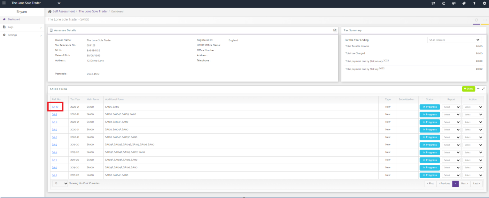
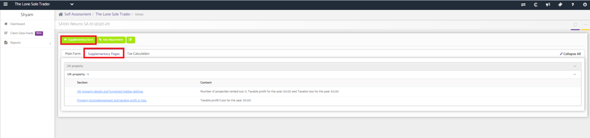
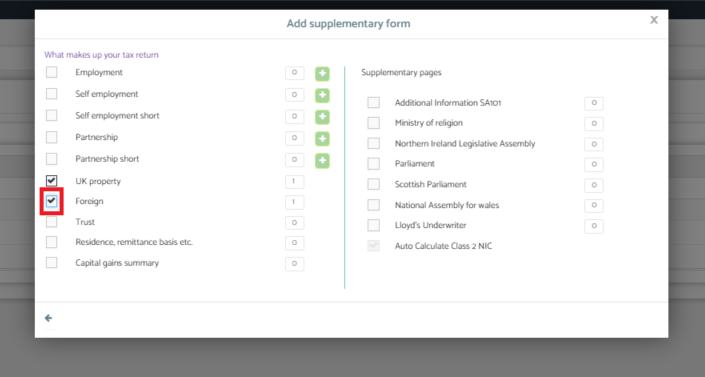
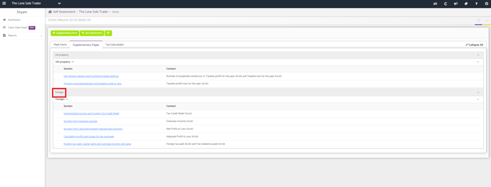

# How to update the SA106 Foreign form
	 	
			
			Print

- **Category:** Self Assessment
- **Folder:** Self Assessment FAQs
- **Source URL:** [https://capium.freshdesk.com/support/solutions/articles/9000204416-how-to-update-the-sa106-foreign-form](https://capium.freshdesk.com/support/solutions/articles/9000204416-how-to-update-the-sa106-foreign-form)
- **Article ID:** 9000204416

## Content

Solution home 
		Self Assessment 
		Self Assessment FAQs

### How to update the SA106 Foreign form

			Print

	Modified on: Tue, 13 Jul, 2021 at  4:35 PM

		Location:

Self assessment >> Select client >> Select the return that needs to be edited >> Supplementary pages >> Add the 'Foreign' supplementary page >> Enter information into relevant sections

Video Tutorial:

Click here to watch how to update the SA106 Foreign form 

Help Guide:

From the clients dashboard, select the return that needs to be edited. 

Navigate to the 'Supplementary page' tab and then click on '+ Supplementary form'.

Click on the box next to 'Foreign' to add the relevant page. 

This will create the SA106 Foreign form. You can go into the relevant sub section to enter the information.  

										Did you find it helpful?
								Yes
								No

Send feedback	Sorry we couldn't be helpful. Help us improve this article with your feedback.

## Screenshots & Diagrams (4)

