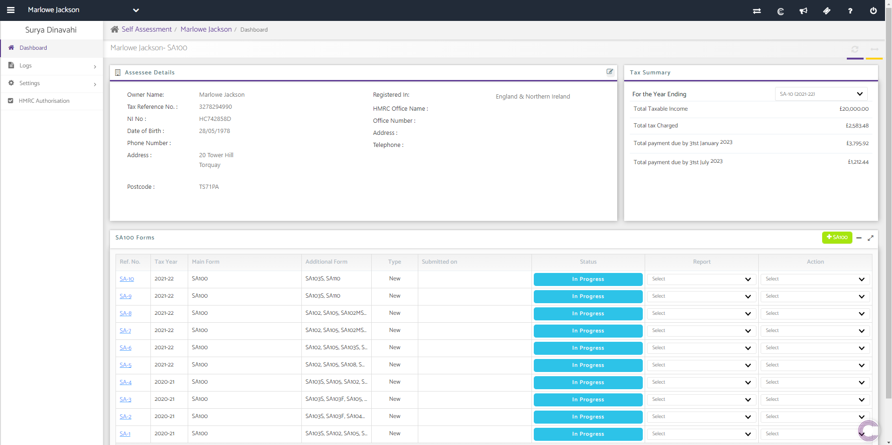
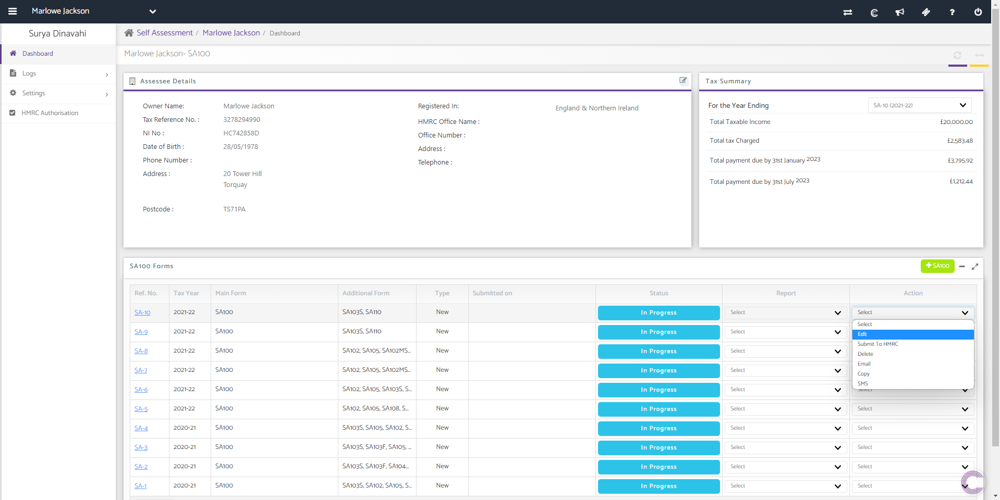
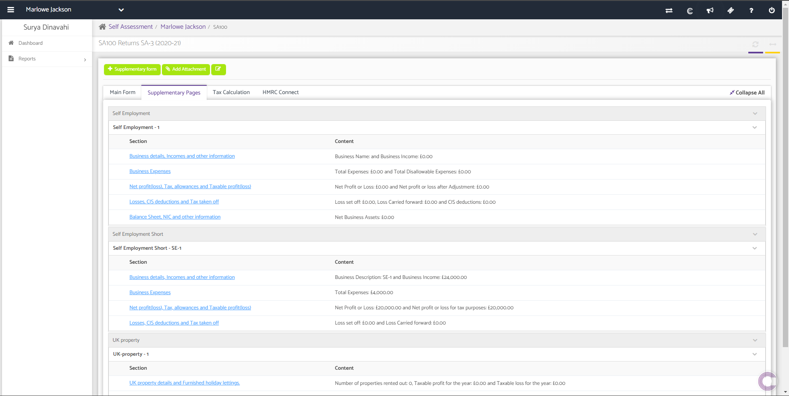
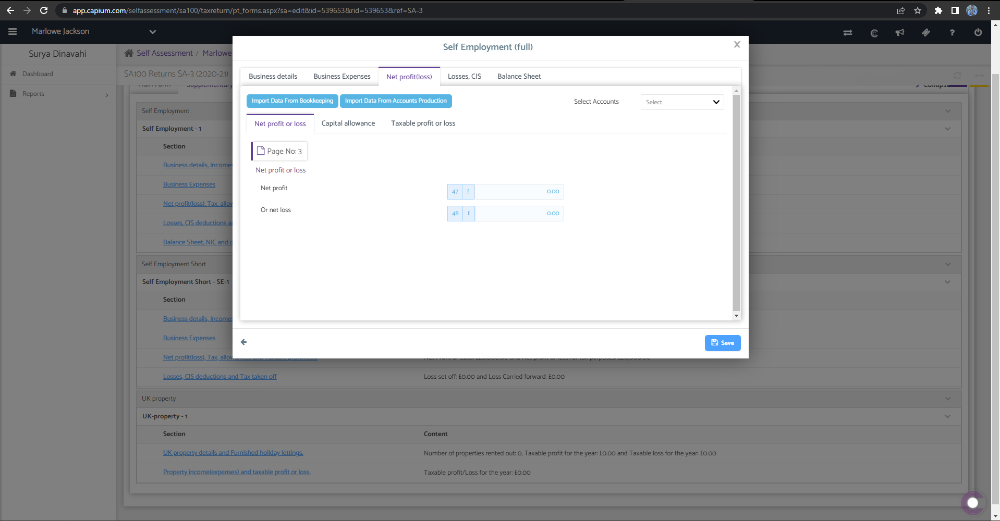
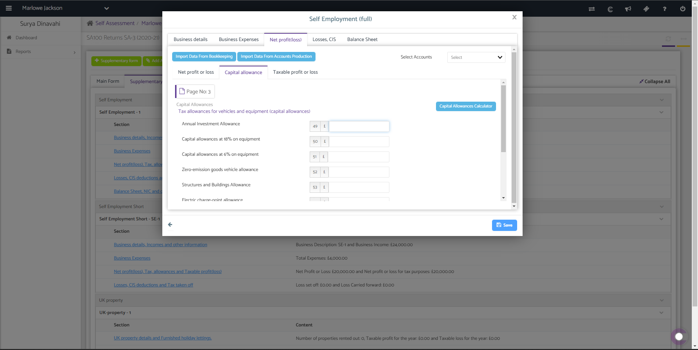

# Self Assessment - Capital Allowances Calculator
	 	
			
			Print

- **Category:** Self Assessment
- **Folder:** Self Assessment Help Guide
- **Source URL:** [https://capium.freshdesk.com/support/solutions/articles/9000221449-self-assessment-capital-allowances-calculator](https://capium.freshdesk.com/support/solutions/articles/9000221449-self-assessment-capital-allowances-calculator)
- **Article ID:** 9000221449

## Content

Solution home 
		Self Assessment 
		Self Assessment Help Guide

### Self Assessment - Capital Allowances Calculator

			Print

	Modified on: Tue, 17 Jan, 2023 at  9:45 AM

To view the Capital Allowances Calculator you click on this link. Alternatively you can also follow the navigation as shown below. 

Navigation: Self Assessment >> SA100 >> Client Specific >> Edit >> Supplementary Pages >> Net profit(loss), Tax, allowances and Taxable profit(loss) >> Capital allowance 

Video Tutorial:

After you have navigated your way to the client specific SA100 dashboard, either create a new SA100 Return which will appear in the SA100 Forms or select the 'Edit' from the 'Action' drop down of an existing one. 

Enter the 'Supplementary Pages' tab.

Select the 'Net profit(loss), Tax, allowances and Taxable profit(loss)' link which will open the prompt below.

Enter the 'Capital allowance' tab.

Fill in all the details as required and save the form.

										Did you find it helpful?
								Yes
								No

Send feedback	Sorry we couldn't be helpful. Help us improve this article with your feedback.

## Screenshots & Diagrams (5)

