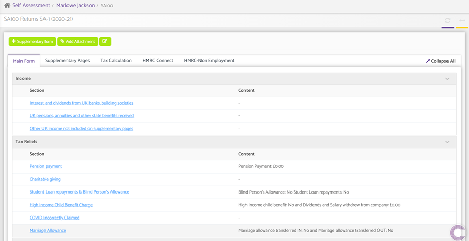
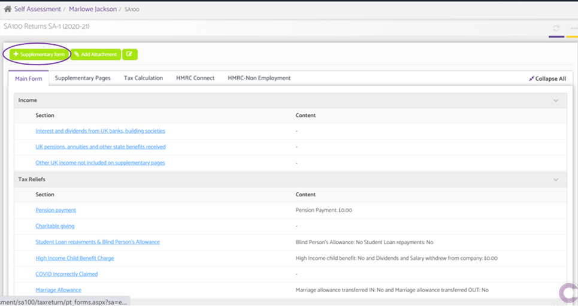
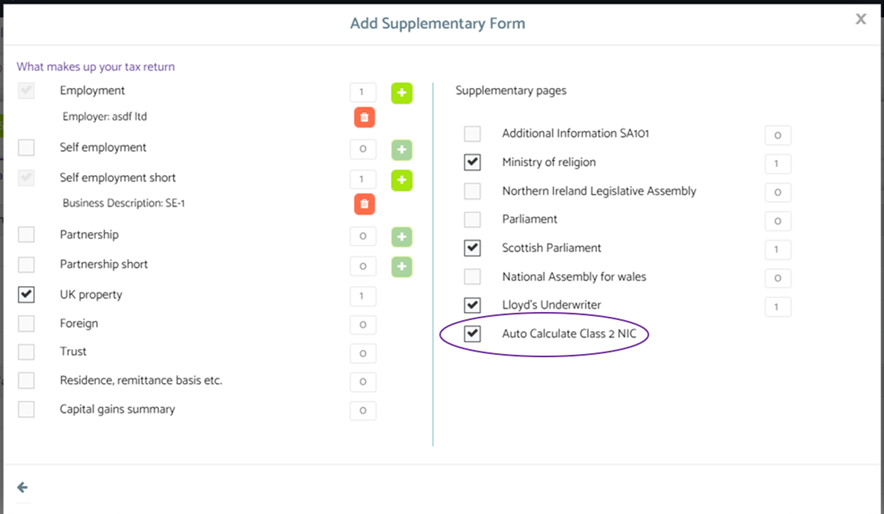
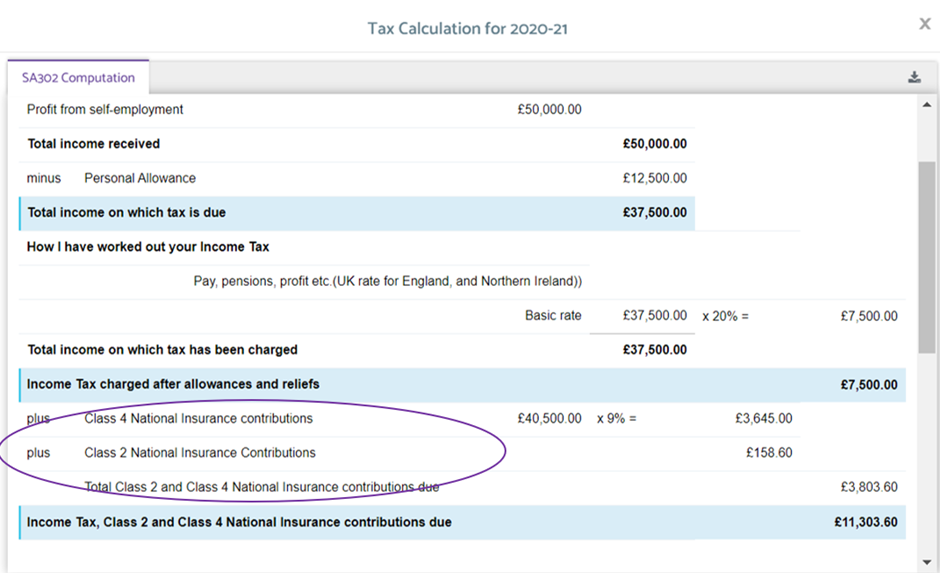
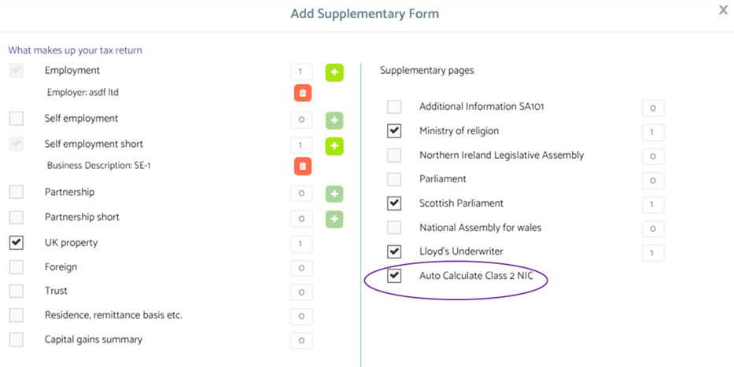
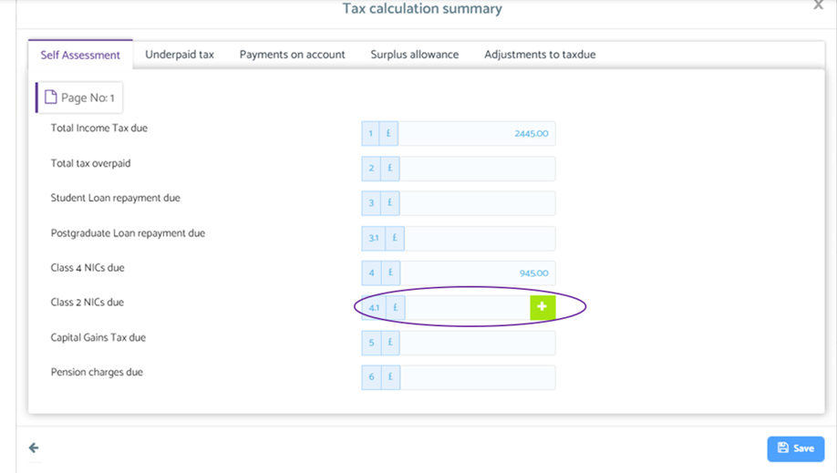
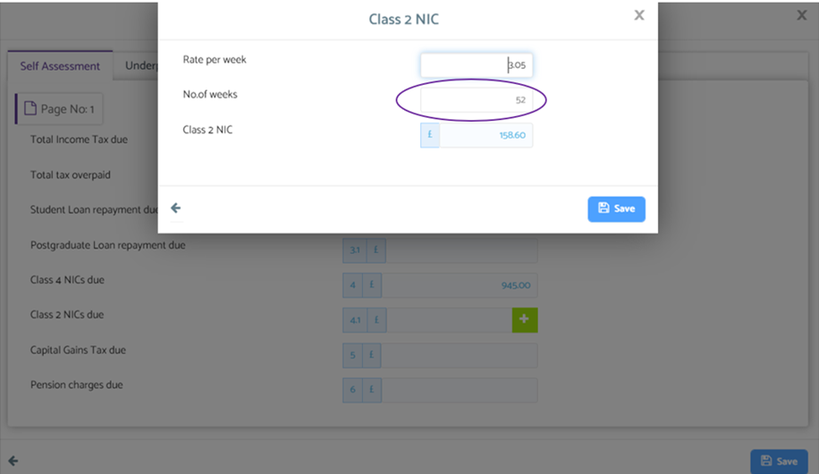

# National Insurance overview
	 	
			
			Print

- **Category:** Self Assessment
- **Folder:** Self Assessment Help Guide
- **Source URL:** [https://capium.freshdesk.com/support/solutions/articles/9000224998-national-insurance-overview](https://capium.freshdesk.com/support/solutions/articles/9000224998-national-insurance-overview)
- **Article ID:** 9000224998

## Content

Solution home 
		Self Assessment 
		Self Assessment Help Guide

### National Insurance overview

			Print

	Modified on: Thu, 6 Apr, 2023 at  8:15 AM

		To run self-assessment in Capium and ensure national insurance contributions have been met. 

Help/Guide

Navigation: Self Assessment > Client > SA100 

Following navigation process described above, a user is able to set self assessment criteria to a selected client. 

Once it has been done, a user is able to make changes within supplementary form by clicking “+ Supplementary form” option. 

Navigation: Self Assessment > Client > SA100 > Supplementary form

To automate the National insurance contribution within the Self Assessment module, a user is required to tick a box shown above. 

Navigation: Self Assessment > Client > Reports > SA302 Computation 

To see the summary of the National Insurance contribution for a selected client, a user is required to follow the navigation process shown above. 

To make changes for periods regarding National Insurance contributions within the Self Assessment module. 

Navigation: Self Assessment > Client > SA100 > Supplementary form 

To amend periods for which National Insurance contribution should be calculated, a user must follow the navigation process and untick the box highlighted above. 

Navigation: Self Assessment > Client > SA100 > Tax calculation > Self Assessment

Once it has been done, a user is able to make changes within National Insurance contribution section by following navigation process and clicking to a green button shown above.

Once it has been performed, a user is able to make relevant changes within the NI contribution option and clicking save button to populate any changes made. 

										Did you find it helpful?
								Yes
								No

Send feedback	Sorry we couldn't be helpful. Help us improve this article with your feedback.

## Screenshots & Diagrams (7)

